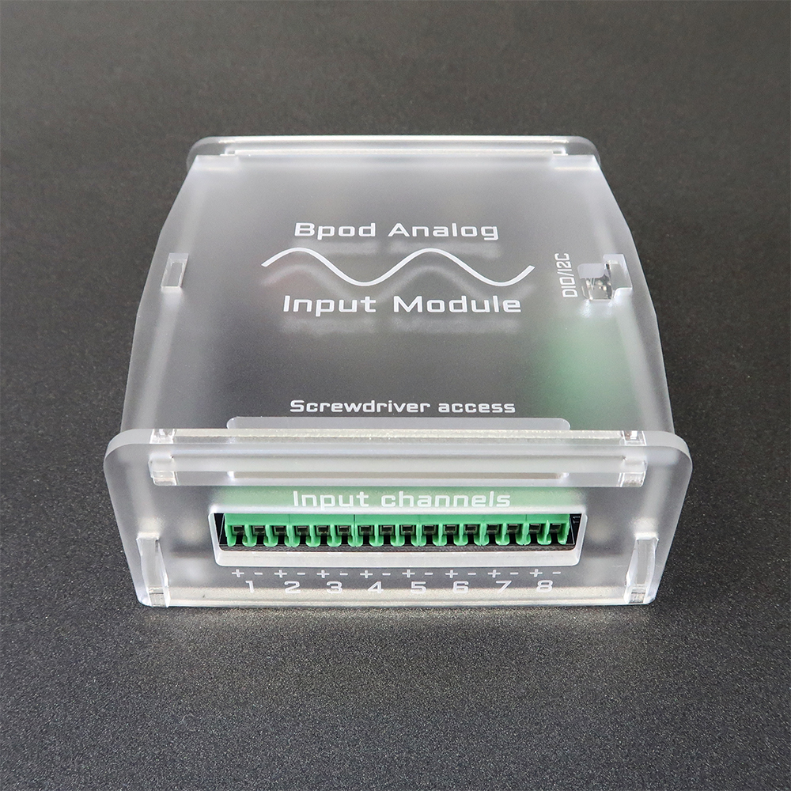
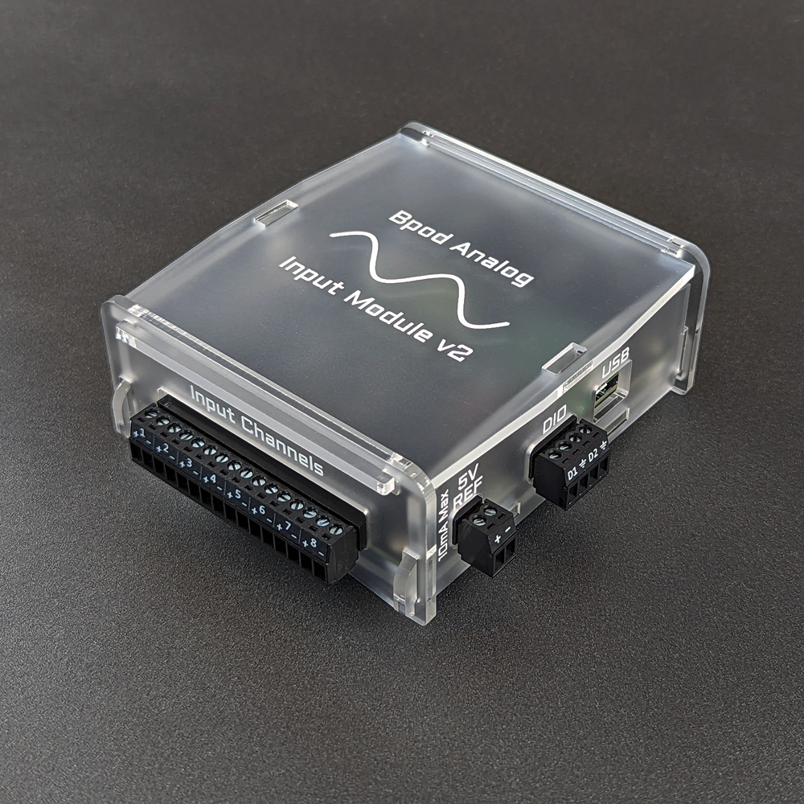
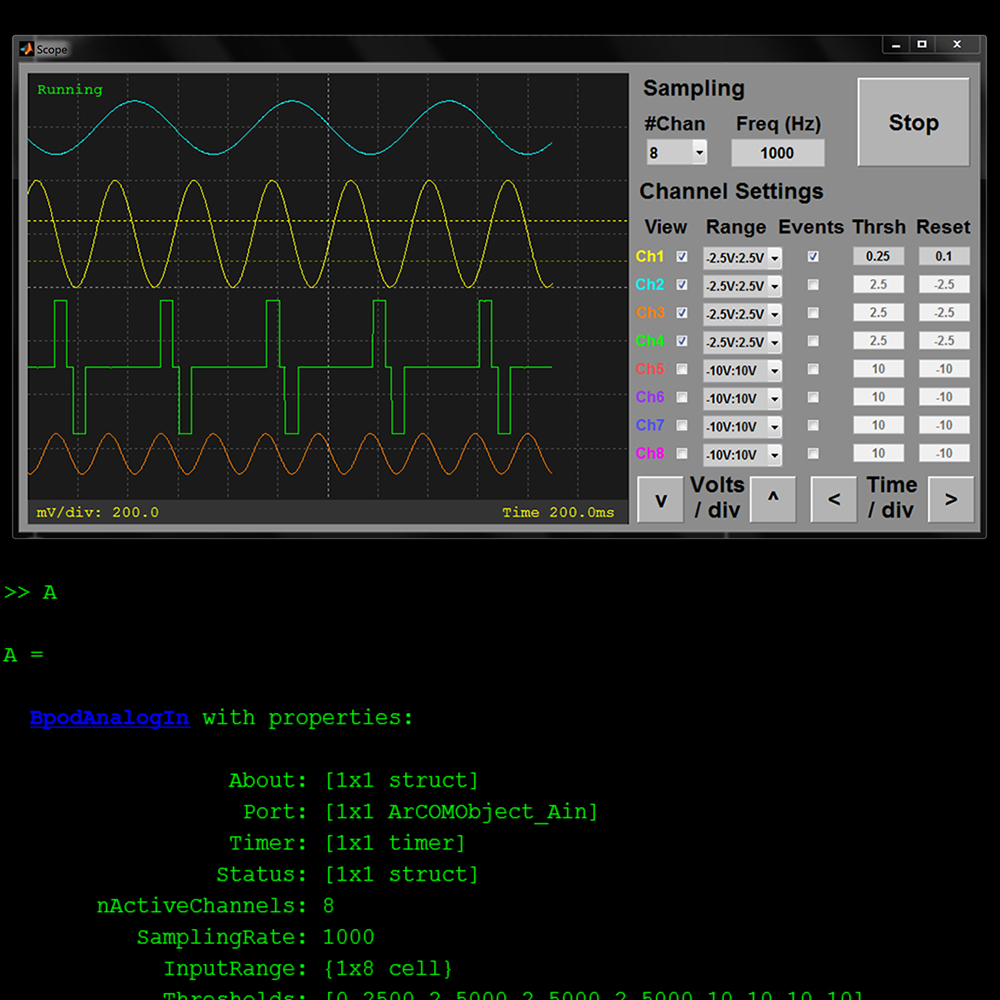

# Analog Input Module

<!-- todo: use html to size images -->
The analog input module records voltage waveforms from 8 input channels, and sends voltage threshold crossing events to the Bpod state machine.

Firmware for the analog input module is available [here](https://github.com/sanworks/Bpod_AnalogInput_Firmware).

## Hardware Specs (v1):

- Arduino-compatible 180MHz ARM Cortex M4 processor ([Teensy 3.6](https://www.pjrc.com/store/teensy36.html))
- Integrated analog to digital (ADC) - Analog Devices [AD7327](http://www.analog.com/media/en/technical-documentation/data-sheets/AD7327.pdf) 
- Voltage precision: 12-bit
- 4  single-ended input range settings: -10V:10V, -5V:5V, -2.5V:2.5V, 0V:10V
- 8MB/s USB data transfer
- 16GB microSD memory for logging waveform data
- Max sampling rate: 10kHz
- Configurable voltage thresholds for generating behavior events, to control the Bpod State Machine.
- Dedicated port to stream analog data directly to the analog output module (for closed loop applications)
## Hardware Specs (v2):

- Arduino-compatible 600MHz ARM Cortex M7 processor ([Teensy 4.1](https://www.pjrc.com/store/teensy41.html))
- Highly integrated analog to digital (ADC) - Analog Devices [AD7606C](https://www.analog.com/media/en/technical-documentation/data-sheets/ad7606c-16.pdf)
- Voltage precision: 16-bit
- 7 single-ended input range settings: -12.5V:12.5V, -10V:10V, -6.5V:6.5V, -5V:5V, -2.5V:2.5V, 0V:5V, 0V:10V
- 8MB/s USB data transfer
- 16GB microSD memory for logging waveform data
- Max sampling rate: 50kHz
- Configurable voltage thresholds for generating behavior events, to control the Bpod State Machine.
- Dedicated port to stream analog data directly to the analog output module (for closed loop applications)
- Galvanic isolation divides analog interface from USB and MCU
- Anti-Alias filtering and oversampling on-chip
- True-differential mode selectable per-channel, w/ certain voltage ranges
- 5V reference source included to simplify connection of resistive sensors

## Bill of Materials
### AIM v1
<iframe width=1000 height=600 jsname="L5Fo6c" jscontroller="usmiIb" jsaction="rcuQ6b:WYd;" class="YMEQtf L6cTce-purZT L6cTce-pSzOP KfXz0b" sandbox="allow-scripts allow-popups allow-forms allow-same-origin allow-popups-to-escape-sandbox allow-downloads allow-modals" frameborder="0" aria-label="Spreadsheet, AnalogInputModule BOM" allowfullscreen="" src="https://docs.google.com/spreadsheets/d/1B28oYLb75R5Aai4ZGmX7yfROE-Glmrg1MVKQzdOTojA/htmlembed?authuser=0"></iframe>

### AIM v2
<iframe width=1000 height=600 jsname="L5Fo6c" jscontroller="usmiIb" jsaction="rcuQ6b:WYd;" class="YMEQtf DnR2hf L6cTce-purZT L6cTce-pSzOP KfXz0b" sandbox="allow-scripts allow-popups allow-forms allow-same-origin allow-popups-to-escape-sandbox allow-downloads allow-modals" frameborder="0" aria-label="Spreadsheet, Analog Input Module 2 rev1.0 BOM" style="height: 903px" allowfullscreen="" src="https://docs.google.com/spreadsheets/d/1R63oUVdTBbxqu8eVUPFfh0Rz5ioP0WGE2bFruKp68T4/htmlembed?authuser=0"></iframe>