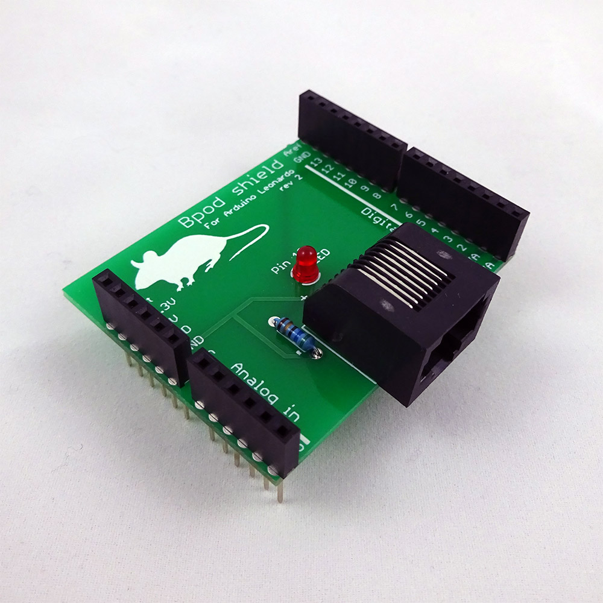

# Arduino shield 0.5

The Bpod/Arduino shield allows Bpod to control Arduino devices. It's very simple to build. Here's how.

1. Order all parts in the [Bill of Materials.](#bill-of-materials)
    - These parts can be purchased from commercial suppliers except for the printed circuit board.
    - We have previously used SeeedStudio's [FusionPCB service](http://www.google.com/url?q=http%3A%2F%2Fwww.seeedstudio.com%2Fservice%2Findex.php%3Fr%3Dsite%2FpcbService&sa=D&sntz=1&usg=AOvVaw0rlz-RzKAXgAXaBkL6c5KN) as follows:
        - **QTY:** 10
        - **PCB Layer:** 2
        - **PCB Thickness:** 1.6mm
        - **PCB Dimension:** 5cm max X 10cm max
        - **PCB Color:** green
        - **Surface Finish:** HASL
    - This should work out to ~$2.39 per board for an order of 10 boards (Jan 2014). Select "Next".
    - Select: C:\\Bpod\\CAD\\PCB\\BpodArduinoShield\\BpodArduinoShield\_r1\_Gerber.zip and finish the order.
2. Gather tools. You'll need:
    - A clean soldering iron and sponge
    - Solder
3. Follow the assembly instructions

## Assembly Instructions
- Solder the components into the board as shown. 
- DO NOT cut the legs from the bottom of the strip headers after soldering - they will plug into Arduino.

## Bill of Materials
<iframe width=1000 height=300 jsname="L5Fo6c" jscontroller="usmiIb" jsaction="rcuQ6b:WYd;" class="YMEQtf L6cTce-purZT L6cTce-pSzOP KfXz0b" sandbox="allow-scripts allow-popups allow-forms allow-same-origin allow-popups-to-escape-sandbox allow-downloads allow-modals" frameborder="0" aria-label="Spreadsheet, Bpod Arduino Shield r1 BOM" allowfullscreen="" src="https://docs.google.com/spreadsheets/d/0Ar9i-aWhPeIIdFlKNGx3YTVDSEZyZW1XYUxFTy1yeXc/htmlembed?authuser=0"></iframe>