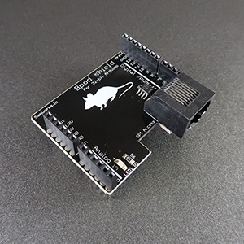

# Arduino Shield Gen2
Bpod Arduino shield for Bpod 0.7+, designed by [Sanworks](https://www.google.com/url?q=https%3A%2F%2Fsanworks.io%2Findex.php&sa=D&sntz=1&usg=AOvVaw3ONKsl0feSx8_-0wLMw013).

The Arduino shield interfaces the Bpod state machine with Arduino M0, Arduino Zero, Arduino Due or Adafruit Metro M4.

It is an interface for making custom Arduino-based modules, encapsulating different sensors and actuators.

The shield exchanges UART messages via Arduino serial objects: Serial1 (Arduino M0, Zero, Metro M4) or Serial (Arduino Due).

It uses only Arduino digital pins 0 and 1. Pin 13's LED is broken out to the top of the shield for visibility.

The UART stream is buffered to full-duplex RS-485 via a converter IC. An identical chip on the state machine restores the message to single-ended 3.3V logic levels.

Example Arduino files for use with the Bpod shield + Arduino are available [here](https://www.google.com/url?q=https%3A%2F%2Fgithub.com%2Fsanworks%2FBpod_Gen2%2Ftree%2Fmaster%2FExamples%2FFirmware%2FBpod%2520Shield&sa=D&sntz=1&usg=AOvVaw1FYEq0fUn5sUuEtUEJpUA7).

## Bill of Materials
<iframe width=1000 height=400 jsname="L5Fo6c" jscontroller="usmiIb" jsaction="rcuQ6b:WYd;" class="YMEQtf L6cTce-purZT L6cTce-pSzOP KfXz0b" sandbox="allow-scripts allow-popups allow-forms allow-same-origin allow-popups-to-escape-sandbox allow-downloads allow-modals" frameborder="0" aria-label="Spreadsheet, Bpod Arduino Shield Gen2 BOM" allowfullscreen="" src="https://docs.google.com/spreadsheets/d/1w6H0hiug1EVmc4b8JeVq-62S_cei3RZzO9uidd2_doI/htmlembed?authuser=0"></iframe>