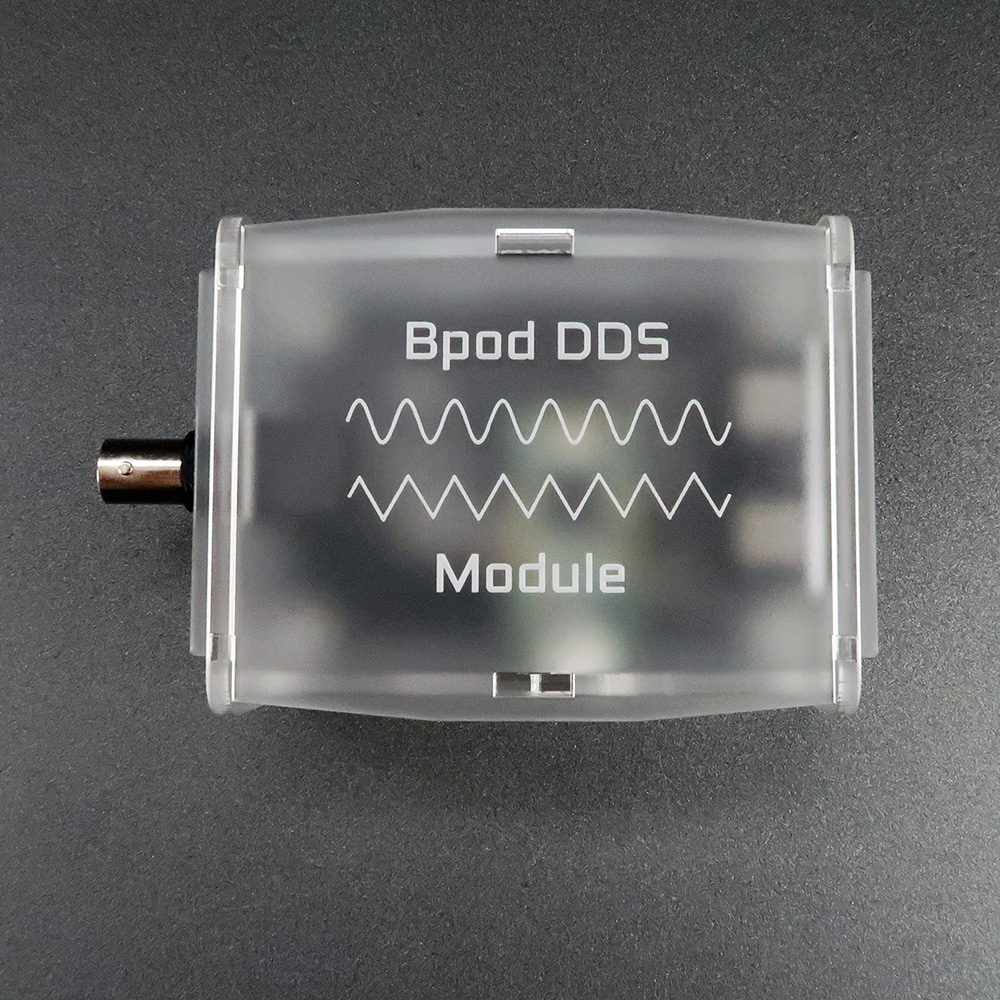

# DDS Module

The DDS (direct digitzal synthezier) module outputs a continuous sine or triangle wave, with frequency and amplitude modulated by the state machine, a separate Bpod module or both in parallel.

Specs:

- Arduino-compatible 96MHz ARM Cortex M4 processor ([Teensy 3.2](https://www.google.com/url?q=https%3A%2F%2Fstore.hackaday.com%2Fproducts%2Fteensy-3-2&sa=D&sntz=1&usg=AOvVaw2eJPEnIoNKdJW4GJnhuw7d))
- Direct digital synthesis IC (DDS) - [AD9834](http://www.google.com/url?q=http%3A%2F%2Fwww.analog.com%2Fmedia%2Fen%2Ftechnical-documentation%2Fdata-sheets%2FAD9834.pdf&sa=D&sntz=1&usg=AOvVaw2ItKpIVxjJLVPCs9YTOUNh).
    - Driven by 10MHz oscillator, anticipating output frequencies between 1 and 100kHz
- 12 bit digital amplitude control with an external DAC IC: [AD5620](http://www.google.com/url?q=http%3A%2F%2Fwww.analog.com%2Fmedia%2Fen%2Ftechnical-documentation%2Fdata-sheets%2FAD5620_5640_5660.pdf&sa=D&sntz=1&usg=AOvVaw0WaCaVCMPif5e58HyZ5Zrs)
    - Output amplitude from 150mV to 650mV peak-to-peak
- 1 Bpod state machine port.
- 1 Bpod module port (most often used for streaming digital inputs, with configurable mapping to frequency outputs).
- BNC output connector
- Module can optionally derive its power supply from pocket state machine (using an on-board jumper).

Note: This module loosely implements Analog Devices [Circuit Note CN0156](http://www.google.com/url?q=http%3A%2F%2Fwww.analog.com%2Fmedia%2Fen%2Freference-design-documentation%2Freference-designs%2FCN0156.pdf&sa=D&sntz=1&usg=AOvVaw2C80Ga95lsdW_ehrhdkAvk) for amplitude control. The output channel is directly driven by the DDS IC, resulting in a DC offset that varies slightly with the amplitude setting. See the amplitude adjustment section in the [MATLAB plugin documentation](../module-documentation/dds-module.md) for more info.
<!-- replace plugin doc link -->
Firmware for the DDS module is available [here](https://www.google.com/url?q=https%3A%2F%2Fgithub.com%2Fsanworks%2FBpod_DDS_Firmware&sa=D&sntz=1&usg=AOvVaw0lWJaTWggOnfuOwEguT7ce).

## Bill of Materials
<iframe width=1000 height=650 jsname="L5Fo6c" jscontroller="usmiIb" jsaction="rcuQ6b:WYd;" class="YMEQtf L6cTce-purZT L6cTce-pSzOP KfXz0b" sandbox="allow-scripts allow-popups allow-forms allow-same-origin allow-popups-to-escape-sandbox allow-downloads allow-modals" frameborder="0" aria-label="Spreadsheet, DDS Module BOM" allowfullscreen="" src="https://docs.google.com/spreadsheets/d/1aT7cE0vNaNuZWVvTubO3SvTyoXnzWGH9s9Fop74rqCc/htmlembed?authuser=0"></iframe>