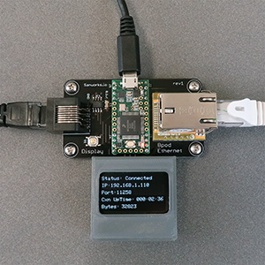

# Ethernet Module

The Bpod Ethernet module allows devices on the local network to exchange messages with the state machine (v0.7-0.9, 2.0).

For state machine v2, it can also act as the primary communication channel, replacing the USB cable. This allows computers to be significantly more distant from the rigs they control. To do this, upload [SM_Relay firmware](https://www.google.com/url?q=https%3A%2F%2Fgithub.com%2Fsanworks%2FBpod_Ethernet_Firmware%2Ftree%2Fmaster%2FEthernet_SM_Relay&sa=D&sntz=1&usg=AOvVaw3g99NVDpHuFkLFGD0HyLnF) to the Ethernet module, [Ethernet-routed state machine firmware](https://www.google.com/url?q=https%3A%2F%2Fgithub.com%2Fsanworks%2FBpod_StateMachine_Firmware%2Ftree%2Fver19%2FPreconfigured%2FVia%2520Ethernet%2FStateMachine-Bpod2_0&sa=D&sntz=1&usg=AOvVaw2j1xvnjnEKCVEWiepKHRKM) to the state machine, and call Bpod with an IP address argument - e.g. Bpod('192.168.1.110'). Note: you must have Bpod Console v1.5.3 or newer.

NOTE: Currently, the module requires the MATLAB instrument control toolbox. An alternative (free and open) interface via PsychToolbox is under development.

## Bill of Materials
<iframe width=1000 height=500 jsname="L5Fo6c" jscontroller="usmiIb" jsaction="rcuQ6b:WYd;" class="YMEQtf L6cTce-purZT L6cTce-pSzOP KfXz0b" sandbox="allow-scripts allow-popups allow-forms allow-same-origin allow-popups-to-escape-sandbox allow-downloads allow-modals" frameborder="0" aria-label="Spreadsheet, Ethernet Module BOM" allowfullscreen="" src="https://docs.google.com/spreadsheets/d/1z8u6tdBfbtg58nH9yGePwnynv0eD1yclxGzuWx1RY0M/htmlembed?authuser=0"></iframe>