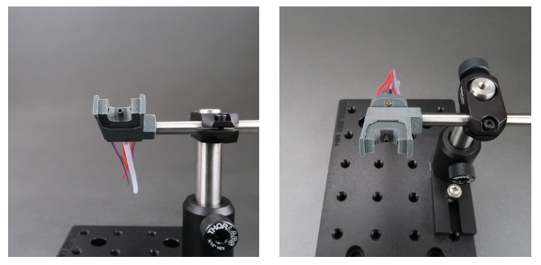

# Lickometer
The lickometer measures the precise time of lick events, and provides a steel tube to deliver liquid reward.

The lickometer uses a photogate created from an infrared emitter with a narrow (10 degree) beam angle and a spectrally matched phototransistor. A white LED angled towards the subject is provided, to be used as a cue or for feedback.

The lickometer interfaces with the state machine via the [port interface board](../assembly/port-breakout-board-assembly.md).

The lickometer design file contains two 3D printable parts:

- a scaffolding to hold the LED, sensor, emitter and 15ga drink tube
- a sheath to block ambient light and to mount the lickometer.

When printed with an FDM printer using a 0.4mm extruder, the components press-fit into the scaffolding, and the sheath press-fits over it.

The lickometer shown above was printed from gray [ColorFabb XT](http://www.google.com/url?q=http%3A%2F%2Fcolorfabb.com%2Fco-polyesters&sa=D&sntz=1&usg=AOvVaw2UoqZxa9RbpGsPYXS3IBZK) Copolyester.

A 4-40 nut press-fits into a pocket in the sheath, to mount it to a ThorLabs mini-series post.

Print settings are specified in a text document that accompanies the design files on [Github](https://www.google.com/url?q=https%3A%2F%2Fgithub.com%2Fsanworks%2FBpod-CAD%2Ftree%2Fmaster%2FPorts%2FLickometer&sa=D&sntz=1&usg=AOvVaw05HKXzALgOeBl51p9pBbpi).

The mount shown in the images above provides coarse adjustment in 3 axes, and rotation about 2 axes. Its components are:

- 1 Imperial [MS series post](https://www.google.com/url?q=https%3A%2F%2Fwww.thorlabs.com%2Fnewgrouppage9.cfm%3Fobjectgroup_id%3D1257&sa=D&sntz=1&usg=AOvVaw0CpQQOCeOCFk1I0pWra913) ([MS3R](https://www.google.com/url?q=https%3A%2F%2Fwww.thorlabs.com%2Fthorproduct.cfm%3Fpartnumber%3DMS3R&sa=D&sntz=1&usg=AOvVaw00wS6PkQeq5d5OJCS22wME) shown; 6mm mini-series post with 4-40 threaded end; choose length to match your assay)
- 1 [RA90TR](https://www.google.com/url?q=https%3A%2F%2Fwww.thorlabs.com%2Fnewgrouppage9.cfm%3Fobjectgroup_id%3D1985%26pn%3DRA90TR%239797&sa=D&sntz=1&usg=AOvVaw0aoKa_ufsTDJzeR5JDfcgL) (1/2" to 6mm post clamp)
- 1 Imperial [1/2" optical post](https://www.google.com/url?q=https%3A%2F%2Fwww.thorlabs.com%2Fnewgrouppage9.cfm%3Fobjectgroup_id%3D1266&sa=D&sntz=1&usg=AOvVaw13lLlYy7EtGKG8cU0-Tf1K) ([TR2](https://www.google.com/url?q=https%3A%2F%2Fwww.thorlabs.com%2Fthorproduct.cfm%3Fpartnumber%3DTR2&sa=D&sntz=1&usg=AOvVaw1h74UB1qRBsUSwposM3AQX) shown, choose length to match your assay)
- 1 Imperial [1/2" post holder](https://www.google.com/url?q=https%3A%2F%2Fwww.thorlabs.com%2Fnewgrouppage9.cfm%3Fobjectgroup_id%3D1268&sa=D&sntz=1&usg=AOvVaw3uTs4Zo3hXUnzEP5L34Ko2) ([PH2](https://www.google.com/url?q=https%3A%2F%2Fwww.thorlabs.com%2Fthorproduct.cfm%3Fpartnumber%3DPH2%23ad-image-0&sa=D&sntz=1&usg=AOvVaw3ExMzJjGmqHNHZZ7DIQ9Y9) shown, choose length to match your assay)
- 1 Imperial [BA1S](https://www.google.com/url?q=https%3A%2F%2Fwww.thorlabs.com%2Fthorproduct.cfm%3Fpartnumber%3DBA1S&sa=D&sntz=1&usg=AOvVaw3P-sOF5G4d-1pdRf8NfX_y) mounting base

The bill of materials for the lickometer is shown below:
<iframe width=1000 height=350 jsname="L5Fo6c" jscontroller="usmiIb" jsaction="rcuQ6b:WYd;" class="YMEQtf L6cTce-purZT L6cTce-pSzOP KfXz0b" sandbox="allow-scripts allow-popups allow-forms allow-same-origin allow-popups-to-escape-sandbox allow-downloads allow-modals" frameborder="0" aria-label="Spreadsheet, Lickometer BOM" allowfullscreen="" src="https://docs.google.com/spreadsheets/d/18Ho9eff9zoy9dI3QwjUVwABjPnf5bNUgEpQBKByetDY/htmlembed?authuser=0"></iframe>