# Mouse Behavior Port Assembly

The mouse behavior port combines a photo-gate with a steel tube for delivering liquid reward, in a 3D-printed housing.

It allows freely moving subjects to indicate decisions and collect rewards.

The behavior port uses a photogate created from an infrared emitter with a narrow (10 degree) beam angle and a spectrally matched phototransistor.

A white LED embedded in the port illuminates it, to be used as a decision cue or for feedback.

The behavior port interfaces with the Bpod state machine via the [port interface board](../assembly/port-breakout-board-assembly.md).

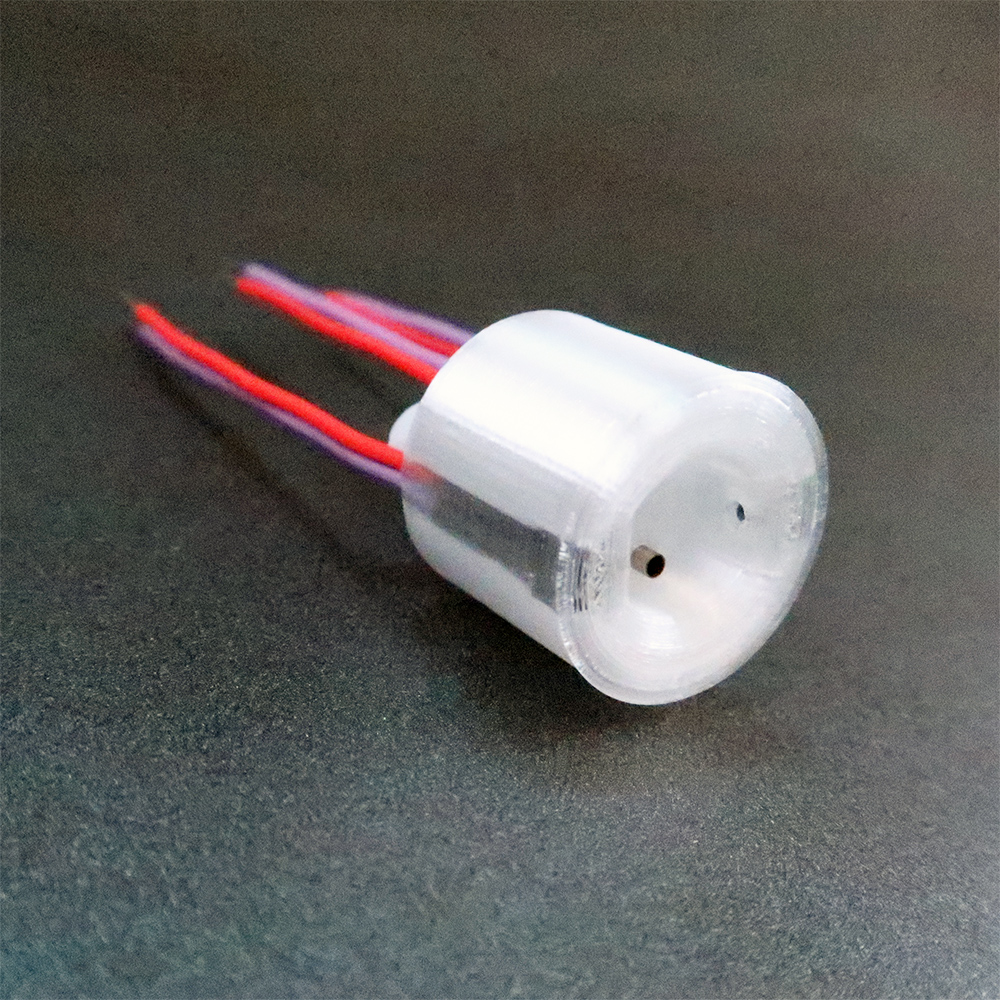

## Assembly Instructions
<!-- todo: resize images -->

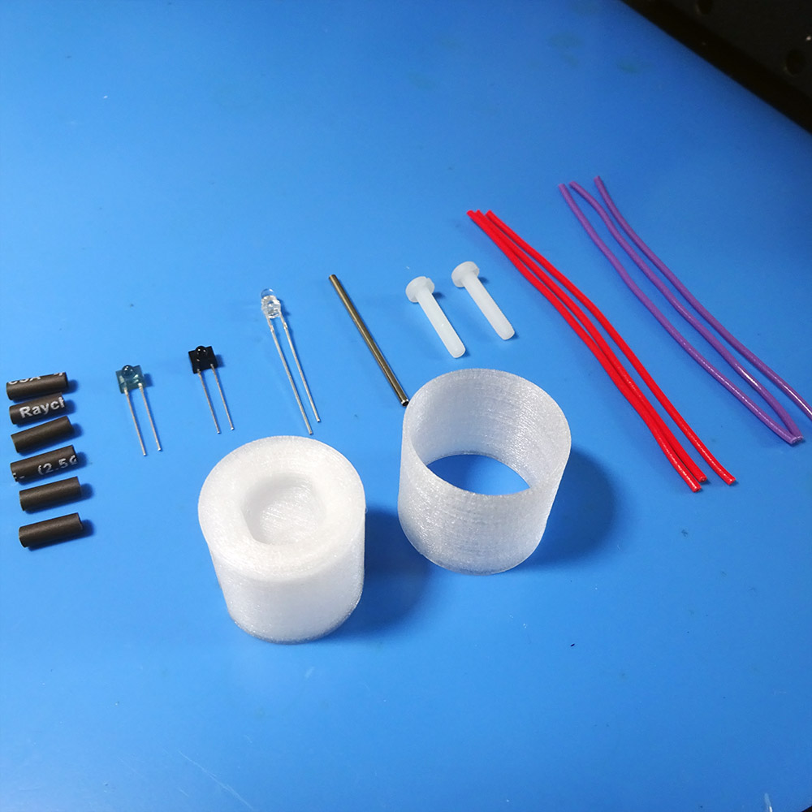

**Top row** (from the left):

- 6x 12mm lengths of heat shrink tubing
- IR emitter
- Phototransistor
- White 3mm LED
- A 35mm length of 15ga stainless steel hypodermic tubing (deburred)
- 2x M4, 16mm screws
- 3x red 22Ga solid-core wires 70mm long
- 3x purple 22Ga solid-core wires 70mm long

**Bottom row** (from the left):

- 3D printed Port (using clear [XT Copolyester](http://www.google.com/url?q=http%3A%2F%2Fcolorfabb.com%2Fco-polyesters%2Fcolorfabb-xt&sa=D&sntz=1&usg=AOvVaw3W6frE7aFTeOuZCd3WLeid))
- 3D printed sheath.

**You will also need:** a soldering iron, a wire stripper, a wire cutter, a [third hand](https://www.google.com/search?q=third+hand&espv=2&biw=1393&bih=802&site=webhp&source=lnms&tbm=isch), an M3 bottoming tap and a heat gun.

**Step 1:** With the wire stripper (using the 22ga hole), remove 4mm from each end of each wire:

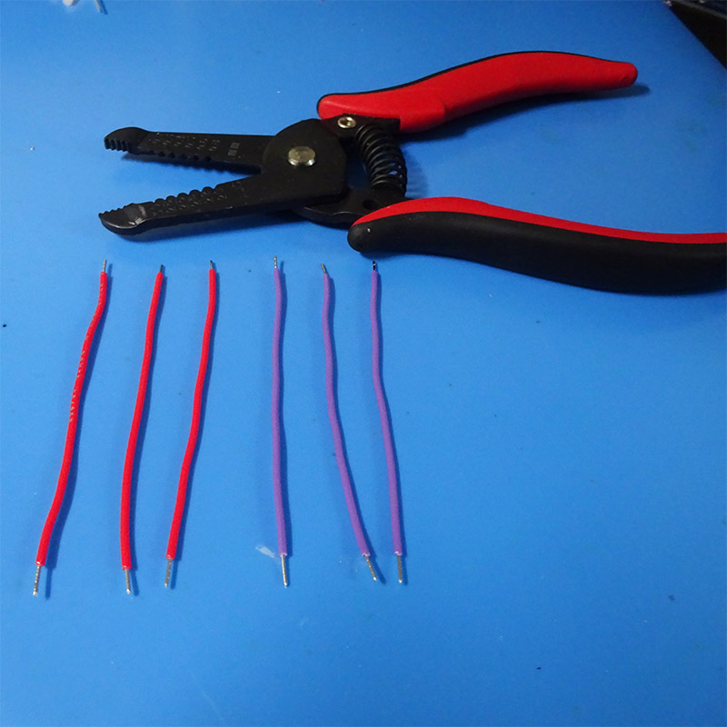

**Step 2:** Mount the infrared emitter in the 3rd hand, facing you, and trim its leads. 

Next, solder the purple (ground) wire to the left lead, and the red (power) wire to the right lead.

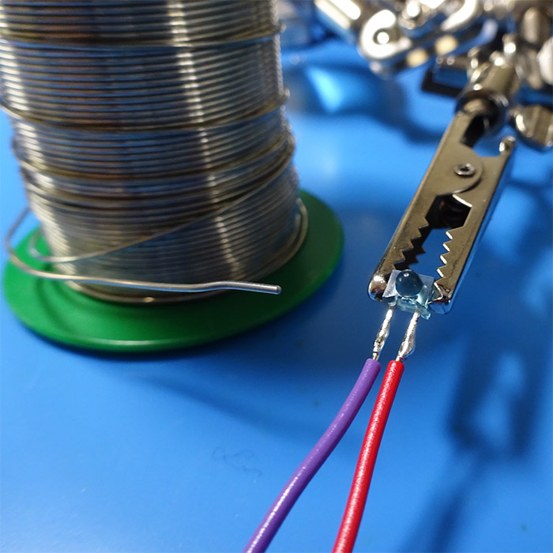

**Step 4:** Repeat steps 2 and 3 for the phototransistor and the white LED. For the white LED, the longer leg (before you clip them) should be attached to the red wire.

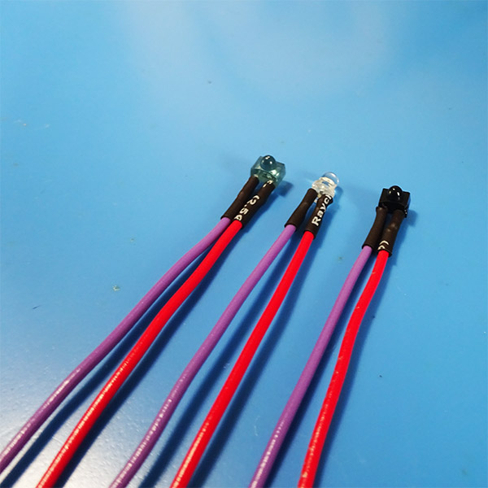

**Step 5:** Carefully tap the two M4 holes on the back-side of the port. Ensure that the nylon M4 screws can be inserted to ~2/3 of their length:

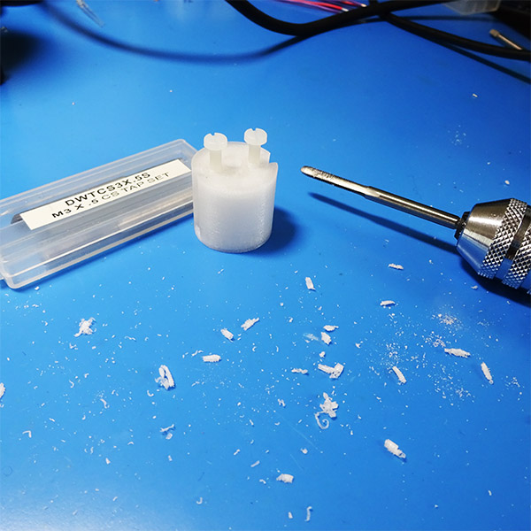

**Step 6**: Remove the screws and insert the steel tube into the hole matching its size. This may require some force initially.

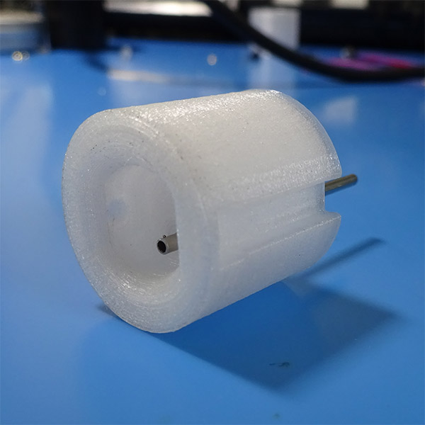

**Step 7**: Press the white LED into place. It is a press-fit, so you may need a small screwdriver to assist.

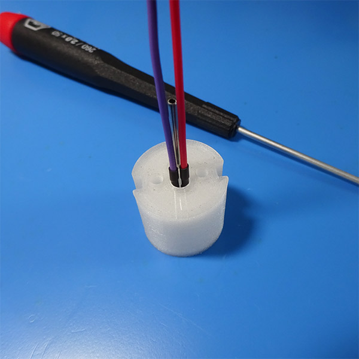

**Step 8**: Reinsert the M4 screws.

Next, Press the IR emitter and photo-transistor into place. When the steel tube is on the bottom and you are facing the port (see image from Step 6), the IR emitter (blue) should go on the right, and the photo-transistor (black) should go on the left:

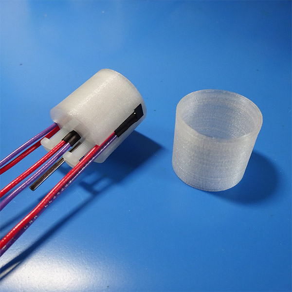

**Step 9:** Press the port into the sheath:

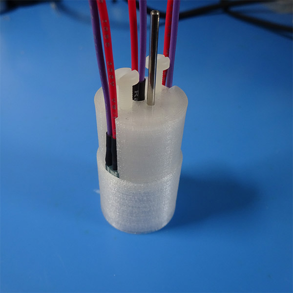

Congratulations, your port is complete!

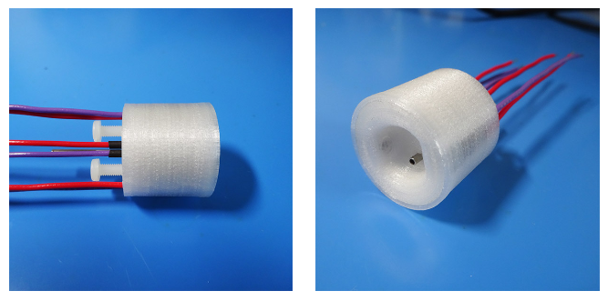

Next, connect it to a [port interface board](../assembly/port-breakout-board-assembly.md) and test it with Bpod.

Note: The port design shown here has a thin layer of XT covering the sensor and emitter. However, we found that the optical clarity of the material is not always guaranteed in the print, occasionally producing a port that could not be used. The current design revision available in the Bpod repository has the sensor and emitter directly exposed, a configuration that has worked well in several labs.

## Bill of Materials
<iframe height=500 width=1000 jsname="L5Fo6c" jscontroller="usmiIb" jsaction="rcuQ6b:WYd;" class="YMEQtf L6cTce-purZT L6cTce-pSzOP KfXz0b" sandbox="allow-scripts allow-popups allow-forms allow-same-origin allow-popups-to-escape-sandbox allow-downloads allow-modals" frameborder="0" aria-label="Spreadsheet, Nosepoke BOM" allowfullscreen="" src="https://docs.google.com/spreadsheets/d/1sjXZLI-TCDGARnuvqxwgMVo9y7-Wfx3jGSRSFMjSV9U/htmlembed?authuser=0"></iframe>