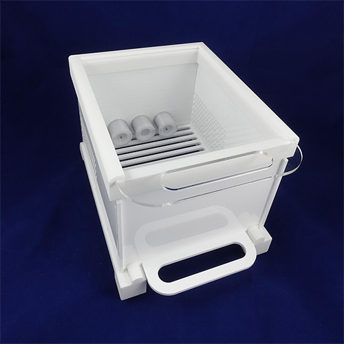
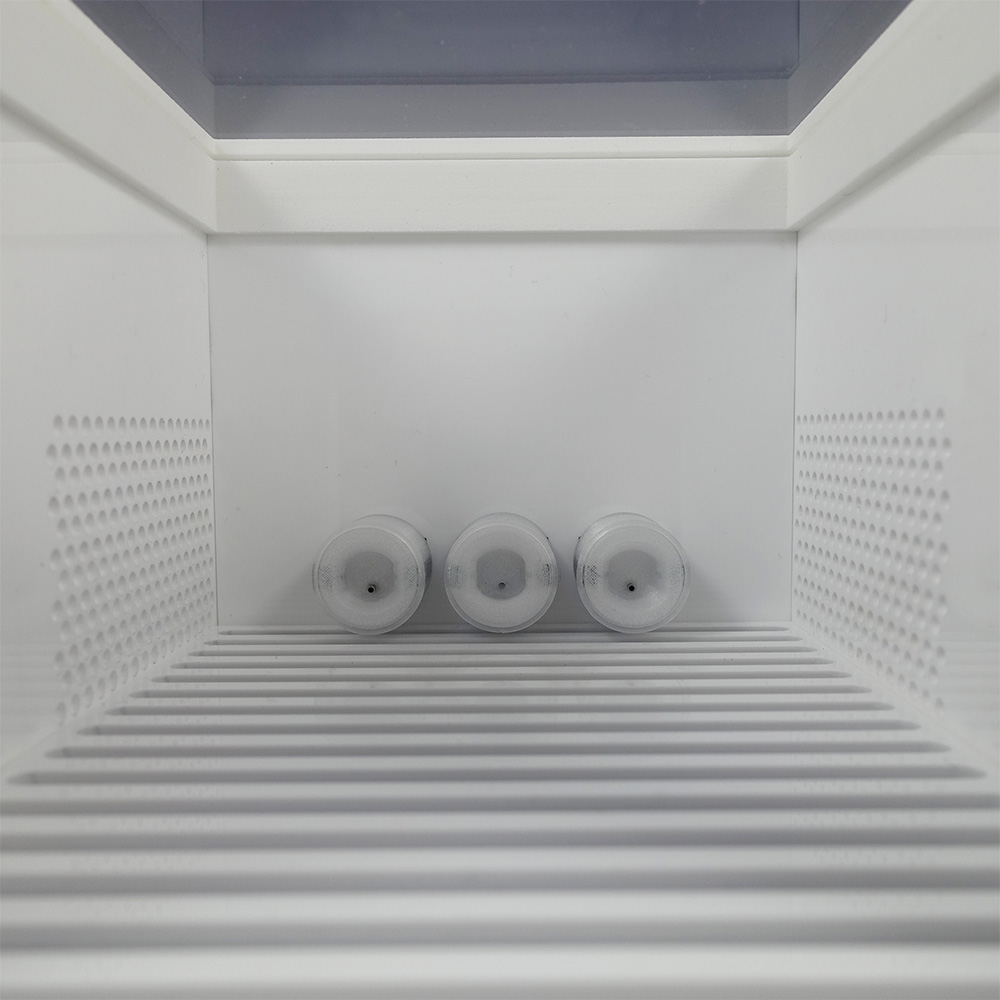

# Mouse Box
Design files for a mouse behavior box have been included in the Bpod repository.

The box allows two alternative forced choice (2AFC) and GO/NOGO tasks in freely moving mice.

It can be constructed entirely from 3mm laser cut acrylic and 3-d printed material (PLA preferred)

The box is designed to work with [Bpod Mouse Ports](./mouse-behavior-port-assembly.md). It features a floor with an easy release mechanism, and side-walls that are sound-permeable near the ports. A clear acrylic roof slides into place on a track, for imaging of the mouse during behavior.

The box uses 4 [rubber feet](http://www.google.com/url?q=http%3A%2F%2Fwww.digikey.com%2Fproduct-search%2Fen%3Fkeywords%3DSJ5523-9-ND&sa=D&sntz=1&usg=AOvVaw102GKcvFDmyLh0aW_lkkky). Aside from this, it requires no independent bill of materials. 

## Bill of Materials
Here it is shown with [the recommended solenoid valve](http://www.google.com/url?q=http%3A%2F%2Fwww.theleeco.com%2Felectro-fluidic-systems%2Fsolenoid-valves%2Flhd%2Fsoft-tube-ported-style.cfm&sa=D&sntz=1&usg=AOvVaw1w0EV-e7R4MRGhzhhuY39h) for Bpod (part#LHDA1231115H). You will have to block the bottom valve port.

<iframe width=1000 height=400 jsname="L5Fo6c" jscontroller="usmiIb" jsaction="rcuQ6b:WYd;" class="YMEQtf L6cTce-purZT L6cTce-pSzOP KfXz0b" sandbox="allow-scripts allow-popups allow-forms allow-same-origin allow-popups-to-escape-sandbox allow-downloads allow-modals" frameborder="0" aria-label="Spreadsheet, Mousebox Nosepoke Board BOM" allowfullscreen="" src="https://docs.google.com/spreadsheets/d/1ax3h8I4viZRAnkPIYAFTg07nmZ6zZAlredhUpqxPSgw/htmlembed?authuser=0"></iframe>

This version of the nosepoke board uses a trimmer potentiometer to adjust the LED current. This will enable you to set the maximum intensity of each port to some value with a light meter. Intensity is also controlled programmatically within Bpod via PWM.