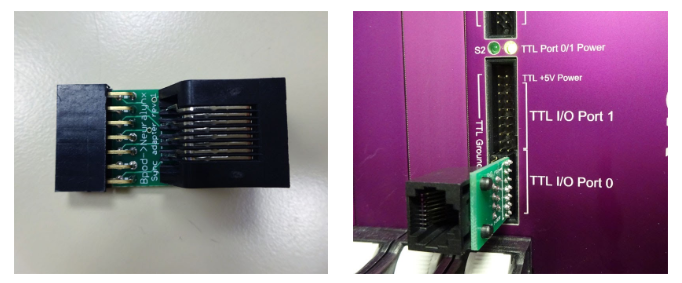

# Bpod/Neuralynx sync board assembly
Bpod/Neuralynx sync board

The Neuralynx sync board allows behavior and events logged by Bpod v0.5 to be sent to a [Neuralynx](http://www.google.com/url?q=http%3A%2F%2Fgoog_1444698261&sa=D&sntz=1&usg=AOvVaw2p8mm1NnJ2TM2HPH-y7pWR) [electrophysiology system](http://www.google.com/url?q=http%3A%2F%2Fneuralynx.com%2Fproducts%2Fdigital_data_acquisition_systems%2F&sa=D&sntz=1&usg=AOvVaw2_INAnaz2--DKA_ANjr_Zr).

**Note: Bpod state machine 0.7+ Does not require the sync board.**

It's very simple to build. Here's how.

1. Order all parts in the [Bill of Materials.](/site/bpoddocumentation/assembling-bpod/bpodneuralynx-sync-board/bill-of-materials?authuser=0)
    - These parts can be purchased from commercial suppliers except for the printed circuit board.
    - We have previously used SeeedStudio's [FusionPCB service](http://www.google.com/url?q=http%3A%2F%2Fwww.seeedstudio.com%2Fservice%2Findex.php%3Fr%3Dsite%2FpcbService&sa=D&sntz=1&usg=AOvVaw0rlz-RzKAXgAXaBkL6c5KN) as follows:
        - **QTY:** 10
        - **PCB Layer:** 2
        - **PCB Thickness:** 1.6mm
        - **PCB Dimension:** 5cm max X 5cm max
        - **PCB Color:** green
        - **Surface Finish:** HASL
    - This should work out to ~$2.39 per board for an order of 10 boards (Jan 2014). Select "Next".
    - Select C:\\Bpod\\CAD\\PCB\\NeuralynxSync\\BpodNlxSync.zip and finish the order.
2. Gather tools. You'll need:
    - A clean soldering iron and sponge
    - Solder
3. Follow the assembly instructions.

## Assembly Instructions
Solder the two components into the board as shown below (left).

Then, connect a CAT6 cable between the "sync" port on the Bpod device and the ethernet jack on the adapter board.

The adapter board plugs into the Neuralynx TTL port as shown below (right).

WARNING: On some Neuralynx systems, there is enough space below the bottom pin, for the sync board to plug into air. If you accidentally do this, your lowest bit will be lost! Make sure each row holes on the sync board header are aligned with Neuralynx pins.

Here are images of the final product:

## Bill of Materials
<iframe height=300 width=1000 jsname="L5Fo6c" jscontroller="usmiIb" jsaction="rcuQ6b:WYd;" class="YMEQtf L6cTce-purZT L6cTce-pSzOP KfXz0b" sandbox="allow-scripts allow-popups allow-forms allow-same-origin allow-popups-to-escape-sandbox allow-downloads allow-modals" frameborder="0" aria-label="Spreadsheet, Neuralynx Bpod sync adapter BOM" allowfullscreen="" src="https://docs.google.com/spreadsheets/d/1BTuCKdFUepXkjJUmtOaI6Y0d3yqW7Z4J8Y5CcgFr-dc/htmlembed?authuser=0"></iframe>