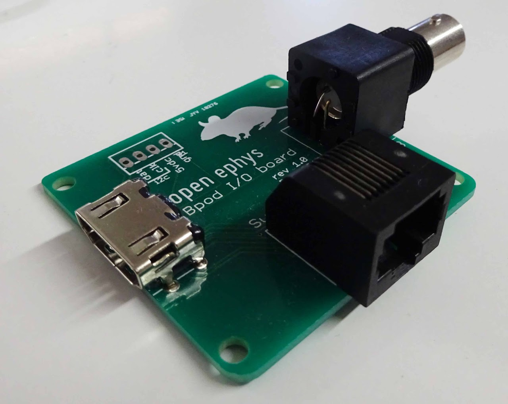

# Bpod/OpenEphys Sync Board

The Open Ephys sync board allows behavior and events logged by Bpod to be sent to an [Open Ephys](http://www.google.com/url?q=http%3A%2F%2Fopen-ephys.org%2F&sa=D&sntz=1&usg=AOvVaw3oIFGmg6Jg8f-lrMlFh0q_) electrophysiology system.

**Note: Bpod state machine 0.7+ does not require the sync board.**

It's very simple to build. Here's how.

1. Order all parts in the Bill of Materials
    - These parts can be purchased from commercial suppliers except for the printed circuit board.
    - We have previously used SeeedStudio's [FusionPCB service](http://www.google.com/url?q=http%3A%2F%2Fwww.seeedstudio.com%2Fservice%2Findex.php%3Fr%3Dsite%2FpcbService&sa=D&sntz=1&usg=AOvVaw0rlz-RzKAXgAXaBkL6c5KN) as follows:
        - **QTY:** 10
        - **PCB Layer:** 2
        - **PCB Thickness:** 1.6mm
        - **PCB Dimension:** 5cm max X 5cm max
        - **PCB Color:** green
        - **Surface Finish:** HASL
    - This should work out to ~$2.39 per board for an order of 10 boards (Jan 2014). Select "Next".
    - Select C:\\Bpod\\CAD\\PCB\\OpenEphysSync\\OpenEphysSync\_r1\_Gerber.zip and finish the order.
2. Gather tools. You'll need:
    - A clean soldering iron and sponge
    - Solder
3. Follow the assembly instructions.

## Assembly instructions
Solder the three components into the board as shown below.

The HDMI connector pins are surface mount, and will require [special soldering techniques](https://www.youtube.com/watch?v=5uiroWBkdFY).

Here is an image of the final product:

## Bill of Materials
<iframe width=1000 height=300 jsname="L5Fo6c" jscontroller="usmiIb" jsaction="rcuQ6b:WYd;" class="YMEQtf L6cTce-purZT L6cTce-pSzOP KfXz0b" sandbox="allow-scripts allow-popups allow-forms allow-same-origin allow-popups-to-escape-sandbox allow-downloads allow-modals" frameborder="0" aria-label="Spreadsheet, OpenEphysSync_r1_BOM" allowfullscreen="" src="https://docs.google.com/spreadsheets/d/0Ar9i-aWhPeIIdE9xckdCelU4NlFZVUpPRzROQk5mUUE/htmlembed?authuser=0"></iframe>