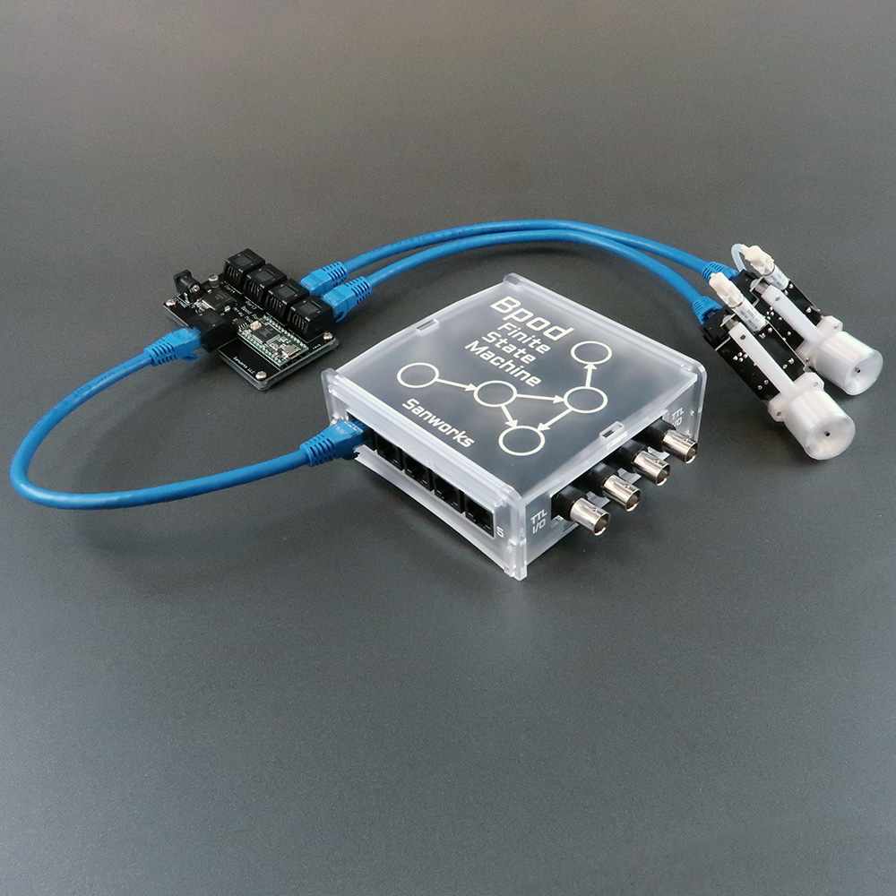

# Port Array Module Assembly

The Port Array Module interfaces 4 behavior ports to a Bpod State Machine. 

Up to 5 port array modules may be used with a single state machine, for experiments requiring large numbers of behavior ports.

The Port Array Module is compatible with state machine r0.7+

## Bill of Materials
<iframe width=1000 height=500 jsname="L5Fo6c" jscontroller="usmiIb" jsaction="rcuQ6b:WYd;" class="YMEQtf L6cTce-purZT L6cTce-pSzOP KfXz0b" sandbox="allow-scripts allow-popups allow-forms allow-same-origin allow-popups-to-escape-sandbox allow-downloads allow-modals" frameborder="0" aria-label="Spreadsheet, Port Array Module BOM" allowfullscreen="" src="https://docs.google.com/spreadsheets/d/1koG_JYqBlHM2BV03bhV4nlo765IEthSyIkxVXH9f-bA/htmlembed?authuser=0"></iframe>