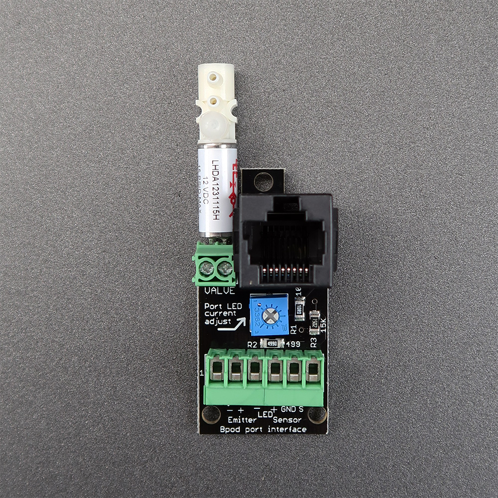
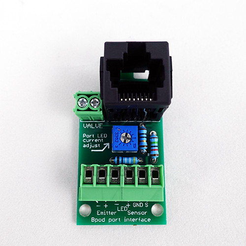

# Port Interface Board

Each port interface board connects one infrared photo-gate, one LED and one solenoid valve with the Bpod state machine via an Ethernet cable.

## Assembly
1. Solder the parts on to the board (through-hole version shown). Begin with the 3 resistors. Make sure their values match the values printed on the board. Next, solder the blue potentiometer, the 6-position screw terminal connector, the 2-position connector, and finally the Ethernet jack.

1. If you have a solenoid valve and wish to mount it directly to the board, clip 2mm off from leads with a wire cutter, insert the valve into the 2-position screw terminal and screw it in to place:

## Bill of Materials
<iframe height=400 width=700 jsname="L5Fo6c" jscontroller="usmiIb" jsaction="rcuQ6b:WYd;" class="YMEQtf L6cTce-purZT L6cTce-pSzOP KfXz0b" sandbox="allow-scripts allow-popups allow-forms allow-same-origin allow-popups-to-escape-sandbox allow-downloads allow-modals" frameborder="0" aria-label="Spreadsheet, Mousebox Nosepoke Board BOM" allowfullscreen="" src="https://docs.google.com/spreadsheets/d/1ax3h8I4viZRAnkPIYAFTg07nmZ6zZAlredhUpqxPSgw/htmlembed?authuser=0"></iframe>