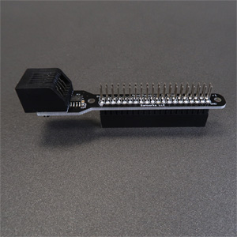

# Raspberry Pi Shim

The Bpod Raspberry Pi Shim interfaces the Bpod Finite State Machine r0.7 or newer with Raspberry Pi via its UART interface.

Its 'shim' form factor is designed to avoid mechanical collisions with other [Raspberry Pi hats](https://www.google.com/url?q=https%3A%2F%2Fwww.raspberrypi.org%2Fblog%2Fintroducing-raspberry-pi-hats%2F&sa=D&sntz=1&usg=AOvVaw22xUs8a2JFV6pfR_pDzxhh).

An extra-tall stacking pin header ensures compatibility with most Raspberry Pi enclosures.

Assembly is implicit from the PCB layout, with the exception of the stacking pin header which attaches as shown in the photo below.

## Bill of Materials
<iframe height=300 width=1000 jsname="L5Fo6c" jscontroller="usmiIb" jsaction="rcuQ6b:WYd;" class="YMEQtf L6cTce-purZT L6cTce-pSzOP KfXz0b" sandbox="allow-scripts allow-popups allow-forms allow-same-origin allow-popups-to-escape-sandbox allow-downloads allow-modals" frameborder="0" aria-label="Spreadsheet, Raspberry Pi Shim BOM" allowfullscreen="" src="https://docs.google.com/spreadsheets/d/1sg_CjjEeOa-BNOvEDrPs1JLkYYPr1-5xbWjqEkAero8/htmlembed?authuser=0"></iframe>