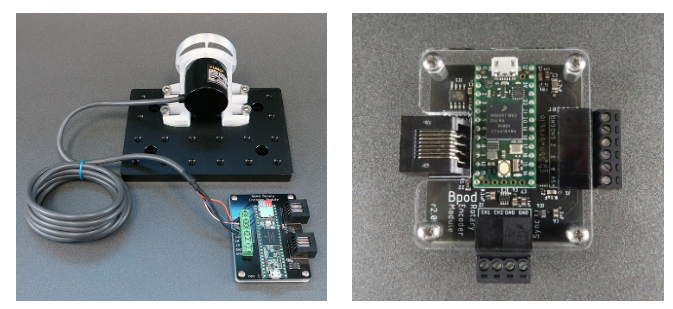

# Rotary Encoder Module

Left, V1; right V2

The Rotary encoder module interfaces a 1024-position quadrature rotary encoder (e.g. [Yumo E6B2-CWZ3E](https://www.google.com/url?q=https%3A%2F%2Fwww.sparkfun.com%2Fproducts%2F11102&sa=D&sntz=1&usg=AOvVaw3me6_W6cz4tQPHbkvVvfQV)) with the Bpod state machine and its governing computer. It can be used to capture paw movements, and generate behavioral events when position thresholds are crossed. There are two versions of the module with unique capabilities.

Version 1 (left, above) can stream the current position directly to the DDS or Analog Output module for low-latency closed loop sensory feedback. It can also log data to a microSD card during each experimental trial and dump it back between trials (instead of returning data via USB) if processing bandwidth is limited in your assay.

Version 2 (right, above) has a 2-channel analog output interface to synchronize the current wheel position and 3.3V sync pulses directly with Ephys or microscopy systems. It also has a much more powerful processor, allowing for more complex event threshold [criteria](/site/bpoddocumentation/user-guide/serial-interfaces/rotaryencodermodule?authuser=0).

Both models are compatible with Bpod State Machine r0.7 or newer.

Hardware Specs:

- Arduino-compatible ARM Cortex processors. **V1**: Cortex M4, 120MHz ([Teensy 3.5](https://www.google.com/url?q=https%3A%2F%2Fwww.pjrc.com%2Fstore%2Fteensy35.html&sa=D&sntz=1&usg=AOvVaw0N0dBwxMdAoe-dsuai3CSA), PJRC). **V2**: Cortex M7, 600MHz ([Teensy 4.0](https://www.google.com/url?q=https%3A%2F%2Fwww.pjrc.com%2Fstore%2Fteensy40.html&sa=D&sntz=1&usg=AOvVaw2bhTUAS_yZrDYvo8EKaXT-), PJRC)
- Screw terminal interface connects directly to rotary encoder wires
- 2 digital i/o lines exposed, capable of forming a hardware I2C interface for custom applications (V1 only)
- 2 analog output channels: 12-bit, 0-4V (V2 only)
- Design files for a 3D-printable mount and paw-manipulation wheels are provided in the Sanworks [Bpod-CAD](https://www.google.com/url?q=https%3A%2F%2Fgithub.com%2Fsanworks%2FBpod-CAD%2Ftree%2Fmaster%2FRotary%2520Encoder&sa=D&sntz=1&usg=AOvVaw0fRmG-2xYHZRwzU7KSTle2) repository.

Firmware for the Rotary Encoder module is available [here](https://www.google.com/url?q=https%3A%2F%2Fgithub.com%2Fsanworks%2FBpod_RotaryEncoder_Firmware&sa=D&sntz=1&usg=AOvVaw3P2j3QYw8vJD4SYkDNsaNT).

## Bill of Materials
### Version 1
<iframe width=1000 height=500 jsname="L5Fo6c" jscontroller="usmiIb" jsaction="rcuQ6b:WYd;" class="YMEQtf L6cTce-purZT L6cTce-pSzOP KfXz0b" sandbox="allow-scripts allow-popups allow-forms allow-same-origin allow-popups-to-escape-sandbox allow-downloads allow-modals" frameborder="0" aria-label="Spreadsheet, Rotary Encoder Module BOM" allowfullscreen="" src="https://docs.google.com/spreadsheets/d/1x7dX9o_PXsrM73ysIs31Eqibp1LFqf5qpn3Ep0Tz4T0/htmlembed?authuser=0"></iframe>

### Version 2
<iframe width=1000 height=500 jsname="L5Fo6c" jscontroller="usmiIb" jsaction="rcuQ6b:WYd;" class="YMEQtf DnR2hf L6cTce-purZT L6cTce-pSzOP KfXz0b" sandbox="allow-scripts allow-popups allow-forms allow-same-origin allow-popups-to-escape-sandbox allow-downloads allow-modals" frameborder="0" aria-label="Spreadsheet, Rotary Encoder Module BOM v2" style="height: 625px" allowfullscreen="" src="https://docs.google.com/spreadsheets/d/1cBd3iHp24S_bFverBJuZhGIcqhhSwu1MkoZHfk7eGFE/htmlembed?authuser=0"></iframe>