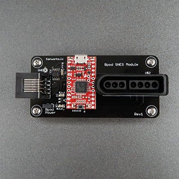
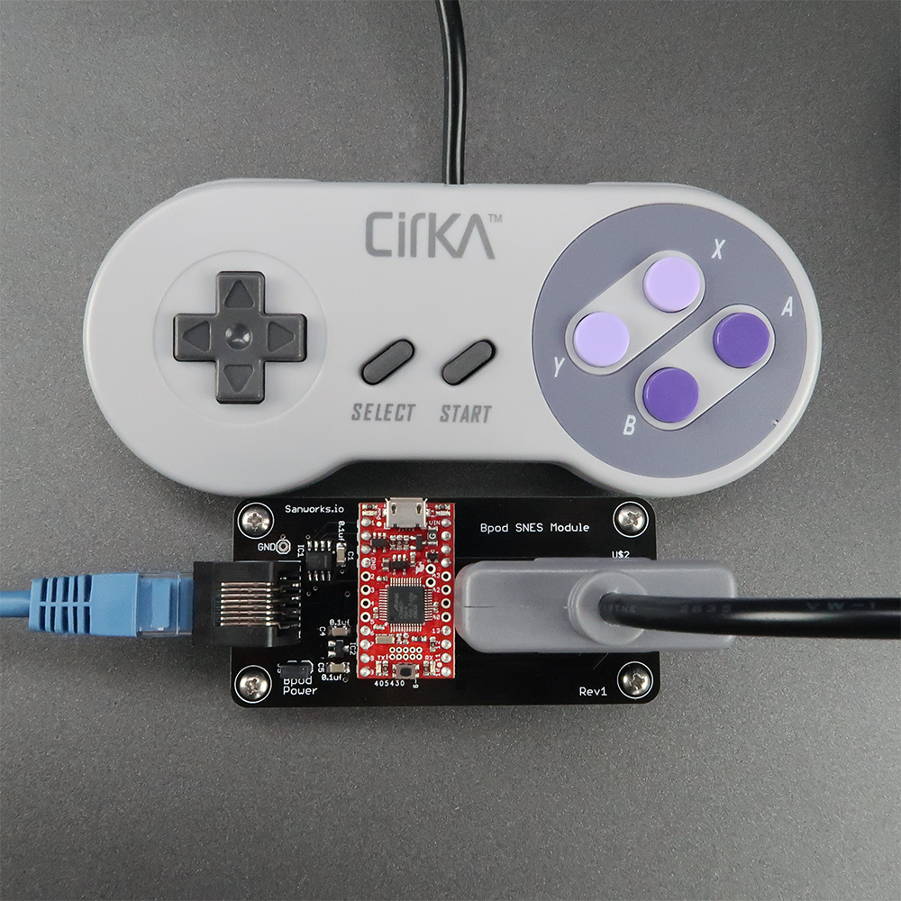

# SNES Module

The SNES module interfaces a Super Nintendo controller with Bpod. This provides a convenient button array for psychophysics tasks using human subjects. Pressing or releasing each of the gamepad's buttons generates a unique event that can be handled by the state machine. The gamepad's button states are read by the module at ~20kHz and detected events drive the state machine in ~100 microseconds, providing excellent temporal resolution on button press events. To validate the module, we dissected the popular [aftermarket controller](https://www.google.com/url?q=https%3A%2F%2Fwww.newegg.com%2FProduct%2FProduct.aspx%3FItem%3D9SIAD2K5AT9617&sa=D&sntz=1&usg=AOvVaw02pqZpxsn5tU4DIM8k7ocJ) pictured above, and soldered leads to the button footprint on its PCB, allowing us to create button press events with known onset times.

Compatible with Bpod 0.7+

Hardware Specs:

- Arduino-compatible 48MHz ARM Cortex M0 processor ([SAMD21 Breakout](https://www.google.com/url?q=https%3A%2F%2Fwww.sparkfun.com%2Fproducts%2F13664&sa=D&sntz=1&usg=AOvVaw0XeduDYUT1Y6LCsRG8inUF), Sparkfun Electronics)
- Circuitry to optionally derive controller power from Pocket State Machine (no separate USB cable required)

Firmware for the SNES module is available [here](https://www.google.com/url?q=https%3A%2F%2Fgithub.com%2Fsanworks%2FBpod_SNES_Firmware&sa=D&sntz=1&usg=AOvVaw3EbEdlJ9e0AtdysVZCSoJz).

## Bill of Materials
<iframe width=1000 height=500 jsname="L5Fo6c" jscontroller="usmiIb" jsaction="rcuQ6b:WYd;" class="YMEQtf L6cTce-purZT L6cTce-pSzOP KfXz0b" sandbox="allow-scripts allow-popups allow-forms allow-same-origin allow-popups-to-escape-sandbox allow-downloads allow-modals" frameborder="0" aria-label="Spreadsheet, SNESModule BOM" allowfullscreen="" src="https://docs.google.com/spreadsheets/d/14Su_MSOj3gjeDmfFUj0IptJ5FdFrRq1wjKRD93XW3-4/htmlembed?authuser=0"></iframe>