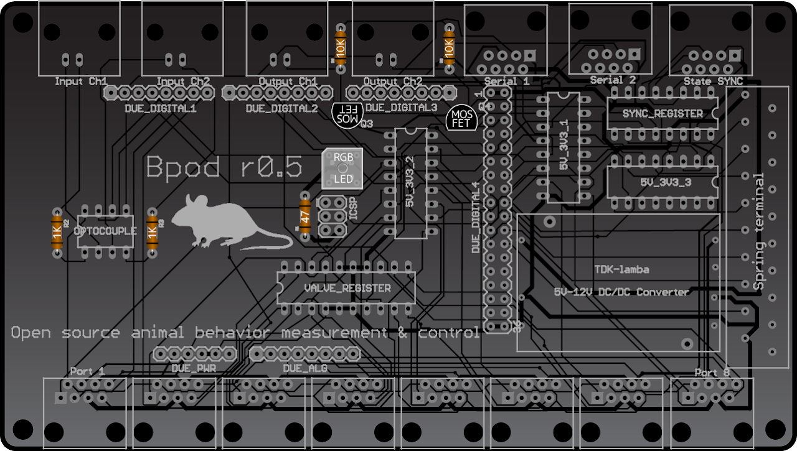
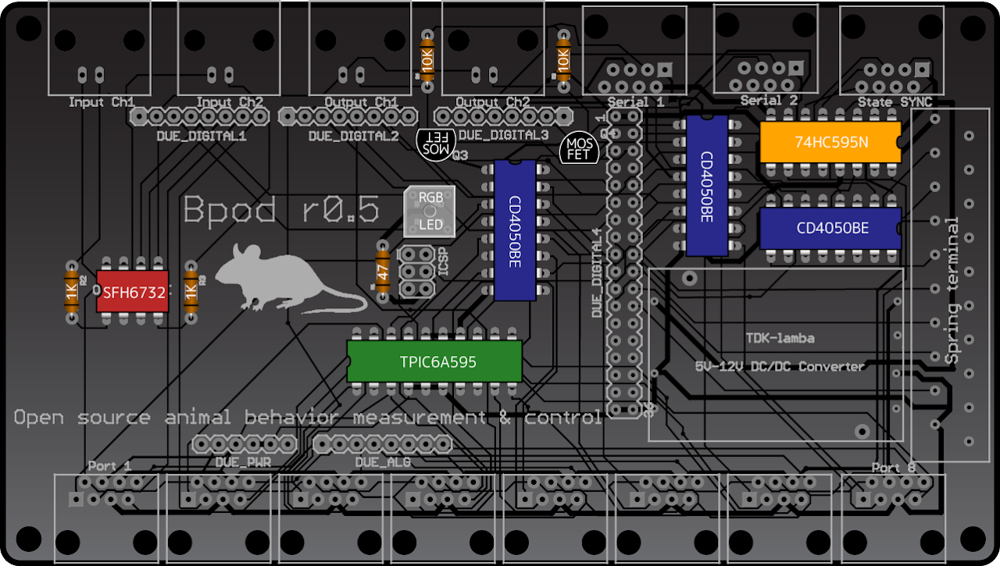
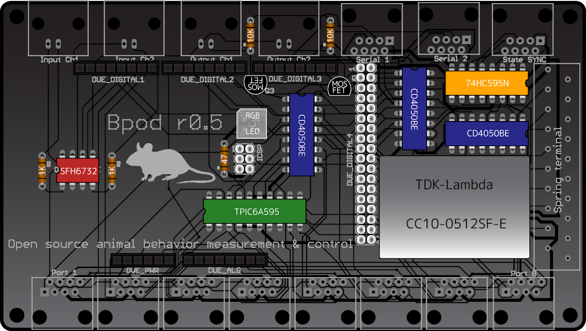
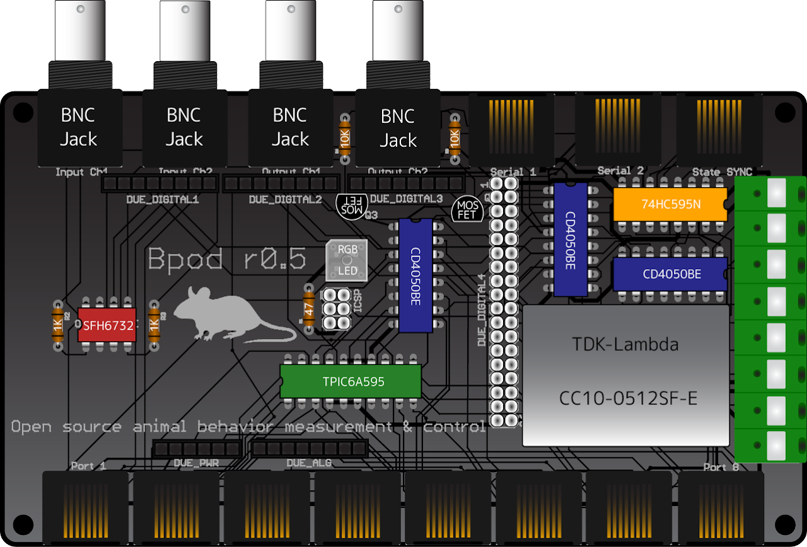
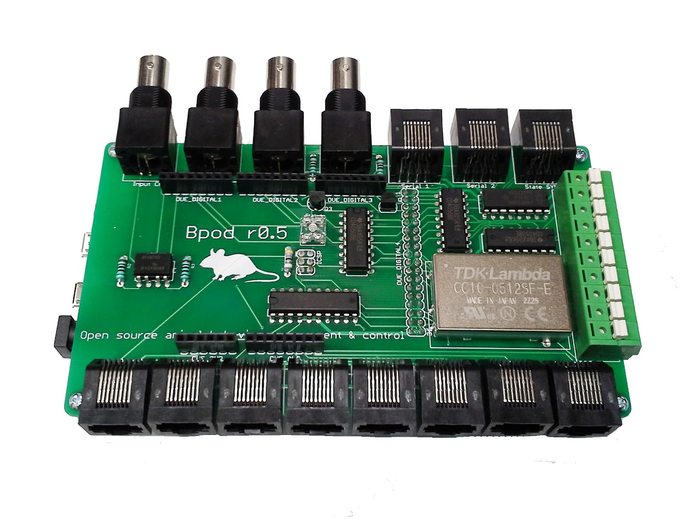

# State Machine 0.5

Bpod's state machine module can be assembled in as little as one hour at a soldering bench. Here's how.

1. Order all parts in the Bill of Materials
    - These parts can be purchased from commercial suppliers with two exceptions:
        - The printed circuit board. We have previously used SeeedStudio's [FusionPCB service](https://www.google.com/url?q=https%3A%2F%2Fwww.seeedstudio.com%2Ffusion_pcb.html&sa=D&sntz=1&usg=AOvVaw3L3Y1lhecWxtoORTkwuVV0) as follows:
            - **QTY:** 10
            - **PCB Layer:** 2
            - **PCB Thickness:** 1.6mm
            - **PCB Dimension:** 10cm max X 15cm max
            - **PCB Color:** green
            - **Surface Finish:** HASL
            - This should work out to ~$5.50 per board for an order of 10 boards (Jan 2014). Select "Next".
            - Select C:\\Bpod\\CAD\\PCB\\BpodDevice\\BpodGerber.zip and finish the order.
        - The acrylic enclosure. We have previously used Pololu's [Custom laser cutting service](http://www.google.com/url?q=http%3A%2F%2Fwww.pololu.com%2Fproduct%2F749&sa=D&sntz=1&usg=AOvVaw1kRSq-BYSIMpmunR-C21L0) as follows:
            - Select "Request a Quote"
            - Next to "My Files" click "Browse" and select C:\\Bpod\\CAD\\Enclosure\\BpodEnclosure\_r0\_5\_X.cdr, where X is the latest version number available.
            - Next to "Quantity" enter "N copies of layout provided" to order N Bpod enclosures.
            - Under "Material Selection" choose "Use This Material" to the right of the line: 3.0mm (1/8") / translucent / clear matte
            - Acknowledge the limitations and submit the quote request. Once the quote is provided (1-2 days), place an order for the enclosure.
2. Gather tools. You'll need:
    - A clean soldering iron and sponge
    - Solder
3. Follow the assembly instructions.

## Assembly Instructions
Before assembly, ensure that you have all parts specified in the bill of materials in appropriate quantities. You will also need a soldering iron, solder, wire cutters, water, a soldering sponge, a small Phillips head screwdriver, and about one hour if this is your first time building a Bpod.

The order of assembly below is determined by height of the components on the board, for easy positioning during soldering.

If you are new to soldering a circuit board with ICs, see [this < 2-minute video tutorial](https://www.youtube.com/watch?v=VgcPxdnjwt4) for power-tips.

First, we will solder components into the printed circuit board. It looks like this:

!!! note
    Image missing in original wiki

<!-- todo: Ask Josh about figure 1 -->

Figure 1: The Bpod r0.5 printed circuit board

### Step 1: Add resistors, MOSFETs and status LED

Required components:
- 10K resistors x 2. (BOM Part#7)
- 1K resistors x 2. (BOM Part#8)
- 47 ohm resistor (BOM Part#9)
- MOSFET x2 (BOM Part#18)
- RGB LED (BOM Part#12)

Instructions:
- Solder the resistors as shown in Figure 2.
- Solder the MOSFETS. Make sure the flat side matches the circuit board notation. Insert until they are nearly flush with the board.
- The RGB LED has a flat corner. Align it with the corner on the board notation, or as shown in Figure 2.

The board should now appear as illustrated in Figure 2.

*Figure 2: The board after adding resistors, MOSFETs and status LEDs*

### Step 2: Add integrated circuits

Required components:
- SFH6732 Optical Isolator. (BOM Part#4)
- TPIC6A595 Power shift register. (BOM Part#2)
- CD4050BE level shifter x3 (BOM Part#5)
- 74HC595N TTL shift register (BOM Part#3)

Instructions:
- Solder the integrated circuits as shown in Figure 3. Make sure the notches in the ICs line up with the notches annotated on the board.
- The optoisolator IC has a small circular indentation to indicate the end with the notch.

The board should now appear as illustrated in Figure 3.

*Figure 3: The board after adding ICs*

### Step 3: Add Arduino headers, rectangular pin headers and the TDK Lambda integrated voltage converter

Required components:
- 6-pin Arduino header. (BOM Part#20)
- 8-pin Arduino header x4. (BOM Part#21)
- 2x36-pin male rectangular header (BOM Part#10)
- 2x3 pin female rectangular header (BOM Part#11)
- TDK Lambda voltage converter (BOM Part#6)

Instructions:
- Solder the four 8-pin Arduino headers. They are labeled on the board: Due_Digital1, Due_Digital2, Due_Digital3 and Due_ALG. **DO NOT CUT THE LEADS AFTER SOLDERING!** They will be used to plug this board in to Arduino. On each header, solder one pin first, ensure the pins point straight down, then solder the others.
- Solder the 6-pin Arduino header. Do not cut the leads.
- Cut the 2x36-pin male header in half with a wire cutter to make a 2x18. Place the board on top of it so the silver side of the pins sticks through the board, and solder from the top as illustrated in Figure 4.
- Place the board on top of the 2x3 female header, and solder from the top.
- Solder the voltage converter. 

The board should now appear as illustrated in Figure 4.

*Figure 4: The board after adding headers and voltage converter*

### Step 4: Add Ethernet jacks, spring terminal and BNC jacks

Required components:
- Ethernet jack x11. (BOM Part#13)
- Spring terminal. (BOM Part#1)
- BNC jack x4 (BOM Part#14)

Instructions:
- Snap the Ethernet jacks into place and solder their leads.
- Solder the spring terminal
- Solder the BNC jacks, making sure they are resting on the board and pointing out at a 90 degree angle. This is important for the enclosure to fit.

The completed board should now appear as illustrated in Figure 5.

*Figure 5: The completed board after adding Ethernet jacks, spring terminals and BNC jacks*

### Step 5: Add stand-offs and Arduino Due

Required components:
- 1" 4-40 screw x4. (BOM Part#22)
- 3/4" 4-40 stand-off. (BOM Part#24)
- Arduino Due Microcontroller (BOM Part#25)

Instructions:
- Place a screw in each corner hole, pointing down through the board.
- Screw a stand-off on each corner screw until it is flush with the board.
- Plug Arduino Due into the bottom of the board. The 18x2 pin header will resist - squeezing from above the header and below Arduino will help.

The completed board should now appear as shown from above:

## Bill of Materials

<iframe width=1000 height=800 jsname="L5Fo6c" jscontroller="usmiIb" jsaction="rcuQ6b:WYd;" class="YMEQtf L6cTce-purZT L6cTce-pSzOP KfXz0b" sandbox="allow-scripts allow-popups allow-forms allow-same-origin allow-popups-to-escape-sandbox allow-downloads allow-modals" frameborder="0" aria-label="Spreadsheet, Bpod2 Parts" allowfullscreen="" src="https://docs.google.com/spreadsheets/d/0Ar9i-aWhPeIIdC1GU0YtTWNSRU9PRkZKaDNjMGd3SHc/htmlembed?authuser=0"></iframe>