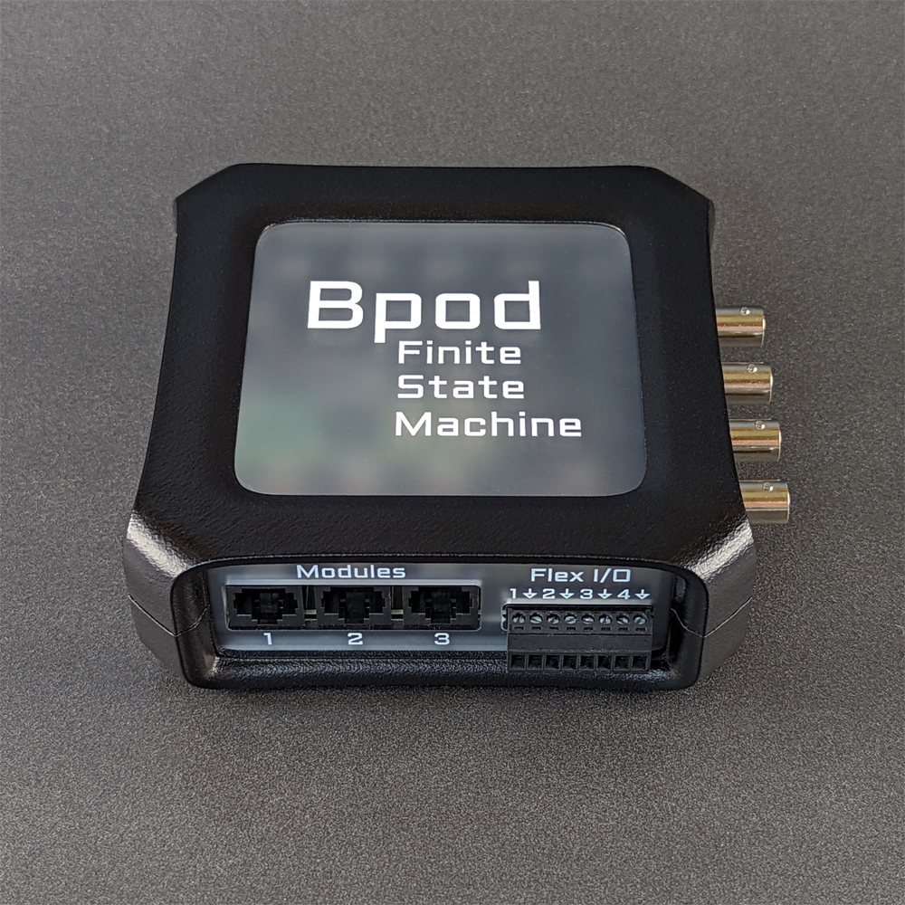

# State Machine 2+

Bpod Finite State Machine r2+ builds on [r2.5](./state-machine-assembly-2_5.md) with additional onboard I/O:
- 4 Flex I/O Channels can each be configured as:
    - Digital Output (5V TTL)
    - Digital Input (5V tolerant)
    - Analog Input (12-bit, 0-5V range, 1kHz sampling)
    - Analog Output (12-bit, 0-5V range)
- 1 additional behavior port, for a total of 5

Version 2+ also has an improved enclosure developed in collaboration with [BZDesign](https://www.google.com/url?q=https%3A%2F%2Fbzdesign.com%2F&sa=D&sntz=1&usg=AOvVaw2BTuoRieUGGg-xji5OavgH). The new enclosure's 3D-printed scaffolding secures its laser-cut panels.

## Bill of Materials
<iframe height=700 width=1000 jsname="L5Fo6c" jscontroller="usmiIb" jsaction="rcuQ6b:WYd;" class="YMEQtf DnR2hf L6cTce-purZT L6cTce-pSzOP KfXz0b" sandbox="allow-scripts allow-popups allow-forms allow-same-origin allow-popups-to-escape-sandbox allow-downloads allow-modals" frameborder="0" aria-label="Spreadsheet, Finite State Machine 2+ rev1.2 BOM" style="height: 1187px" allowfullscreen="" src="https://docs.google.com/spreadsheets/d/1okgFWFCVsFd1Nn6VyfrqdQiO6oXKp2vJxzSCtm2NeAg/htmlembed?authuser=0"></iframe>