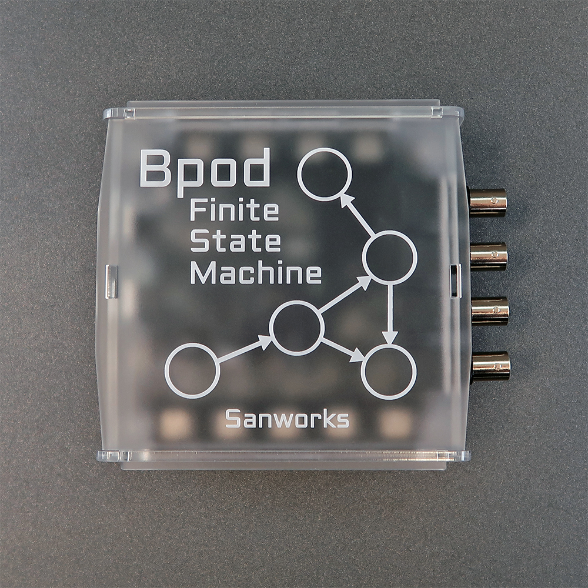

# State Machine 2.3-2.4

Bpod Finite State Machine r2.3 is a minor hardware revision of r2.0.

- r2.3 adds pull-up resistors to the mouse port input channels, stabilizing them when disconnected from the port interface board (note: disconnected ports should still be disabled in software for optimized data processing).
- r2.3 does not have jumpers to disconnect the DC converters on module ports 1-3, as these were deemed unnecessary.

Bpod Finite State Machine r2.4 improves on r2.3 with several minor improvements and component substitutions:
- 2.4 adds light termination resistors to the RS-485 receive lines for the 5 module interfaces. On previous versions, if no module was connected to a module port, some ports would receive an occasional spurious byte 255, which is an invalid event code and is ignored in firmware. 
- r2.4 replaces the BNC output isolator (Analog Devices ADUM5240) with a more energy-efficient chip: ADUM6200.
- r2.4 replaces the module 5V->9V DC/DC converter (Murata MTU1S0509MC) with a more readily available converter: Murata MEE1S0509SC.

Beginning with r2.4, an array of microcontroller pins is used to read out the board revision number. Bits in the array are grounded, and the version number is incremented with each board revision. State machine firmware v23 reads the board revision number, and the PC software saves it with each dataset.

Note: r2.1 and r2.2 were minor tweaks to the 2.0 PCB that did not affect the BOM (e.g. silkscreen updates, widening of certain solder pads, changes to the barrel jack solder pad shape).

## Bill of Materials
### 2.3
<iframe height=700 width=1000 jsname="L5Fo6c" jscontroller="usmiIb" jsaction="rcuQ6b:WYd;" class="YMEQtf L6cTce-purZT L6cTce-pSzOP KfXz0b" sandbox="allow-scripts allow-popups allow-forms allow-same-origin allow-popups-to-escape-sandbox allow-downloads allow-modals" frameborder="0" aria-label="Spreadsheet, Finite State Machine r2.3 BOM" allowfullscreen="" src="https://docs.google.com/spreadsheets/d/1F0EzBuQpKlE2HFfET_72tzQCC6WNifqesPs6URmc1-s/htmlembed?authuser=0"></iframe>

### 2.4
<iframe height=700 width=1000 jsname="L5Fo6c" jscontroller="usmiIb" jsaction="rcuQ6b:WYd;" class="YMEQtf DnR2hf L6cTce-purZT L6cTce-pSzOP KfXz0b" sandbox="allow-scripts allow-popups allow-forms allow-same-origin allow-popups-to-escape-sandbox allow-downloads allow-modals" frameborder="0" aria-label="Spreadsheet, Finite State Machine r2.4 BOM" style="height: 920px" allowfullscreen="" src="https://docs.google.com/spreadsheets/d/1z2Z3OeUBhQfHkxfRhQZN20LL6cXawsFGSqR0E78Vwk8/htmlembed?authuser=0"></iframe>