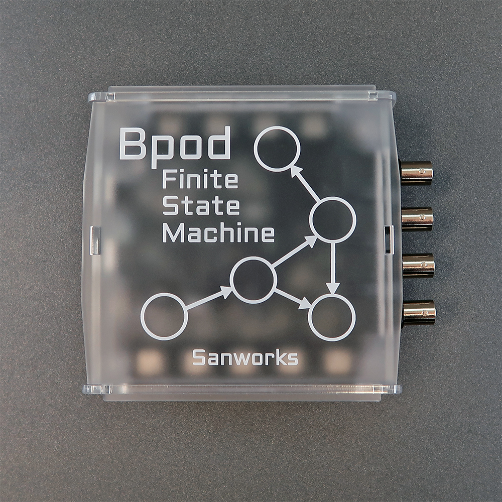

# State Machine 2.5

Bpod Finite State Machine r2.5 is a significant hardware revision of r2.4.

- r2.5 upgrades the Teensy 3.6 microcontroller to Teensy 4.1.  Improvements relevant to Bpod are:
    - Significantly faster processing (600MHz, up from 180MHz)
    - Significantly more SRAM memory (1MB, up from 256KB)
    - Significantly faster USB data transfer (480Mbit/s, up from 12Mbit/s)
- r2.5 has a dual footprint for the 5V->9V DC/DC converters (required for each module port), allowing the board to be populated with either Murata MTU1S0509MC or Murata MEE1S0509SC. This increases robustness against supply chain interruptions.
- Due to the change in microcontroller pinout, r2.5 must be run with State Machine Firmware v23 or newer.

## Bill of Materials
<iframe height=900 width=1000 jsname="L5Fo6c" jscontroller="usmiIb" jsaction="rcuQ6b:WYd;" class="YMEQtf DnR2hf L6cTce-purZT L6cTce-pSzOP KfXz0b" sandbox="allow-scripts allow-popups allow-forms allow-same-origin allow-popups-to-escape-sandbox allow-downloads allow-modals" frameborder="0" aria-label="Spreadsheet, Finite State Machine r2.5 BOM" style="height: 877px" allowfullscreen="" src="https://docs.google.com/spreadsheets/d/1Bvim6T036Oq8AwU1QsMe83GjTzN_QnnkfPfBAIKvoHY/htmlembed?authuser=0"></iframe>