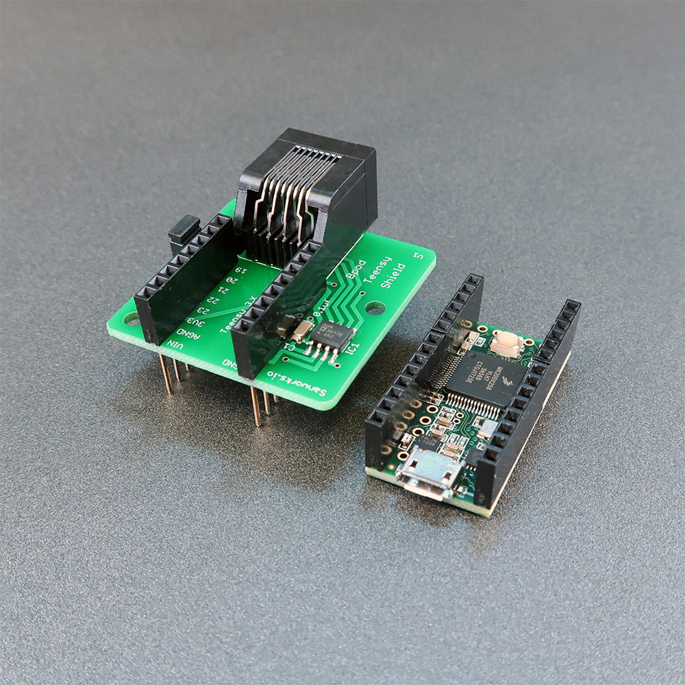

# Teensy Shield

A shield is now available to interface Teensy 3.X with the Bpod state machine.

It uses Teensy digital channels 0 and 1 for communication, and provides power to the Teensy board (if used with state machine r2 or newer)

Example Arduino files for use with the Teensy shield + Teensy 3.2 are available [here](https://www.google.com/url?q=https%3A%2F%2Fgithub.com%2Fsanworks%2FBpod_Gen2%2Ftree%2Fmaster%2FExamples%2FFirmware%2FTeensy%2520Shield&sa=D&sntz=1&usg=AOvVaw0cB1G0Z-8u8x5NZrGNaPqM).

## Bill of Materials
<iframe width=1000 height=400 jsname="L5Fo6c" jscontroller="usmiIb" jsaction="rcuQ6b:WYd;" class="YMEQtf L6cTce-purZT L6cTce-pSzOP KfXz0b" sandbox="allow-scripts allow-popups allow-forms allow-same-origin allow-popups-to-escape-sandbox allow-downloads allow-modals" frameborder="0" aria-label="Spreadsheet, Teensy Shield BOM" allowfullscreen="" src="https://docs.google.com/spreadsheets/d/1D95GHqmZM_H2sIYXvc42Q74l4RbBo4HFcMm6oIelwuU/htmlembed?authuser=0"></iframe>