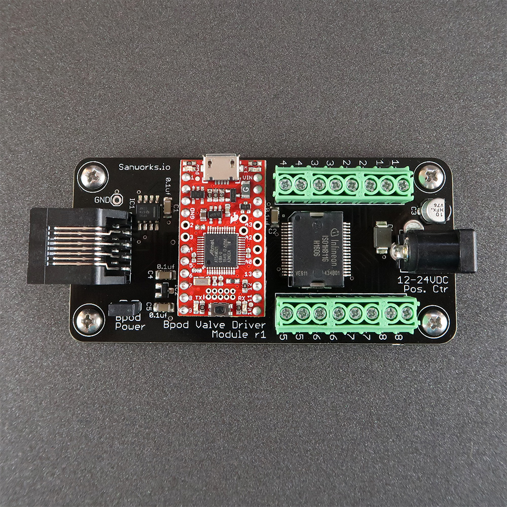

# Valve Driver Module

Version 1, released November 2017

The valve driver module controls 8 solenoid valves. Valve currents are galvanically isolated from control logic circuitry.

The module is most often used in behavior research for temporally precise air flow control and liquid dispensing.

Compatible with Bpod 0.7+

Hardware Specs:

- Processor: 
    - v1: Arduino-compatible 48MHz ARM Cortex M0 processor ([SAMD21 Breakout](https://www.sparkfun.com/products/13664), Sparkfun Electronics)
    - v2: Arduino-compatible 600MHz ARM Cortex M7 processor (Teensy 4.0, PJRC)
- Highly integrated isolated high-side current driver (Infineon [ISO1H815G](http://www.infineon.com/dgdl/Preliminary+Datasheet+ISO1H811G.pdf?folderId=db3a30431b3e89eb011b8dbc543010a5&fileId=db3a304320896aa201208af1f76c0075)).
- Compatible with 12V-24V solenoid valves.
- Max valve current: 250mA continuous current / channel (with spec-matched DC wall adapter)
- Valve side powered by standard DC wall adapter (2.1mm barrel jack, positive center)
- Buffered RS485 interface to Bpod State Machine
- Can be powered by Module ports 1-3 of State Machine r2 or newer (no separate USB cable required)

Firmware for the valve driver module is available [here](https://github.com/sanworks/Bpod_ValveDriver_Firmware).

## Bill of Materials
### Version 1
<iframe width=1000 height=600 jsname="L5Fo6c" jscontroller="usmiIb" jsaction="rcuQ6b:WYd;" class="YMEQtf L6cTce-purZT L6cTce-pSzOP KfXz0b" sandbox="allow-scripts allow-popups allow-forms allow-same-origin allow-popups-to-escape-sandbox allow-downloads allow-modals" frameborder="0" aria-label="Spreadsheet, ValveModule BOM" allowfullscreen="" src="https://docs.google.com/spreadsheets/d/1Lx8oCRSscads0Ua8xJr1sK9sUX5R2KO6Duw-Ed7pLKw/htmlembed?authuser=0"></iframe>

### Version 2
<iframe width=1000 height=400 jsname="L5Fo6c" jscontroller="usmiIb" jsaction="rcuQ6b:WYd;" class="YMEQtf DnR2hf L6cTce-purZT L6cTce-pSzOP KfXz0b" sandbox="allow-scripts allow-popups allow-forms allow-same-origin allow-popups-to-escape-sandbox allow-downloads allow-modals" frameborder="0" aria-label="Spreadsheet, Bpod Valve Module 2 BOM" style="height: 527px" allowfullscreen="" src="https://docs.google.com/spreadsheets/d/1LFguBD9RfoWVN1-qc37N6U1HEOtODFHqumWENRfn77Y/htmlembed?authuser=0"></iframe>