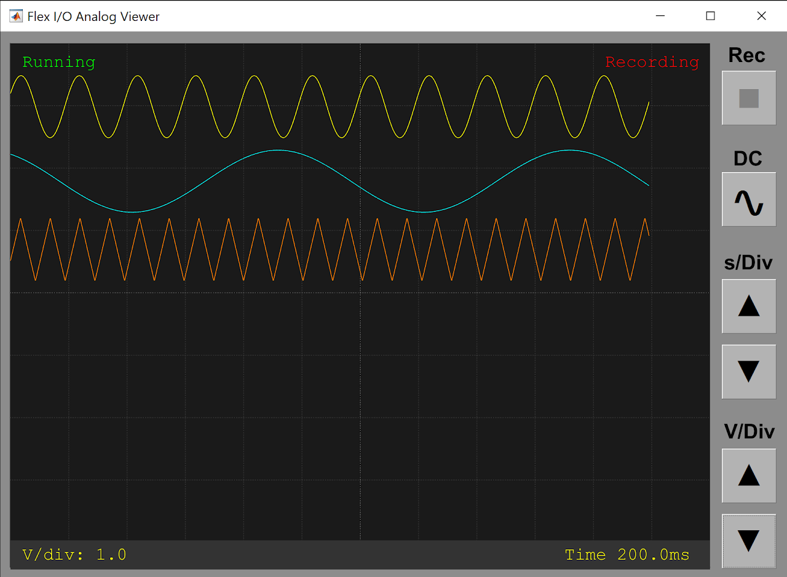

# BpodSystem functions

### `assertModule()`
**Description**

Throws an error if a given Bpod module is not present.
- An optional argument specifies whether the module must also be paired with its USB serial port via the USB pairing UI.
- After connecting a new module, you must press the 'refresh' button on the [Bpod console GUI] to make it visible to `assertModule()`.

**Syntax**

`BpodSystem.assertModule(moduleNames, USBPaired)`

**Parameters**

- `moduleNames`: a character array containing the name of the module. A cell array of strings may also be provided to assert multiple modules. Note: The names of connected modules are given in BpodSystem.Modules
- `USBPaired`: optional, an array of 1s and 0s with one value for each module in moduleNames. 
    - 1 = the module must be paired with its USB serial port. 
    - 0 = the module does not have to be paired.

**Return**

- None

**Example**

This code will throw an error if the HiFi or ValveDriver modules are missing.
It will also throw an error if the HiFi module is not paired with its USB serial port.
```matlab
BpodSystem.AssertModule({'HiFi', 'ValveDriver'}, [1 0]);
```

### `setStatusLED()`
**Description**

Enables or disables the status indicator LED on the Bpod finite state machine.

- If disabled, the status LED will remain off until the state machine is power cycled, or until re-enabled with `setStatusLED()`
- `setStatusLED()` requires state machine firmware v23 or newer

**Syntax**
```matlab
BpodSystem.setStatusLED(status) 
```

**Parameters**

- status
    - 0 = LED off
    - 1 = LED on

**Returns**

- None

**Example**

This code will disable the state machine status LED
```matlab
BpodSystem.setStatusLED(0);
```

### `startAnalogViewer()`
**Description**

Launches a viewer for Flex I/O channels configured as analog input.



- The viewer can also be launched from the Bpod console
- The viewer can run during the behavior session for online monitoring (note: the UI may add jitter to soft-code processing if using TrialManager).
- Pushbuttons are:
    - REC: Press to record to the current analog data file. Recording starts with the next behavior session.
    - Note: The analog data file is created automatically when starting a session. It has the same path and naming convention as the primary data file. It can be merged into the primary data file at the end of the session by calling AddFlexIOAnalogData().
- DC: Press to subtract the DC offset from all signals (in the viewer only; logged data is unaffected)
- s/Div: Adjust seconds per division on the viewer grid. The 'Time' label on the bottom info bar shows the current time per division.
- V/Div: Adjust volts per division on the viewer grid. 

**Syntax**
```matlab
BpodSystem.startAnalogViewer() 
```

**Parameters**

- None

**Returns**

- None

**Example**

This code will launch the analog viewer
```matlab
BpodSystem.startAnalogViewer();
```
