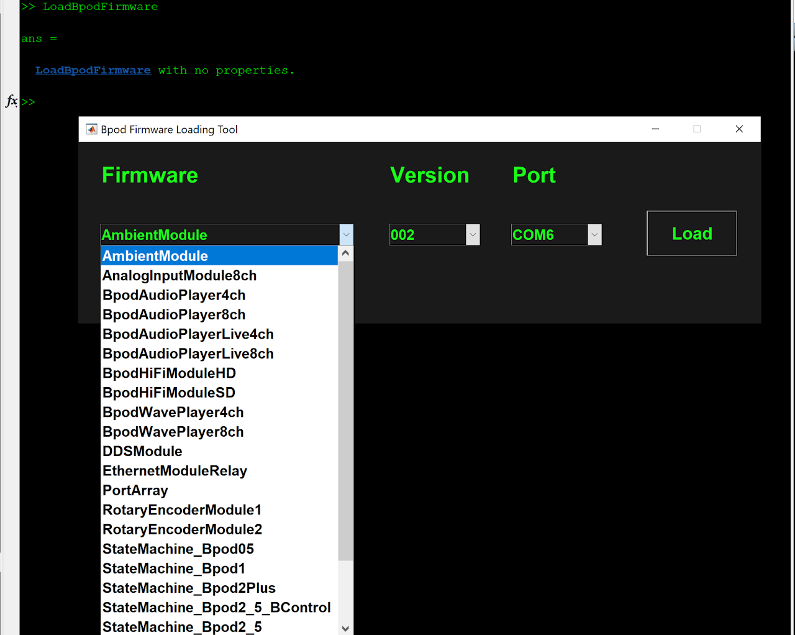

# Updating Bpod
### `LoadBpodFirmware()`
**Description**

Launches a tool to load firmware to any Bpod state machine or module.



**Usage**

- Select the target state machine version or module from the 'Firmware' menu.
- Select the firmware version from the 'Version' menu. The latest firmware in Bpod_Gen2 will be selected by default.
- Select the target serial port from the 'Port' menu. If you don't know the target serial port, close the tool, unplug all other Bpod and Arduino devices from the PC and re-run LoadBpodFirmware.
- Press 'Load' to load the firmware to the device. 
- Most devices are programmed in a few seconds
- State Machine r0.5-r1.0 may take several minutes. This is normal.
- A confirmation popup will indicate when the firmware has been successfully updated

### `UpdateBpodSoftware()`
**Description**

Launches the Bpod software update tool. This tool will update your local copy of the [Bpod_Gen2 repository](https://www.google.com/url?q=https%3A%2F%2Fgithub.com%2Fsanworks%2FBpod_Gen2&sa=D&sntz=1&usg=AOvVaw0hZOqBP6mI4rPtPR76Nb5k) to the latest stable release.

!!! warning
    If you are using a version control tool (e.g. Git) to keep your Bpod_Gen2 folder current, you should use the tool's "Pull" function and NOT UpdateBpodSoftware().

As of August 2018, the software update tool is a BETA release, and works only on Win7 and Win10 with MATLAB r2014b or newer. 

A backup copy of your existing Bpod_Gen2 folder will be made in your Bpod_Local folder.

The updater will overwrite any changes you may have made to your local copy of the Bpod_Gen2 repository, so if you made mods to the Bpod system files, make sure to back up your existing Bpod_Gen2 folder first! Note: behavior protocols, behavioral data, internal settings and calibration files are normally located in a separate folder outside of Bpod_Gen2 - make sure this is true of your system before proceeding.

Internet connectivity is required to launch the updater.

In event of an update failure, see instructions for [manual update](../install-and-update/software-update.md). 

Please report any issues to support@sanworks.io.

**Syntax**

!!! note
    Must be run while Bpod software is closed:
```matlab
UpdateBpodSoftware() 
```

**Parameters**

- None

**Returns**

- None

**Example**

Launches the software updater
```matlab
% Note: Run this with Bpod software closed
UpdateBpodSoftware();
```