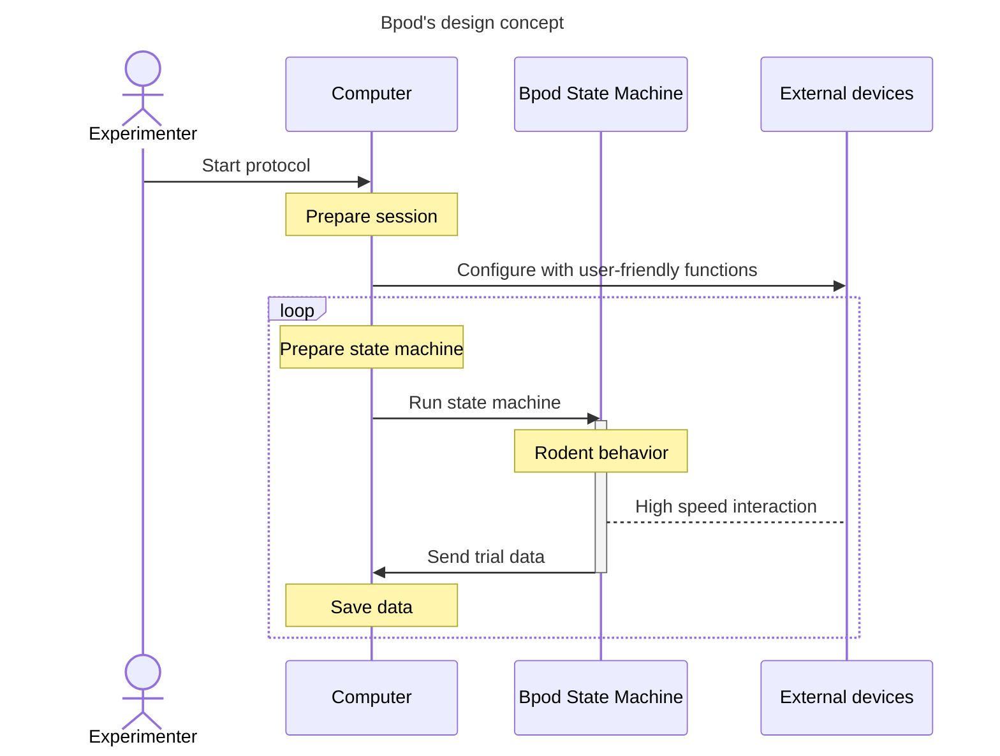

# Bpod

    

        Bpod
    

    <em>Rodent behavior with Bpod: low-cost, extensible, open-source.</em>

---

**Bpod_Gen2 source code**: [https://github.com/sanworks/Bpod_Gen2](https://github.com/sanworks/Bpod_Gen2)

**Documentation**: [https://sites.google.com/site/bpoddocumentation/](https://sites.google.com/site/bpoddocumentation/)
<!-- todo: change doc site link on migration completion -->

**Computer Aided Design (CAD) files**: [https://github.com/sanworks/Bpod-CAD](https://github.com/sanworks/Bpod-CAD)

Legacy release (state machine 0.5 only): [https://github.com/sanworks/Bpod/tree/master](https://github.com/sanworks/Bpod/tree/master)

---

!!! warning

    :stop_sign: This is a test version of the Bpod wiki to examine the feasibility of moving it to Github. The official wiki maintained by Sanworks is hosted [here](https://sites.google.com/site/bpoddocumentation/home?authuser=0).
    
    :construction: All of the content on the existing wiki should have been moved across, and only a few new additions remain incomplete.

Bpod is an open source rodent behavioral platform used in over 100 publications since 2013.

The key features include:

- Hardware and software open-sourced under GNU General Public License v3
- Optimized for rodent behavior measurement and closed-loop control
- Arduino based architecture for user extendibility and easy integration into existing setups
- Existing modules support common behavioral approaches

## About Bpod
Bpod is an open source system for real-time behavior measurement in tasks consisting of multiple experimental trials. Experiment software is written in MATLAB, and device firmware is written in [Arduino](https://www.arduino.cc/). Hardware can be assembled with DIY desktop manufacturing methods - hand-soldering, 3-D printing, laser cutting and hand-tapping. The system architecture is low cost, and supremely hackable - precisely what is necessary to explore a space of behavioral metrics, or to train test subjects with high throughput. This wiki contains instructions for assembly and programming.

Bpod was initially developed in [Kepecs Lab](http://kepecslab.cshl.edu/) at Cold Spring Harbor Laboratory, as a project alongside the lead developer's thesis research. It is maintained by [Sanworks LLC](https://sanworks.io/), a company dedicated to developing Bpod and other open neuroscience tools.

Bpod builds on the central design concept of [B-control](http://brodywiki.princeton.edu/bcontrol/index.php/Main_Page), a system provided by [Brody Lab](http://brodylab.org/) at Princeton University for rodent behavior measurement. Experimental trials are constructed in MATLAB as [finite state machines](https://en.wikipedia.org/wiki/Finite-state_machine), and executed on a separate real-time Linux computer. Bpod combines this parallel processing model with the accessibility of embedded computing in the Arduino language. Bpod provides a rich suite of software tools in high level interpreted computing environments for protocol development and online analysis, while real-time processing is delegated to an Arduino microcontroller network governed by finite state machine firmware.

<!-- todo: make this into an actual schematic -->

We love hearing about the awesome [science](https://sanworks.io/science/science.php) that is generated with Bpod! 

Please post on the [Forums](https://sanworks.io/forums/) with your questions and feedback, or [email us](https://sanworks.io/about/contact.php) directly.