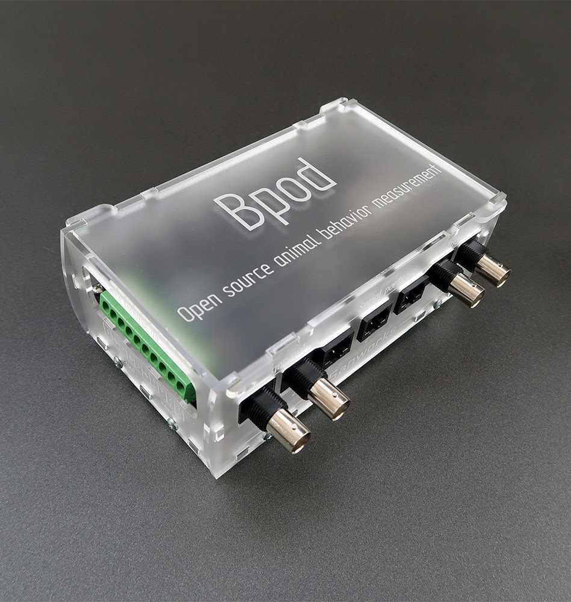
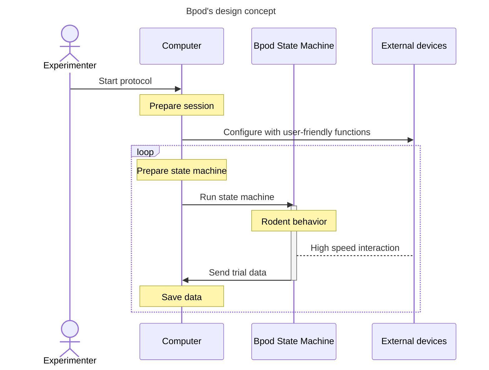

# Bpod Github Markdown Wiki Test
Welcome to the Bpod Wiki.

!!! warning

    :stop_sign: This is a test version of the Bpod wiki to examine the feasability of moving it to Github. The official wiki maintained by Sanworks is hosted [here](https://sites.google.com/site/bpoddocumentation/home?authuser=0).
    
    :construction: This test wiki does not contain all items, and some of the items included have been modified.

    :bulb: Some new additions exist.

Bpod is an open source system for real-time behavior measurement in tasks consisting of multiple experimental trials. Experiment software is written in MATLAB, and device firmware is written in [Arduino](https://www.arduino.cc/). Hardware can be assembled with DIY desktop manufacturing methods - hand-soldering, 3-D printing, laser cutting and hand-tapping. The system architecture is low cost, and supremely hackable - precisely what is necessary to explore a space of behavioral metrics, or to train test subjects with high throughput. This wiki contains instructions for assembly and programming.

### Download
The Bpod repository is available here:

- Current release (Mandatory for state machine r0.7+, compatible with r0.5)
  - MATLAB software: https://github.com/sanworks/Bpod_Gen2 
  - CAD: https://github.com/sanworks/Bpod-CAD
- Legacy release (Bpod state machine 0.5 only)
  - https://github.com/sanworks/Bpod/tree/master

## Table of Contents

> 
> - :white_check_mark: : import from original wiki complete
> - :memo: : additional information/improvements is planned/added
> - :bulb: : new item
> - :construction: : under construction

- Assembly
  - Items and assembly
  - [Bench testing Bpod](docs/assembly/bench-testing-bpod.md) :white_check_mark:
  - Downloads and sources
  - Hardware
  - [Installing  Bpod](docs/assembly/installing-bpod.md) :white_check_mark:
  - Firmware updates
  - Software updates
- User guide
  - General concepts :memo:
  - Hardware Overview :memo:
  - [Function reference](docs/user-guide/function-reference.md) :construction:
  - [Modules](docs/user-guide/modules.md) :construction: :memo:
  - [Protocol development](docs/user-guide/protocol-development.md) :white_check_mark: :memo: :construction:
  - [Serial interfaces](docs/user-guide/serial-interfaces.md) :construction: :memo:
  - Using BControl
  - :bulb:[Advanced user guide](docs/user-guide/advanced-user-guide.md) :construction:
- Module guides
  <!-- - Ambient Module -->
  - Analog Input Module
  - Analog Output Module
  - DDS Module
  - Ethernet Module
  - HiFi Module
  - I2C Messenger Module
  - [Rotary Encoder Module](docs/module-documentation/rotary-encoder-module.md) :white_check_mark: :memo:
  - Port Array Module
  - Valve Driver Module

To assist navigating long documents you can open a file outline:

## About Bpod

Bpod was initially developed in [Kepecs Lab](http://kepecslab.cshl.edu/) at Cold Spring Harbor Laboratory, as a project alongside the lead developer's thesis research. It is maintained by [Sanworks LLC](https://sanworks.io/), a company dedicated to developing Bpod and other open neuroscience tools.

Bpod builds on the central design concept of [B-control](http://brodywiki.princeton.edu/bcontrol/index.php/Main_Page), a system provided by [Brody Lab](http://brodylab.org/) at Princeton University for rodent behavior measurement. Experimental trials are constructed in MATLAB as [finite state machines](https://en.wikipedia.org/wiki/Finite-state_machine), and executed on a separate real-time Linux computer. Bpod combines this parallel processing model with the accessibility of embedded computing in the Arduino language. Bpod provides a rich suite of software tools in high level interpreted computing environments for protocol development and online analysis, while real-time processing is delegated to an Arduino microcontroller network governed by finite state machine firmware.

We love hearing about the awesome [science](https://sanworks.io/science/science.php) that is generated with Bpod! 

Please post on the [Forums](https://sanworks.io/forums/) with your questions and feedback, or [email us](https://sanworks.io/about/contact.php) directly.

<!-- ## Contributing
- The Issues section for this repository should be related to problems in the documentation
  - All issues related to Bpod generally should go to the forums -->

### License and Liability
**License**

Bpod is a family of [open source hardware](http://www.google.com/url?q=http%3A%2F%2Fen.wikipedia.org%2Fwiki%2FOpen_source_hardware&sa=D&sntz=1&usg=AOvVaw0ulTFPr3-7yqkc_H-uT2Hd) devices.

Bpod software, firmware and hardware design files were released into the public domain on the terms of the GNU General Public License v3.0.

The text of the license is available here:

http://www.gnu.org/copyleft/gpl.html

In brief, you may build and modify Bpod's hardware and software to suit your needs, and even release your own derivative product with your own branding (see brand restriction below), **so long as that product's software and hardware remains fully open source, and made freely available to the public under GNU v3.0**.

Your derivative work must include a statement detailing your changes to the original code and CAD.

**Brand and Trademark**

'Bpod' is a registered trademark of Sanworks LLC in the [United States](https://www.google.com/url?q=https%3A%2F%2Ftmsearch.uspto.gov%2Fbin%2Fshowfield%3Ff%3Ddoc%26state%3D4801%3A4v00ay.2.1&sa=D&sntz=1&usg=AOvVaw3IqCHQOCvSnKWb_SooCWSB) and the [EU](https://www.google.com/url?q=https%3A%2F%2Feuipo.europa.eu%2FeSearch%2F%23details%2Ftrademarks%2F018247891&sa=D&sntz=1&usg=AOvVaw1VxBXh9cISSjMBrYg1PGVs). 

All rights to use the brand name 'Bpod' in commerce are reserved. 

Derivative products are permitted by license as detailed above, but must use a unique brand name.

**Liability**

By using Bpod hardware and/or software, you agree not to hold Kepecs Lab or Sanworks LLC responsible for any damages you may incur. TO THE MAXIMUM EXTENT PERMITTED UNDER APPLICABLE LAW, KEPECS LAB AND/OR SANWORKS LLC, SHALL NOT BE LIABLE TO YOU, OR ANY THIRD PARTY, FOR ANY INDIRECT, EXEMPLARY, SPECIAL, CONSEQUENTIAL OR INCIDENTAL DAMAGES OF ANY KIND ARISING IN ANY WAY OUT OF USE OF THE BPOD BRANDED PRODUCTS AND WEBSITES, INCLUDING, WITHOUT LIMITATION, LOSS OF PROFITS, REVENUES OR DATA, OR COSTS OF REPLACEMENT GOODS, EVEN IF KEPECS LAB AND/OR SANWORKS LLC HAS BEEN ADVISED OF THE POSSIBILITY OF SUCH DAMAGES AND NOTWITHSTANDING THE FAILURE OF ANY LIMITED REMEDY OF ITS ESSENTIAL PURPOSE.