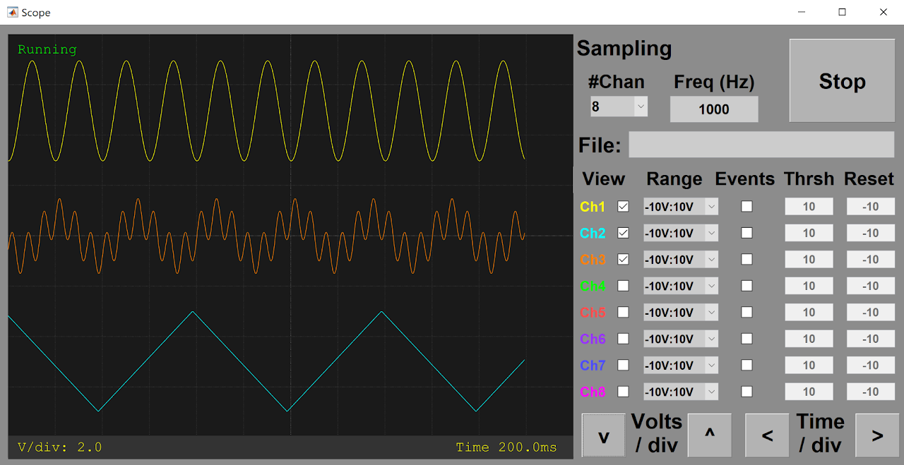

# AnalogInputModule()
## Description

The BpodAnalogIn class provides an object representing Bpod's [Analog Input Module](../assembly/analog-input-module-assembly.md) (a general purpose voltage ADC with a dedicated microcontroller).

The Analog Input Module has 8 input channels with 12 bits of resolution and configurable ranges up to +/-10V.

The object has functions to:

- Acquire data to a microSD card, on trigger from the Bpod state machine
- Return acquired data to MATLAB via USB
- Stream live analog input data to USB for online viewing and data capture
- Stream live data to a Bpod output module (DDS or Analog Output).
- Set voltage thresholds to generate discrete behavior events, which can be handled by the state machine

After running Bpod, an BpodAnalogIn object is initialized with the following syntax:

```matlab
A = BpodAnalogIn('COM3');
```

Where COM3 is the analog input module's serial port.

The Analog Input device is controlled in 2 ways:

- Setting the BpodWavePlayer object's fields
- Calling the BpodWavePlayer object's functions

## Object fields

- **Port**
    - [ArCOM](http://www.google.com/url?q=http%3A%2F%2Fsites.google.com%2Fsite%2Fsanworksdocs%2Farcom&sa=D&sntz=1&usg=AOvVaw0q9tKPNJMCdKV2qsdKk90n) Serial port object
- **SamplingRate** (Hz)
    - 1Hz-20kHz, affects all channels.
    - Other functions (streaming to USB, streaming to external module, running threshold logic) can be used in combination, but will reduce the maximum sampling rate.
- **InputRange** (String)
    - A cell array of strings specifying voltage input range for EACH channel:- '-10V:10V'    - '-5V:5V'    - '-2.5V:2.5V'    - '0V:10V'    
    - For best signal quality, use the smallest voltage range necessary for your application.
    - Signals that exceed the maximum or minimum will be constrained to the range boundary
- **nActiveChannels** (positive integer)
    - Number of channels actively sampled (consecutive, beginning with Ch1).- Fewer channels = faster sampling possible. Read the fewest channels necessary for your application.    
- **Thresholds** (V)
    - A simple voltage threshold and reset scheme is supported by the standard firmware, to generate discrete events
    - Thresholds is a 1 x nChannels vector of voltages.
    - If events are enabled (see startReportingEvents() below), on voltage threshold crossing, the channel# is sent to the state machine.
    - A low->high crossing will trigger the event, if ResetVoltage (below) is less than threshold.
    - A high->low crossing will trigger the event, if ResetVoltage is greater than threshold.
    - After a channel's voltage crosses threshold, event generation is disabled until the channel voltage crosses ResetVoltage (below)
- **ResetVoltages** (V)
    - A 1 x nChannels vector of voltages
    - Event generation is re-enabled after the voltage crosses ResetVoltages(chan).
    - If a channel's ResetVoltage is below Threshold, events are triggered on low -> high threshold crossing.
    - If a channel's ResetVoltage is above Threshold, events are triggered on high -> low threshold crossing.
- **SMeventsEnabled** (logical vector of length nChannels)
    - Indicates whether each channel's threshold crossing events are sent to the state machine
    - To enable or disable event transmission for the channels selected in SMeventsEnabled:
        - Call startEventReporting() to enable events (below)
        - Call stopEventReporting() to disable events (below)    
    - Channels greater than nActiveChannels (above) are ignored.
- **Stream2Module** (logical vector of length nChannels)
    - Indicates whether each channel's measurements are sent to a connected output module
    - Channels greater than nActiveChannels (above) are ignored.
- **nSamplesToLog** (positive integer)
    - Determines the maximum number of samples to log to the microSD card after logging is started with startLogging()
    - Fewer samples can be acquired, if a stop command arrives while logging.
    - Set nSamplesToLog to 'Inf' to log until a stop command arrives

## Object functions

- **startLogging**()
    - Starts logging all samples acquired to the microSD card, overwriting any previously stored data
    - Channels between 1 and nActiveChannels (above) are logged.
    - After logging, acquired data is retrieved with getData() below.
- **stopLogging**()
    - Stops logging samples to the microSD card.
- Data = **getData**()
    - Returns a struct containing data logged to the microSD card since the last call to startLogging()
    - Stops logging, if logging was enabled
    - Fields of the data struct are:
        - X: 1 x nSamples vector containing time of each sample from logging start (in seconds)
        - Y: nActiveChannels x nSamples matrix, containing voltages measured at each time in X    
- **startModuleStream**()
    - Starts streaming data to the "output stream" module connector
    - For each sample, the data stream output is:
        - Character 'R' (byte 82)
        - one 2-byte sample for each channel up to nActiveChannels    
    - [Example firmware](https://www.google.com/url?q=https%3A%2F%2Fgithub.com%2Fsanworks%2FBpod%2Ftree%2Fbeta%2FFirmware%2FBpod%25200_7%2FAnalogModulesClosedLoop%2FAnalogLoop_OutputModule&sa=D&sntz=1&usg=AOvVaw3jvy3XE2agm7VDN8WNpnNY) for the analog _output_ module expects data in this format, and converts it into a voltage signal output.
- **stopModuleStream**()
    - Stops streaming data to the "output stream" module connector
- **startUSBStream**()
    - Starts streaming data to the USB serial object (obj.Port).
    - Data is in the same format used for streaming to modules (see startModuleStream() above)
    - Following startUSBStream, a sample can be read from the port with:
        - obj.Port.read(1, 'uint8') % This will return 'R'
        - obj.Port.read(nActiveChannels, 'uint16') % This will return 1 sample (in bits) for each active channel    
    - Other commands to the module will FAIL while USB streaming. Stop the stream with stopUSBStream().
- **stopUSBStream**()
    - Stops streaming data to the USB port
- **startReportingEvents**()
    - Starts sending bytes to the state machine to report threshold crossing events.
    - Bytes sent indicate the channel of the threshold crossing event (i.e. byte 7 = a threshold crossing on Channel 7)
    - Only channels chosen in SMeventsEnabled (above) send events.
    - The conditions for triggering events are controlled by 2 fields: Thresholds and ResetVoltages (above).
- **stopReportingEvents**()
    - Stops sending threshold crossing events to the state machine.
- **setZero**()
    - This function is used to compensate for the ADC's zero-code offset, by shifting the ranges so that the ground potential reads as 0V.
    - IMPORTANT: Connect a wire between channel 1's + and - terminals before running setZero.
    - The offset will be saved to the microSD card and loaded automatically on boot.
- **scope**()
    - Launches an oscilloscope-style GUI for troubleshooting, threshold configuration and online monitoring.



- By entering a filename in the 'File' field (including the full path) The scope() GUI can continuously capture streaming data to a file during a behavior session, as an alternative to microSD acquisition. See example protocol [here](https://www.google.com/url?q=https%3A%2F%2Fgithub.com%2Fsanworks%2FBpod_Gen2%2Fblob%2Fmaster%2FExamples%2FProtocols%2FAnalog_Input%2FLight2AFC_AnalogStreaming%2FLight2AFC_AnalogStreaming.m&sa=D&sntz=1&usg=AOvVaw2arf6ntL1eN3wUUCdAhnT1).

## Cleanup
- Clear the BpodAnalogIn object with clear:
```matlab
A = BpodAnalogIn('COM3');
% ...Use the analog input module
clear A
```

- Clearing the object releases the serial port, so other applications can access it.
- If a BpodAnalogIn object is created inside a MATLAB function, the object is cleared automatically when the function returns.