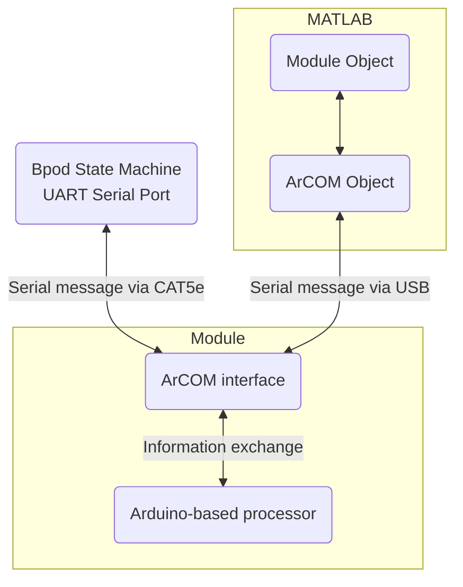

# Modules
Beyond solenoid valves, LEDs and TTL pulses, it's hard to anticipate what kinds of outputs Bpod will need to control in future experiments.

As a general expansion framework, 3 (or more) of the serial ports of the state machine's microcontroller are exposed to enable Sanworks and users to build Arduino-based modules.

## Module documentation
Each module has three pieces of documentation.

1. Hardware: located in Assembly > Modules, hardware specifications and the bill of materials required for construction.
2. Serial interface: located in Modules > Serial Interfaces, USB/serial port communication specifications
3. Plugin: located in Modules > Plugins, plugins/class/API for programmatic module interaction

In most cases, configuration of a module at the start of a session involves the use of the plugin, while actions performed during a trial are triggered using serial messages from the state machine.

## General explanation of module architecture

ArCOM is a library for Arduino developed by Sanworks to simplify data transaction between Arduinos with other Arduinos and computers. Rather than working directly in binary, ArCOM makes it easy to send and receive bytes from a module. The rationale for its development can be found [here](https://sanworks.io/news/viewArticle?articleID=ArCOM1).

<!-- but why use this instead of the Serial class? -->

For example, modules that play a stimulus are often sent two bytes, byte `'P'` to signify that the instruction is to play, and a second byte to specify which pre-loaded stimulus to play (e.g. `['P' 1]`). Communication of all forms is performed using ArCOM, and the plugins (which are [classes](https://www.mathworks.com/help/matlab/object-oriented-programming.html)) are used to make this easily accessible within the protocol file's programming language.

Bytes can be sent to the module using both the USB connection with the plugin (which is actually just utilising the `ArCOM` object), and via the state machine serial port.

To understand this sequence more closely, read the [example in-depth explanation](../module-documentation/rotary-encoder-module.md#serial-interface-and-module-class-guide) for the Rotary Encoder Module.

### UART communication description

- The [UART serial ports](https://www.google.com/url?q=https%3A%2F%2Flearn.sparkfun.com%2Ftutorials%2Fserial-communication%2Fuarts&sa=D&sntz=1&usg=AOvVaw2e5bid8ez_clYR9sdmyEtv) are indicated on the enclosure as RJ45 ethernet jacks labeled "Modules" 1-N.
- The ports are configured to communicate with other microcontrollers at 1.3125Mb/s
- The state machine sends UART serial transmissions to modules using an RS485 IC at each end of the ethernet cable. This employs differential signaling over the Ethernet cable's twisted wire pairs, to make the digital messages more robust against noise.

## Building your own module/integrating existing Arduino system
The [Bpod Arduino Shield](../assembly/arduino-shield-gen2-assembly.md) is a simple circuit board used to interface the serial ports on the state machine and the UART on Arduino boards (M0, Zero, Due, Leonardo, Adafruit MetroM4). 

General pointers for building a module can be found in the [guide to building your own module](../user-guide/building-own-module.md). It will help to become familiar with the [Arduino language](http://www.google.com/url?q=http%3A%2F%2Farduino.cc%2Fen%2FReference%2FHomePage&sa=D&sntz=1&usg=AOvVaw1v-cPDNL0l0ua0s9yO_xvD), an excellent intro for which is located [here](https://www.google.com/url?q=https%3A%2F%2Flearn.sparkfun.com%2Ftutorials%2Fwhat-is-an-arduino&sa=D&sntz=1&usg=AOvVaw1od5YgunQFQgRDuuzRaBOE).

