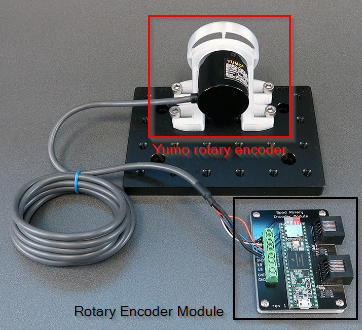

# Rotary Encoder Module
A rotary encoder is a device that sends information related to its angular rotation.

## Explanation of  the module
This is a guide explaining how the module works, which provides a template for understanding the functions of other modules.

Off the shelf rotary encoder's are relatively simple devices that report a direction of movement by a certain amount. The following diagram (from the [datasheet](https://www.mouser.com/datasheet/2/307/e6b2-c_ds_csm491-25665.pdf) for the Yumo E6B2-C rotary encoders) describes the purpose of the black, white, and orange wires; the Phase A, Phase B, and Phase Z, respectively.

Each wire  can either be Hig or Low, and the combination of them describes the movement/position of the rotary encoder.
The black and white wires pulse once at the same time when the encoder moves enough in one direction.
However, one will pulse slightly ahead of the other depending on whether the encoder moved clockwise or anticlockwise.
The amount required to move to trigger a pulse depends on the resolution of the rotary encoder, with a 1024 resolution encoder having 1024 ticks per 360 degrees of rotation.
The orange wire will pulse when the rotary encoder is moved through a full rotation (i.e. at the same place each time), allowing a system to monitor absolute position even if power momentarily fails.

The fact that a rotary encoder moved clockwise or anti clockwise one tick is low level information, so the rotary encoder module will take that information, convert it into degrees, and timestamp it.
That is the purpose of the rotary encoder module, to provide an interface with a rotary encoder to pre-processes the data into something more usable and support more complex functions, such as a threshold system.

A [printed circuit board](https://en.wikipedia.org/wiki/Printed_circuit_board), or PCB, is essentially conductive wires printed into an insulated sheet. Rather than have actual complex wires, it's much easier to have the wires statically embedded in a reproducible piece of plastic.

The module makes use of a [Teensy](https://www.pjrc.com/teensy/) board, a microcontroller that can be programmed with the Arduino language. Consider the rotary encoder module, which must process the incoming wire inputs. Rather than trying to insert those inputs into the Teensy board directly, it's far better to connect a screw terminal into a PCB, which then "relays" the signals from the wire into the Teensy which is soldered into the PCB.

Communication between the module and the state machine or computer are explained in the [guide to serial interfaces](../user-guide/serial-interfaces.md)
