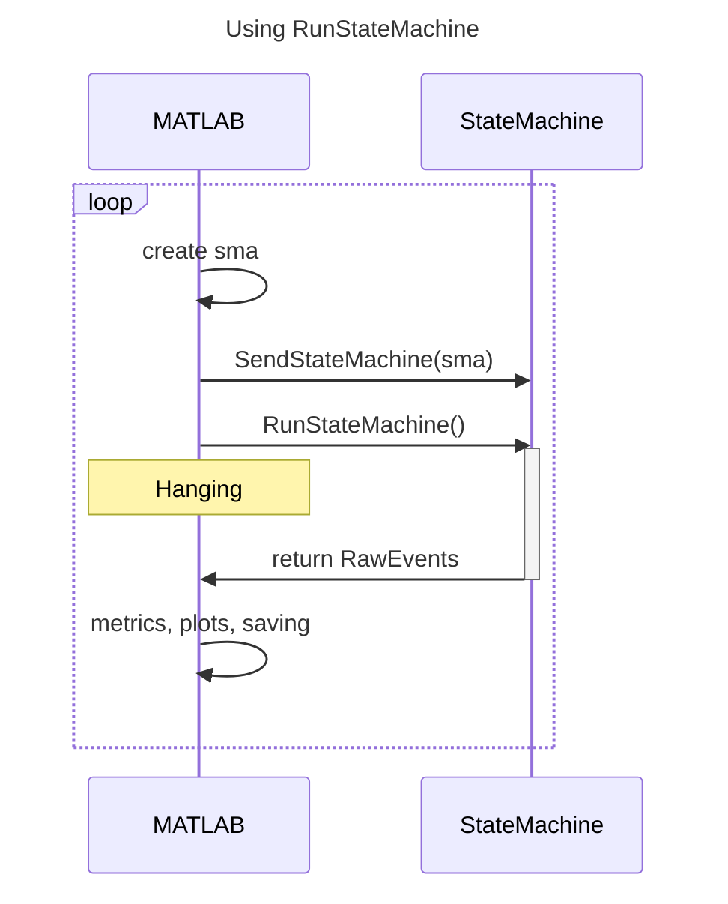
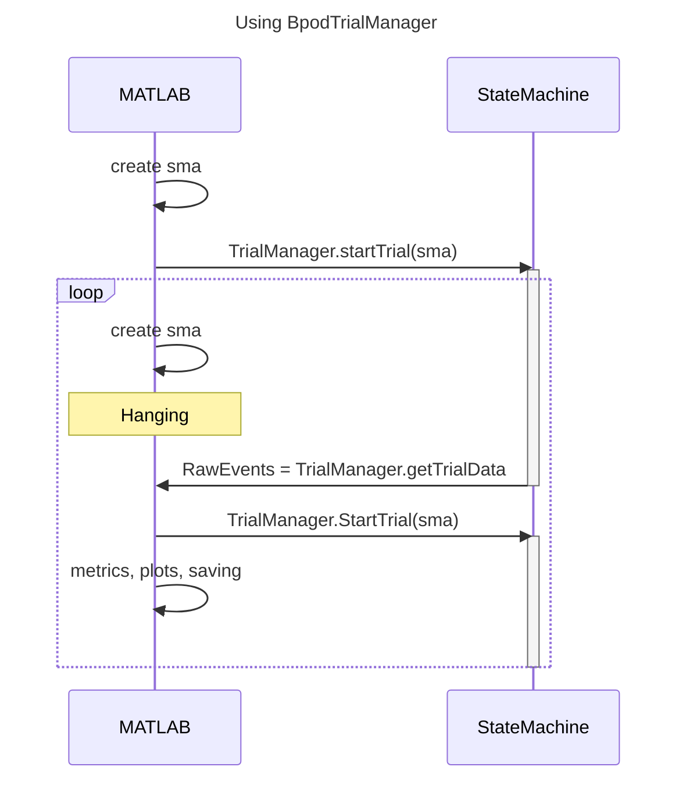

# Advanced user guide

## Navigating Bpod_Gen2 repository
The [Bpod_Gen2 repository](https://github.com/sanworks/Bpod_Gen2/tree/master) contains all of that MATLAB code required to run Bpod.  The [Sanworks repository list](https://github.com/sanworks?tab=repositories) has other items such as firmware and CAD files.

```
Analysis/                       # Currently doesn't contain much
Assets/                         # Images/items for graphical display
Examples/ 
    Example Calibration Files/  # Liquid & sound calibration .mat files
    Example Settings Files/     # Settings structure .mat files
    Firmware/                   # Arduino firmware
    Protocols/                  # Entire protocols
    State Machines/             # State machine construction snippets
Functions/
    ...
    Modules/                    # Class files for modules
    Plugins/                    # Functions like BpodParameterGUI
```


## End-of-session performance summaries
Rodent behavior often takes places in the context of multiple sessions and days of training. At the conclusion of a session, it is possible to generate a summary of both the current session, but also performance across multiple sessions.

```matlab
% retrieve current file's path
[behaviour_folder, sessiondata_filename] = fileparts(BpodSystem.Path.CurrentDataFile);

session_history = struct;
sessiondatas = dir(fullfile(behaviour_folder, '*.mat'));
for file = 1:numel(sessiondatas)
    SessionData = load(fullfile(sessiondatas(file).folder, sessiondatas(file).name), 'SessionData');
    if SessionData.nTrials < 50  % there would be multiple exclusion criteria
        continue  % skip this session
    end

    % append relevant parameters into a data structure
    session_history(end+1).name = sessiondatas(file).name;
    session_history(end) = calculate_parameters(SessionData);;
end

plot_session_parameters(session_history)
```

## Dead time
"Dead time" is the time between the state machine exiting its final state and a new state beginning.

The three main sources of dead-time are:
- `SaveBpodData` slowing down because of increased size of `BpodSystem.Data`
- Update of plots becoming inefficient
- Calculations involving trial parameters growing in size

### Measuring dead time
The `tic` and `toc` functions in MATLAB provide a easy way of measuring time between two lines of code.

### Addressing dead time
If `SaveBpodData` is taking a long time, then data saves could be performed every n trials using a [modulo](https://mathworks.com/help/matlab/ref/mod.html) (e.g.`if mod(currentTrial, n) == 0`).

Updating a plot after each trial without causing unnecessary usage of computing power requires some knowledge of axes objects. If your plot involves the usage of `hold on`, it is possible that the plotting process will slow down due to overlaying of multiple versions of the same plot (if your plotting code does so). Similarly, erasing and then recalculating the entire plot could also cost some time. Instead, updating the existing plot with new data points is the fastest method.

Calculation of trial parameters should be straight forward, but errors/inefficiently written code may result in longer-than-necessary time to compute new trial parameters.

### `BpodTrialManager` vs `RunStateMachine`
To address this users could use `BpodTrialManager` instead of the `RunStateMachine` approach. In short, the difference is that `RunStateMachine` result in MATLAB being unable to operate while the state machine is active, while `BpodTrialManager` does not. However, `BpodTrialManager` is slightly more complex and requires more careful construction of the trial loop.

The difference in terms of hanging states of MATLAB are shown in the sequence diagrams below:





<!-- RunStateMatrix could update a BpodSystem value for time since last run to make this accessible -->

## Global timers

## Synchronization signals
Clocks on different hardware may read different times at the same moment, and drift apart over time due to differences in the oscillating pieces used to track time. Synchronization signals between systems allows time differences in timekeeping to be addressed.

Bpod r0.5 had a dedicated synchronization line

### ScanImage
[ScanImage](https://docs.scanimage.org/index.html) is a control software for two-photon microscopes.


## Liquid delivery

### Calibration

### Managing clogged valves

### Solenoid vs pinch valve

## Trial type coding

### Randomized pre-allocation

### Blocks

### Within-session modification

## `BpodParameterGUI`
Construction of the settings structure for appropriate display by `BpodParameterGUI` requires some finessing.

Developing a settings GUI that makes use of the features such as dropdown boxes may require some testing in emulator mode on your local device.


## State matrix construction patterns

### Construction in protocol function vs dedicated function
If a state matrix is particularly complex, it might be useful to compartmentalize its construction into a dedicated function. This enables:

Development and troubleshooting of a state matrix is more easily performed using a separate file. Take for example the following:
```matlab
% a structure could be generated in the trial loop or manually in a debugging file
actions = struct;
actions.stimulus_time = 1;
actions.stimpoke = {'Port1In', 'LeftLick'};
actions.stimulus_action = {'BNCState', 1};

% state matrix construction becomes one-liner
sma = buildSMA(actions)

% function could be its own m-file
function sma = buildSMA(actions)
sma = NewStateMatrix();

sma = AddState('Name', 'Stimulus',
    'Timer', actions.stimulus_time,
    'StateChangeConditions', {'Tup', 'Decision', actions.stimpoke{:}},
    'OutputActions', actions.stimulus_action)
end
```

In the above example, the protocol m-file calls `buildSMA()` using an `actions` structure that's built within the trial loop, but the user can also manually define the actions when testing changes to the state matrix.

### Managing changing trial types


## Protocol function design approaches

### Training stages: multiple files or single file?
Rodent training sometimes involves multiple stages or phases, where the parameters of the task and the state matrix change.

The question is: does a user maintain multiple versions of a protocol, like Task1, Task2, Task3; or, does the user maintain a single file with the contingencies built in. Hopefully the answer is obviously a single file.

But why? Version control and consistency are much easier to maintain in experiments defined in single files.

- Version control
- Complexity of `if` statements

A task or phase switch can be used in the protocol file, ultimately storing that information in `BpodSystem.Data.TaskInfo.Task = task`. 

### Minimizing modification of protocol m-file by using arguments
A bad practice for dealing with changing parameters during training is to modify the m-file directly to reflect what a specific rodent requires. Instead, it is better to make the use explicitly request what they want (without modifying the m-file directly). 

One way to handle this is [`inputParser`](https://mathworks.com/help/matlab/ref/inputparser.html), MATLAB's argument handling class. 

Normally, `inputParser` is used in a function to parse `varargin`. `varargin` (variable number of arguments in) is any number of inputs into a function, and the `inputParser` can break that apart and identify where the user has specified keyword values.

```matlab
function test_parser(varargin)
    p = inputParser();
    p.addRequired('taskname')
    p.addOptional('weight', [])
    p.addParameter('ITI', 3)
    p.parse(varargin{:})
    disp(p.Results)
end
```

For example the following would meet the syntax requirements.
```matlab
test_parser('roger', 28.1, 'ITI', 3)
```

The `addParameter()` method creates an optional parameter that has a default value is left unspecified. 

- Adding useful additional information into `BpodSystem.Data`

<!-- Possiblity to integrate arguments into RunProtocol.m -->

The following code demonstrates one approach to capturing user inputs during session startup:

```matlab
% Example of asking user for parameters
% A good candidate for turning into a function

question_msg = sprintf("Run protocol for %s...\nInput parameters: ",BpodSystem.GUIData.SubjectName);
while true % loop through until user meets input criteria or exits
    answer = input(question_msg, 's');
    if isequal(answer, 'exit')  % If you just put in exit it will quit the loop.
        fprintf("Quit protocol\n")
        return
    end
    varargin = strsplit(answer,' '); % Format text to expected varargin

    try
        p.parse(varargin{:})
        break
    catch % if the arguments don't meet formatting criteria
        fprintf("Entry not recognised: ")
        disp(varargin)
        continue  % ask for loop again
    end
end
```

Rodent/subject specific parameters like task stage, weight, or even `maxTrials` can be defined using `inputParser`.

Currently it is not possible to run a task using `RunProtocol` from the Command Window with additional arguments to feed into the protocol function.

### Settings setup procedure
If the user chooses to use an `inputParser` approach, then this goes before the construction of the settings structure because the arguments may define default starting values, or the inclusion/exclusion of certain parameter options in the GUI.

```matlab

userinputs = parse_user_inputs();
S = create_settings_struct(userinputs);

```

## Using Git and GitHub for Bpod and protocols
Git is a version control system, and GitHub is an online management service for maintaining Git repositories.

### Protocols
Protocols have various benefits 


Version control makes developing new features for protocols easier. For example, imagine we want to change the code that generates trial types (between 1 and 2) from random sampling to a different sampling system. Rather than modify the file on the rig computer and risk breaking things and interrupting the schedule, with GitHub we can work on the protocol files on our a personal computer (perhaps making use of emulator mode). The user should create ("checkout") a new branch (e.g. 'develop') which contains all of the changes made, insulating it from `main`. The user can then work on the modified code on their own timeline until it appears ready to merge into `main`.

All the while, GitHub is receiving the code.

When the user and the rig have a spare moment, the user switches the rig to the `develop` branch to test its functionality

### Bpod


## Setting up and using Bpod on a single rig with multiple users and protocols
In some labs and on some rigs, it may be common for different users to use the same rig with different behavioral protocols that have different hardware requirements.

### Managing changing connections into state machine

### Using multiple ports/reward delivery approaches

### Managing user-specific folders, files, and functions

## General troubleshooting
- Failure to connect to Bpod
- No water delivery
- Modules fail to connect
- Failure to trigger external hardware

## Dealing with `SessionData`

### Accessing and understanding `RawEvents`
Both the `RawEvents` and `RawData` subfields contain the information returned from the state machine following completion of a trial. However, `RawData` is in an unprocessed format while `RawEvents` contains the same information but in a more human interpretable format -- for this reason is it recommended to work with `RawEvents`.

`RawEvents` contains the subfield `Trial`, where `length(SessionData.RawEvents.Trial) == SessionData.nTrials`. Within each cell is a structure with subfields `States` and `Events`. `States` contains a subfield for each state defined in the state matrix (even if it was not entered into), which then has an array of times, of size nEntries x 2. If the state was not entered into, then the array is `[nan, nan]` `Events` has a subfield for each event which was encountered during the trial, which then has an array of times, of size 1 x nEncounters.

A state named 'DeliverReward' is commonly used to deliver the reward following a "hit" trial, so:

```matlab
if ~isnan(RawEvents.Trial{trialnumber}.States.DeliverReward(0))
    outcome = 'hit';
else
    outcome = 'miss';
end
```

### Building live plots by integrating offline and online visualization methods
Depending on your experience with plotting, it may not work as you want the first time you try. Examine this pseudo-code:

```matlab
classdef LivePlot
methods
    function obj = LivePlot(varargin)
        obj.hplot = scatter()  % Intialize an empty plot
    end

    function update(obj, values_required)
        set(obj.hplot.Parent, __)  % add values into plot handle (rather than clearing and replotting)
    end

    function plotSession(obj, SessionData)
        % Emulates multiple trials and plotting with existing SessionData
        for trial = 1:SessionData.nTrials
            values_required = extract_required_values(SessionData, trial)
            obj.update(values_required)
        end
    end
end
end
```

With this class, we can create a test-run to see how the plot behaves with existing data using `plotSession()`. 

There are various considerations for readability, like how if the x-axes represents trials then it will have to be updated each time `update()` is called.

### Object-oriented programming and data
Object-oriented programming (OOP) is an approach that integrates data and the functions used to handle that data. `SessionData` is well suited to being used in an OOP context. 

SessionData is a struct in MATLAB and a dict in Python, which are data structures that simply store the data. OOP allows functions to be attached into the data (making the method into a structure). For example, in order to performance metrics from `SessionData` a user might have a large collection of functions, the documentation and access for which can be unwieldy as the collection grows.

```matlab
% Create a plot using a series of function calls
performance_metrics = extract_my_metrics(SessionData)
some_other_necessary_data = process_that_thing(SessionData)
plot_my_metrics(performance_metrics)

% OOP
% The series of function calls are performed within 
SessionData.plot()

```

By putting the data and the methods for analysis together, it makes both of them very portable.

This can be done while preserving the original access methods for `SessionData`.

<!-- Inclusion of lowest level OOP in Analysis/ with example of task specific classdef in Examples/Protocols/? -->