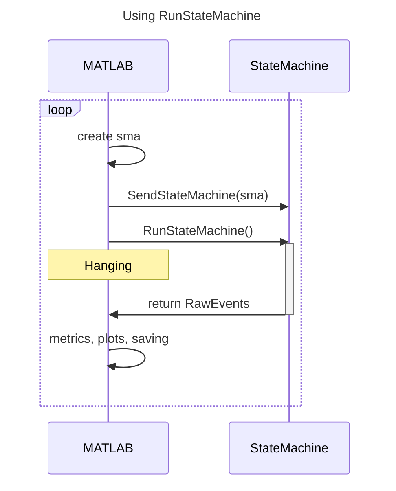
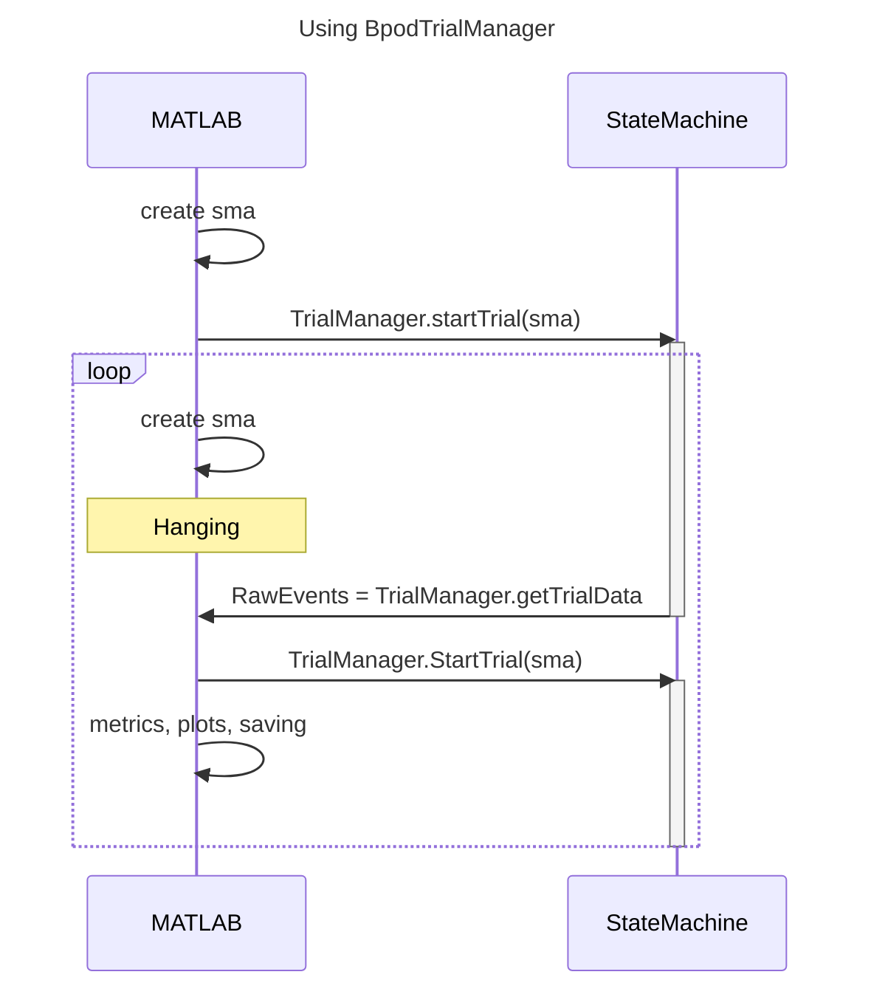

# Advanced user guide

## End-of-session performance summaries
Rodent behavior often takes places in the context of multiple sessions and days of training. At the conclusion of a session, it is possible to generate a summary of both the current session, but also performance across multiple sessions.

```matlab
% retrieve current file's path
[behaviour_folder, sessiondata_filename] = fileparts(BpodSystem.Path.CurrentDataFile);

session_history = struct;
sessiondatas = dir(fullfile(behaviour_folder, '*.mat'));
for file = 1:numel(sessiondatas)
    SessionData = load(fullfile(sessiondatas(file).folder, sessiondatas(file).name), 'SessionData');
    if SessionData.nTrials < 50  % there would be multiple exclusion criteria
        continue  % skip this session
    end

    % append relevant parameters into a data structure
    session_history(end+1).name = sessiondatas(file).name;
    session_history(end) = calculate_parameters(SessionData);;
end

plot_session_parameters(session_history)
```

## Dead time
"Dead time" is the time between the state machine exiting its final state and a new state beginning.

- `SaveBpodData` slowing down because of increased size of `BpodSystem.Data`
- Update of plots becoming inefficient
- Calculations involving trial parameters growing in size

### Measuring dead time

### Addressing dead time

### `BpodTrialManager` vs `RunStateMachine`
To address this users could use `BpodTrialManager` instead of the `RunStateMachine` approach. In short, the difference is that `RunStateMachine` result in MATLAB being unable to operate while the state machine is active, while `BpodTrialManager` does not. However, `BpodTrialManager` is slightly more complex and requires more careful construction of the trial loop.

The difference in terms of hanging states of MATLAB are shown in the sequence diagrams below:





<!-- RunStateMatrix could update a BpodSystem value for time since last run to make this accessible -->

## Global timers

## Liquid delivery

### Calibration

### Managing clogged valves

## Trial type coding

### Randomised pre-allocation

### Blocks

### Within-session modification

## State matrix construction patterns

### Construction in protocol function vs dedicated function

### Managing changing trial types

## Protocol function design approaches

### Minimising modification of protocol m-file by using arguments
[`inputParser`](https://mathworks.com/help/matlab/ref/inputparser.html) is MATLAB's argument handling class.

- Adding useful additional information into `BpodSystem.Data`

<!-- Possiblity to integrate arguments into RunProtocol.m -->

## Setting up and using Bpod on a single rig with multiple users and protocols

### Managing changing connections into state machine

### Using multiple ports/reward delivery approaches

### Managing user-specific folders, files, and functions

## General troubleshooting
- Failure to connect to Bpod
- No water delivery
- Modules fail to connect
- Failure to trigger external hardware

## Dealing with `SessionData`

### Accessing and understanding `RawEvents`
### Integrating offline and online visualization methods

### Object-oriented programming and data