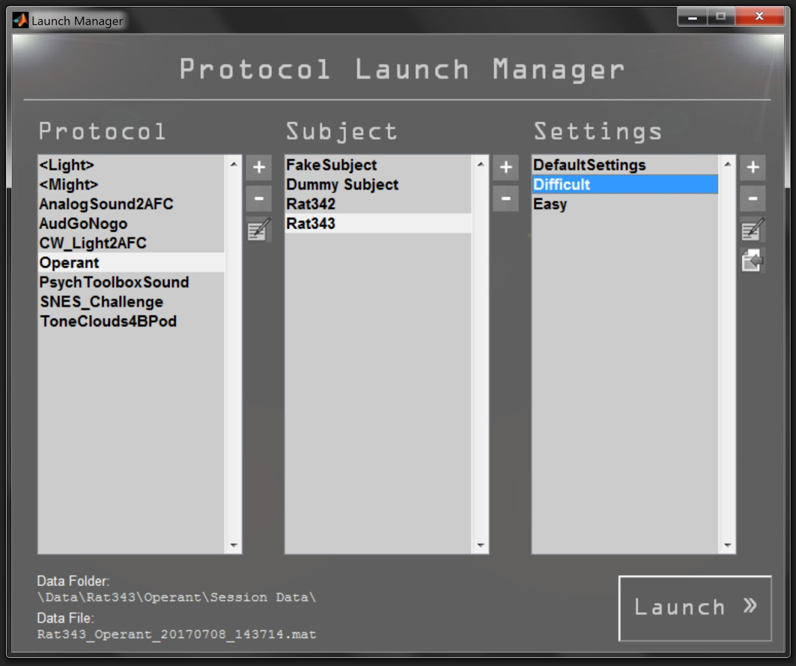
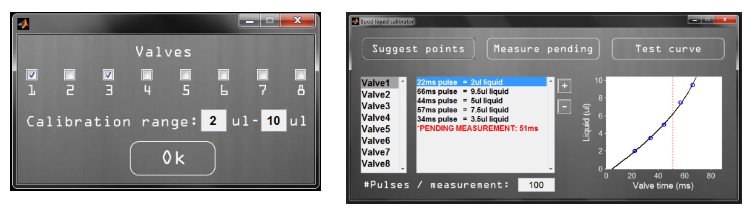

# Using the Bpod console

## Bpod files


```
Bpod Local/ # Contains user-specific files like protcols, calibrations, saved data
    Calibration files/
    Data/
    Protocols/
    Settings/    # Bpod saves 
Bpod_Gen2/    # Contains files required for Bpod to run
```

!!! note
    The expected location for the 'Bpod Local' folder is in same folder as 'Bpod_Gen2' is located.

## Bpod Console
The Bpod Console will appear when `Bpod` is launched and the device successfully connects:


The exact buttons displayed on the console will reflect channels and features available on your state machine version.

The console is your starting point for running protocols with Bpod. It has 5 sections:

- Live Info
    - Displays current and previous states while running an experimental trial
    - Displays the last event recorded during a trial
    - Displays the start time of the current trial in the session
    - Displays the status of the USB serial connection - Idle or Transfer
- Manual Override
    - This section contains an array of tabs. Each tab selects a panel of - override controls for either the state machine, or a connected module.
    - If no module is connected, the tab will display "Serial N", where N is - the number of the physical port (see Serial3 in image above)
    - If a module is connected, it displays as ModuleNameN, where N is the Nth - instance of the module type found.
        - For instance, two SNES modules on module ports 2 and 3 would appear in - separate tabs as SNES1 and SNES2. 
    - The state machine panel provides buttons to override behavior ports, BNC - and Wire interfaces.
    - The module panel defaults to a serial terminal, which exchanges data - between the state machine and the selected module.
    - Custom override panels for modules can be created, and stored in /Bpod/- Functions/Override Panels/
    - The number of panels shown will depend on the configuration of the state - machine hardware and firmware.
- Config
    - Contains four buttons: Module Refresh, Settings, Module USB configuration, System Properties
    - Module Refresh (top-left) 
        - Requests a self-description from connected modules
        - Updates the state machine's list of valid events and outputs. 
        - Displays each module in a tab in the Manual Override section of the GUI
    - Settings (top-right)
        - Launches a menu to configure Bpod settings:
        - Liquid Calibration
        - Audio Calibration
        - Bonsai (TCP/IP) configuration
        - Behavior port enable/disable
        - Flex I/O channel configuration
        - Sync line configuration
        - Data/settings path configuration
    - Module USB configuration (bottom-left)
        - Launches a UI for pairing connected modules with available USB ports
        The resulting paired USB ports are stored in BpodSystem.ModuleUSB.(module - name)
            - i.e. BpodSystem.ModuleUSB.WavePlayer1 could contain the value 'COM4', for - use in your protocol.
    - System Properties (bottom-right)
        - Launches a panel that displays details of the state machine and its - modules:
            - State machine firmware and hardware versions
            - List of the state machine's onboard hardware and functions
            - List of connected modules containing:
                - Name
                - Firmware version
                - Paired USB port
            - List of valid event names for the state machine assembler
            - List of valid output action names for the state machine assembler
    - Clicking the "Module Refresh" button (above) will update the info panel
- Session
    - Session contains two buttons:
        - Play/Pause (top)
            - If idle, opens the launch manager.
            - If running a protocol, schedules a pause after the current trial ends.
        - Stop (bottom)
            - Stops a running protocol, dropping the unfinished trial's data.
- Help
    - A help button on the console's top-right launches a web browser to view this wiki.


**Additional information**

- While the console is open, the state machine's indicator LED will glow green. This indicates that the state machine is ready to communicate with the Bpod software. 
- If you close the Bpod console, the state machine's indicator will glow blue, to indicate that it is disconnected from the program. Running the Bpod command while the console window is open results in an error.
- The console may contain some channels that appear grayed out. These channels are not available on the state machine you have connected.
<!-- - Different state machine models are supported. For instance, the pocket state machine generates the following console: image is not included in the original wiki-->

## Launch manager
The Launch Manager appears when a protocol is run from the Bpod Console.



- **Protocol panel**
    - Lists the protocols in /Bpod Local/Protocols/
    - Folders appear with angle brackets: <MyFolder>. Double click the folder to navigate.
    - Selecting a protocol will display the subjects registered for the protocol in the subject panel.
    - Clicking "+" creates a new protocol from a blank template.
    - Clicking "-" deletes a protocol
    - Clicking the "edit" icon launches the protocol's main .m file in the MATLAB editor.
- **Subject panel**
    - Lists the test subjects registered for the selected protocol. 
    - Clicking "+" adds a test subject to the list. It also creates a folder for the test subject in /Bpod Local/Data/
    - Clicking "-" removes the test subject's folder and all of the data and settings within it.
    - You will be warned before this happens, and forced to click two check-boxes confirming the deletion.
- **Settings panel**
    - Lists the settings files in /Bpod Local/Data/TestSubject/Protocol/Settings/
    - Each settings file is a .mat file, containing a struct with task parameters.
    - Clicking "+" adds a .mat file containing an empty struct to the selected subject's settings folder.
    - Clicking "-" removes the selected .mat file from the selected subject's settings folder.
    - Clicking "edit" loads the struct of the selected .mat file into the local workspace. You can change parameters in the struct, and then run `SaveProtocolSettings(ProtocolSettings)` to save it to its original location.
    - Clicking "import" allows you to copy a settings file to the list (from another test subject's folder).
- **Launch button**
    - Once you are ready to start the protocol, click "Launch".
    - This will run your protocol's main .m file
    - The settings struct you selected will be available in your protocol workspace as: `BpodSystem.ProtocolSettings`

!!! note
    The path to the folder may be different on your system. You can select where settings, protocols and data are stored from the Bpod console's settings menu.

## Emulator mode
If the Bpod software can not connect to a Bpod device, it can be run in Emulator mode.

- In emulator mode, a software state machine on the computer takes the place of the Bpod device.    
- State matrices can be sent and run, and events returned without changing protocol code.
- The Bpod console shows the state of the device, and accepts manual inputs. Simply click port sensor, BNC and wire override buttons.
- The computer clock is used for timers and event timestamps. Thus, timing is far less precise than for measurements obtained with the Bpod device.
- The [PsychToolboxSoundServer plugin](../user-guide/function-reference.md#psychtoolboxsoundserver) detects when Bpod is in emulator mode, and plays sounds through the computer's default sound card.
    - In emulator mode, sounds are played with the [MATLAB sound function](http://www.google.com/url?q=http%3A%2F%2Fwww.mathworks.com%2Fhelp%2Fmatlab%2Fref%2Fsound.html&sa=D&sntz=1&usg=AOvVaw2FJb4XPhRZQubFll-UohrR). Performance and availability varies by platform.
- Emulator mode can be forced when hardware is connected, by running Bpod('EMU')
- To exit emulator mode, ensure that the Bpod device is plugged in and restart Bpod.
- Currently, only the state machine's onboard channels are supported. If your protocol depends on Bpod modules or other external hardware, you will have to run your protocol with the hardware present.

## Liquid calibration
Solenoid valves connected to each behavior port (we recommend [these](http://www.google.com/url?q=http%3A%2F%2Fwww.theleeco.com%2Felectro-fluidic-systems%2Fsolenoid-valves%2Flhd%2Fsoft-tube-ported-style.cfm&sa=D&sntz=1&usg=AOvVaw1w0EV-e7R4MRGhzhhuY39h) for their fast action) can gate the gravity flow of liquid reward from an elevated reservoir to the test subject below. When writing your protocol, you might want to deliver a 5µl of liquid reward to a mouse - but how long should you open the valve to achieve this? The `GetValveTimes()` function will solve this for you, by reading from a calibration curve you create. Here's how to create and manage calibration curves:

<!-- ### Step 1. Launch the calibration manager -->
<!-- Original wiki has no step 2 heading -->

- From the [Bpod console](../user-guide/general-concepts.md#bpod-console), click "Settings" (wrench icon). You will see a settings menu: 


- Next, click "Liquid reward calibration" (the faucet icon on the far left)
- You should now see the calibration manager:


- In the left list box, you can select one of the 8 valves to view its measurements and calibration curve in the right panels.
- The "Plus" button will manually add a new amount to be measured. This will appear in red as a "Pending measurement".
- The "Minus" button will permanently delete the selected measurement. 
    - The "Suggest Points" button prompts you for a liquid amount range of interest, and automatically adds the best pending measurements: 



- The "#Pulses / measurement" button allows you to specify how many pulses will be delivered for each measurement. Larger numbers of pulses reduce measurement error, especially when calibrating for small liquid quantities.
- The "Measure Pending" button delivers pulses from each valve that has a pending measurement. You should capture the water dispensed from each valve in a separate [weigh boat](https://www.google.com/search?q=weigh+boat&source=lnms&tbm=isch). When dispensing is complete, the software prompts you to measure each boat on a laboratory balance, and enter the resulting liquid weights. It then updates the calibration curve.
- The "Test curve" button delivers 100 test pulses of a size you select from a valve you select, prompts for the resulting weight, and indicates whether the measurement is within a selected tolerance:


<!-- this function could be improved if goal is just to see if one liquid port is doing its job -->