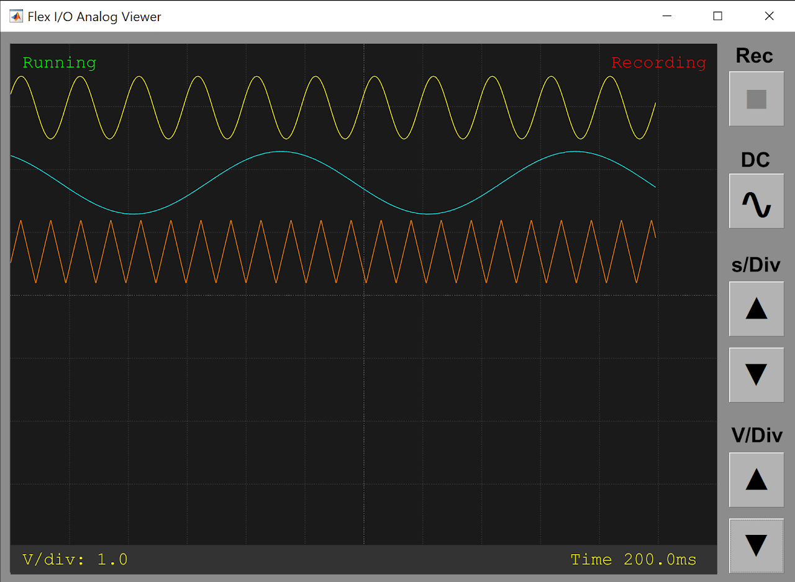
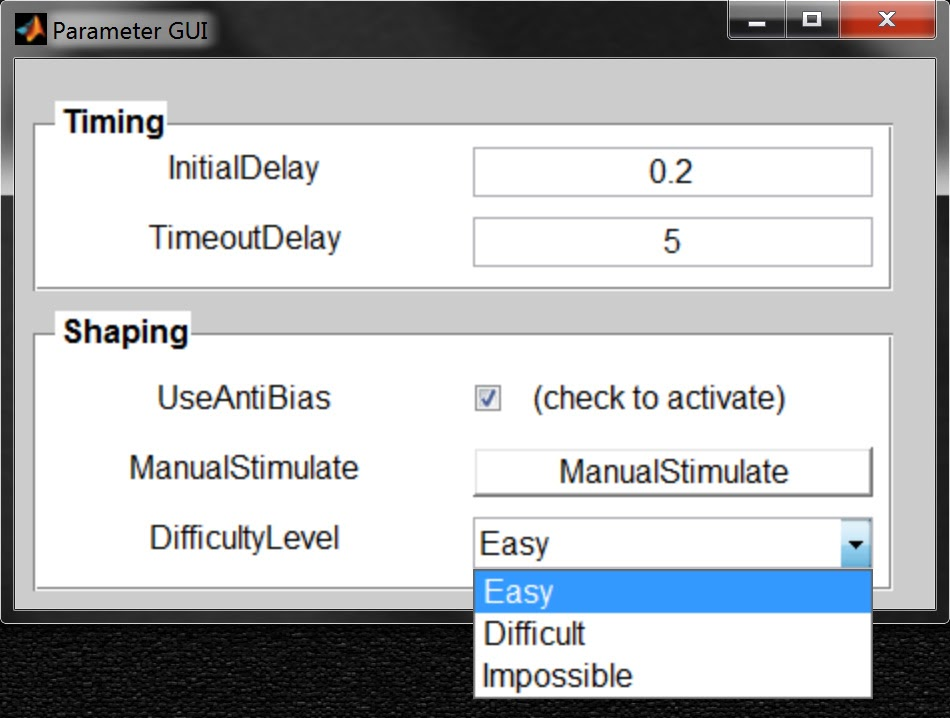
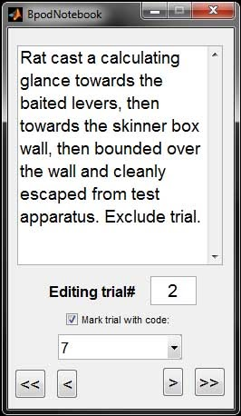
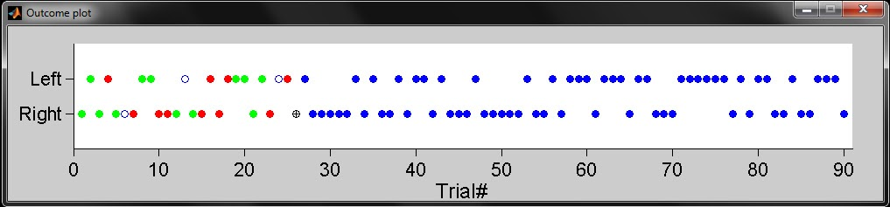
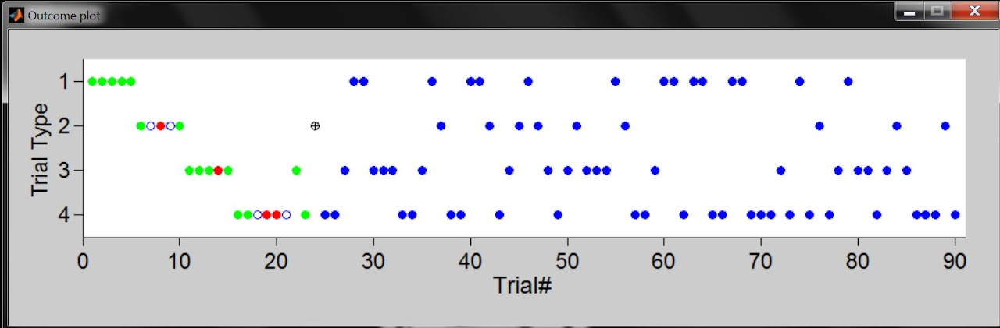
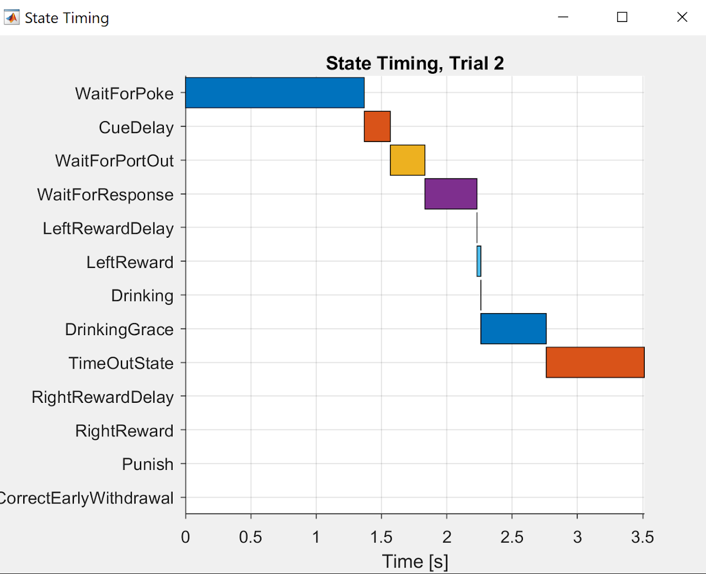
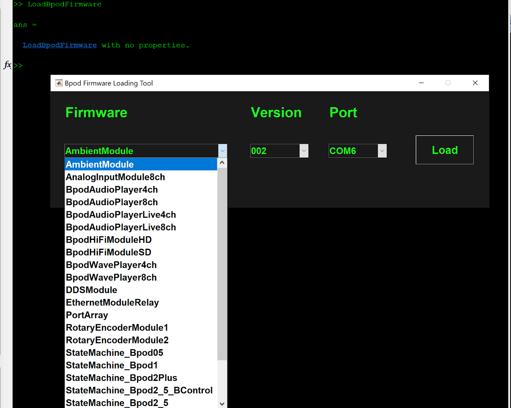

# Function reference
!!! note
    :construction: This file contains all function references, with each section likely to be moved into its own file into the future.

## Initialization

### `Bpod()`
**Description**

Initializes Bpod and creates a global object representing the Bpod device (`BpodSystem`) in the base workspace.

- The function automatically searches all available serial ports and finds Bpod if one is connected.
- It then creates a `BpodSystem` object.

## BpodSystem fields
`BpodSystem` exists in the workspace as a [global object](https://mathworks.com/help/matlab/ref/global.html). It has the following fields:

### Data
**Description**

Stores session data as a `struct`.

- Typically stores the output of [`AddTrialEvents`](#addtrialevents) and other data added as subfields.
- Can be saved automatically with the `SaveBpodSessionData` function.

**Example**

This code sends "sma" (an existing state matrix) to Bpod, runs it 10 times, and packages the raw events for analysis. 
It then saves them to disk on each trial. 

```matlab
SendStateMatrix(sma);
for i = 1:10
    RawEvents = RunStateMatrix;
    BpodSystem.Data = AddTrialEvents(BpodSystem.Data, RawEvents);
    BpodSystem.Data.arbitrarydata = rand(1,10); % Anything can be added
    SaveBpodSessionData;
end
```

### ProtocolSettings
**Description**

Saves the struct BpodSystem.ProtocolSettings to disk.

- The settings in BpodSystem.ProtocolSettings are saved over the file targeted when selecting settings in the launch manager.

**Syntax**

`SaveProtocolSettings()`

**Parameters**

- None

**Returns**

- None

**Example**

This code checks the selected settings file to see if it has been populated - and if not, adds default values.
```matlab
S = BpodSystem.ProtocolSettings; % Load settings chosen in launch manager into current workspace as a struct called S

if isempty(fieldnames(S))   % If settings file was an empty struct,
                            % populate struct with default settings
    S.SoundDuration = 0.5;  % Duration of sound (s)
    S.RiotDuration = 7.5;   % Duration of riot(s)
end

BpodSystem.ProtocolSettings = S;
SaveProtocolSettings; % Saves the default settings to the disk location selected in the launch manager.
```

### SoftCodeHandlerFunction
**Description**

Equal to the full path of a soft code handler m-file to use with the current protocol.

**Example**

For another example of a soft code handler, see [Examples/Protocols/](https://github.com/sanworks/Bpod_Gen2/tree/master/Examples/Protocols). PsychToolboxSound/ contains complete examples of a protocol state matrix construction using SoftCodeHandler_PlaySound.m

```matlab
% 1. (main protocol file): This single-state matrix sends a byte (3) back to the
% governing computer on state entry by setting a 'SoftCode' in Output Actions.
sma = NewStateMachine();
sma = AddState(sma, 'Name', 'State1', ...
    'Timer', 1,...
    'StateChangeConditions', {'Tup', 'exit'},...
    'OutputActions', {'SoftCode', 3});

% Part 2 (in main protocol file): This code specifies which file will handle the
% byte when it comes back.
BpodSystem.SoftCodeHandlerFunction = 'SoftCodeHandler_Printout';

% Part 3 (separate file in protocol folder): This code handles the byte by 
% printing it to the MATLAB command window.
function SoftCodeHandler_Printout(Byte)
disp(Byte);
```

### ProtocolFigures
**Description**

A struct for handles of figures that display online data.

- Since `BpodSystem` is a global variable, the figure handles in this struct will be available in figure update functions and in the main protocol function.
- All figures in `BpodSystem.ProtocolFigures` will automatically be closed when the protocol ends.

**Example**

This code initializes a new figure to show data, and adds its handle to `BpodSystem.ProtocolFigures`.
At the conclusion of the session it will be closed.
```matlab
BpodSystem.ProtocolFigures.MyPlotFig = figure('Position', [200 200 1000 200],...
                                              'name', 'My Plots');
```

### EmulatorMode
**Description**

When no Bpod device is found, the user can launch the Bpod software in emulator mode.

- BpodSystem.EmulatorMode is automatically set to 1 in emulator mode (0 = default, actual hardware).
- Emulator mode is a tool for protocol development; timing data and sound / visual display timing may be imprecise depending on the platform. Protocols developed with the emulator should be validated on hardware prior to any experiment.
- Inputs are read and the hardware state is indicated on the Bpod console while running a state machine.
- When designing a protocol that can be run in emulator mode, block off code that interfaces with unavailable hardware (see example).

**Example**

This code connects to a remote TCP server using the SerialEthernet plugin, only if NOT in emulator mode.
```matlab
if BpodSystem.EmulatorMode == 0
    SerialEthernet('Init', 'COM65'); % Set COM port for Arduino Leonardo
    pause(1);
    RemoteIP = [192 168 0 104]; RemotePort = 3336;
    SerialEthernet('Connect', RemoteIP , RemotePort);
else
    disp('Fake-connected to a fake TCP server')
end
```

### StateMachineInfo
**Description**

A struct containing human-readable information about the currently connected state machine hardware.

Different state machine devices will populate this struct differently, resulting in different possible events and outputs.

It has the following fields:

- nEvents: the total number of unique events monitored from input channels
- EventNames: A character string naming each event 
    - Each event is a state of an input channel
    - Use these with the `AddState()` function when writing state machines.
- InputChannelNames: A character string naming each input channel
    - Each channel is capable of generating multiple states
    - Use these with the `SetCondition()` function
- nOutputChannels: the total number of unique output channels
- OutputChannelNames: A character string naming each output channel
- Use these with the `AddState()` and `SetGlobalTimer()` functions
- MaxStates: The maximum number of states supported by the connected state machine

**Example**

`>> BpodSystem.StateMachineInfo.OutputChannelNames`
```
ans = 

  Columns 1 through 7
    'Serial1'    'Serial2'    'Serial3'    'SoftCode'    'ValveState'    'BNC1'    'BNC2'

  Columns 8 through 15
    'Wire1'    'Wire2'    'Wire3'    'PWM1'    'PWM2'    'PWM3'    'PWM4'    'PWM5'

  Columns 16 through 20
    'PWM6'    'PWM7'    'PWM8'    'GlobalTimerTrig'    'GlobalTimerCancel'

  Column 21
    'GlobalCounterReset'
```
### Status
**Description**

`BpodSystem.Status` is a struct populated with system status variables. Most subfields are used internally by the GUI. 

`BpodSystem.Status.BeingUsed` indicates whether a behavior session is running.

- BeingUsed is set to 1 when:
    - A state machine is run using `RunStateMachine()` or `BpodTrialManager`
    - A session is started with `RunProtocol()` or the Launch Manager
- BeingUsed is set to 0 when:
    - The 'Stop' or 'Pause' buttons are pressed on the Bpod Console GUI
    - The session is stopped with `RunProtocol('Stop')`

**Example**

When the user ends the session, this code calls a user-defined cleanup function before exiting

```matlab
if BpodSystem.Status.BeingUsed == 0
    break
end
```

### FlexIOConfig
**Description**

FlexIOConfig is a struct used to configure Flex I/O channels. Flex I/O channels can each be configured as:

- Digital Input
- Digital Output
- Analog Input (12-bit, 0-5V)
- Analog Output (12-bit, 0-5V)
- High Impedance (channel disabled)

Other configuration settings in FlexIOConfig concern channel(s) configured as analog input:

- Sampling Rate
- ADC measurements per sample
- Threshold configuration

FlexIOconfig is attached to a callback function. Any changes to the struct are automatically sent to the state machine.

**Properties**

- **channelTypes**: An array containing the Flex I/O configuration. The array must specify a configuration for each Flex I/O channel.
    - Configuration values
          - 0: Digital Input
          - 1: Digital Output
          - 2: Analog Input
          - 3: Analog Output
          - 4: Disabled (High Impedance)
    - On calling FlexIOConfig.channelTypes(), the composition of valid state machine events and output actions will be updated to match the requested channel types.
    - Note: a GUI is provided to set the Flex I/O configuration manually, from the settings menu on the Bpod Console. If set from the GUI, the configuration will be loaded automatically to the device each time Bpod is started. FlexIOconfig.channelTypes is useful for reconfiguring the Flex I/O channels when launching an experimental protocol.
- **analogSamplingRate**: The rate of sample acquisition for all Flex I/O channels configured as analog input
    - Units: Hz
    - Range: [1, 1000]
- **nReadsPerSample**: The number of ADC reads to average for each sample acquired. ADC reads are measured consecutively, and each read takes ~2 microseconds. Increasing reads per sample reduces the effect of high-frequency noise.
    - Range: [1, 4]
- **threshold1, threshold2**: A 1x4 array specifying an event threshold for each channel. Each Flex I/O channel has two configurable thresholds, contained in threshold1 and threshold2 respectively.
- Unit  s: Volts
- **polarity1, polarity2**: A 1x4 array specifying the polarity of each channel's threshold. 
    - 0: An event is generated when voltage is above the threshold
    - 1: An event is generated when voltage is below the threshold
- **thresholdMode**: A 1x4 array specifying the mode of each threshold. All thresholds are disabled when reached.
    - 0: Thresholds must be manually re-enabled using the 'AnalogThreshEnable' output action.
    - 1: For a single Flex I/O channel, crossing threshold 1 enables threshold 2. Crossing threshold 2 enables threshold 1.

**Examples**

This code configures channel 1 as an analog input and channel 2 as an analog output. All other channels are configured as high impedance.
```matlab
BpodSystem.FlexIOConfig.channelTypes = [2 3 4 4];
```


This code configures channel 1's two thresholds to 4V (threshold 1) and 2V (threshold 2). Threshold 2 is set to detect voltage below 2V. Thresholds are set to enable each other when crossed. This setup can be used to generate an event on the rising and falling phases of a cyclic signal.

```matlab
Chan = 1;
BpodSystem.FlexIOConfig.channelTypes(Chan) = 2; % Set Flex I/O Ch1 as analog input
BpodSystem.FlexIOConfig.threshold1(Chan) = 4;
BpodSystem.FlexIOConfig.threshold2(Chan) = 2;
BpodSystem.FlexIOConfig.polarity1(Chan) = 0;
BpodSystem.FlexIOConfig.polarity2(Chan) = 1;
BpodSystem.FlexIOConfig.thresholdMode(Chan) = 1;
```

This code configures the sampling rate and number of ADC reads per sample for all analog inputs.
```matlab
BpodSystem.FlexIOConfig.analogSamplingRate = 100; % Set Flex I/O analog input sampling rate to 100Hz
BpodSystem.FlexIOConfig.nReadsPerSample = 2; % Set Flex I/O analog input to 2 averaged ADC reads per sample
```

A behavior protocol demonstrating use of Flex I/O channels for analog acquisition is given in the Bpod_Gen2 repository [here](https://www.google.com/url?q=https%3A%2F%2Fgithub.com%2Fsanworks%2FBpod_Gen2%2Fblob%2Fmaster%2FExamples%2FProtocols%2FLight%2FFlexIOAnalogLight2AFC%2FFlexIOAnalogLight2AFC.m&sa=D&sntz=1&usg=AOvVaw3Hhg52UiVwwLIqlC_2oK8a).

> [!NOTE]
> Flex I/O channels were introduced with Bpod State Machine 2+ in 2022, and may also exist on newer models.


## BpodSystem functions

### `assertModule()`
**Description**

Throws an error if a given Bpod module is not present.
- An optional argument specifies whether the module must also be paired with its USB serial port via the USB pairing UI.
- After connecting a new module, you must press the 'refresh' button on the [Bpod console GUI] to make it visible to `assertModule()`.

**Syntax**

`BpodSystem.assertModule(moduleNames, USBPaired)`

**Parameters**

- `moduleNames`: a character array containing the name of the module. A cell array of strings may also be provided to assert multiple modules. Note: The names of connected modules are given in BpodSystem.Modules
- `USBPaired`: optional, an array of 1s and 0s with one value for each module in moduleNames. 
    - 1 = the module must be paired with its USB serial port. 
    - 0 = the module does not have to be paired.

**Return**

- None

**Example**

This code will throw an error if the HiFi or ValveDriver modules are missing.
It will also throw an error if the HiFi module is not paired with its USB serial port.
```matlab
BpodSystem.AssertModule({'HiFi', 'ValveDriver'}, [1 0]);
```

### `setStatusLED()`
**Description**

Enables or disables the status indicator LED on the Bpod finite state machine.

- If disabled, the status LED will remain off until the state machine is power cycled, or until re-enabled with `setStatusLED()`
- `setStatusLED()` requires state machine firmware v23 or newer

**Syntax**
```matlab
BpodSystem.setStatusLED(status) 
```

**Parameters**

- status
    - 0 = LED off
    - 1 = LED on

**Returns**

- None

**Example**

This code will disable the state machine status LED
```matlab
BpodSystem.setStatusLED(0);
```

### `startAnalogViewer()`
**Description**

Launches a viewer for Flex I/O channels configured as analog input.



- The viewer can also be launched from the Bpod console
- The viewer can run during the behavior session for online monitoring (note: the UI may add jitter to soft-code processing if using TrialManager).
- Pushbuttons are:
    - REC: Press to record to the current analog data file. Recording starts with the next behavior session.
    - Note: The analog data file is created automatically when starting a session. It has the same path and naming convention as the primary data file. It can be merged into the primary data file at the end of the session by calling AddFlexIOAnalogData().
- DC: Press to subtract the DC offset from all signals (in the viewer only; logged data is unaffected)
- s/Div: Adjust seconds per division on the viewer grid. The 'Time' label on the bottom info bar shows the current time per division.
- V/Div: Adjust volts per division on the viewer grid. 

**Syntax**
```matlab
BpodSystem.startAnalogViewer() 
```

**Parameters**

- None

**Returns**

- None

**Example**

This code will launch the analog viewer
```matlab
BpodSystem.startAnalogViewer();
```

## Creating a state machine
> [!NOTE]
> More examples of state machine creation can be found in the Examples/ folder of the repository. [Examples/State Machines/](https://github.com/sanworks/Bpod_Gen2/tree/master/Examples/State%20Machines) contains minimal (building block) examples, while [Examples/Protocols/](https://github.com/sanworks/Bpod_Gen2/tree/master/Examples/Protocols) contains complete examples of a protocol state matrix construction.

### `NewStateMachine()`
**Description**

Creates a new, empty state machine. 

States can be added to the empty state machine description with the `AddState()` function. The state machine description returned is a struct with 21 subfields:

- Meta: a struct with information about the state machine (sizes of variables, precomputed for speed)
- nStates: the number of states that have been added to the state machine
- Manifest: a cell array listing the names of states that have been referenced by other states (though not explicitly added yet)
- nStatesInManifest: the number of states in the manifest
- StateNames: a cell array of strings containing the name of each state added to the state machine with `AddState()`; initialized as a 1x1 cell with the string "Placeholder"
- InputMatrix: each row is a state, each column is an input event. The matrix specifies the new state to go to if each event occurrs in each state.
- OutputMatrix: each row is a state, each column is an output action. The matrix specifies the value of each output action in each state.
- StateTimerMatrix: for each state, specifies the new state to go to if the state's internal timer elapses.
- GlobalTimerStartMatrix: each row is a state, each column is a global timer. The matrix specifies the new state to go to when the global timer starts.
- GlobalTimerEndMatrix: each row is a state, each column is a global timer. The matrix specifies the new state to go to when the global timer elapses.
- GlobalTimers: each column is a timer. This vector specifies the current setting of each timer in seconds.
- GlobalCounterMatrix: each row is a state, each column is a global counter. The matrix specifies the new state to go to if the counter's threshold is exceeded.
- GlobalCounterEvents: each column is a counter. This vector specifies the input event being counted. It defaults to 255 (no input event).
- GlobalCounterThresholds: each column is a counter. This vector specifies the number of events recorded before each counter is exceeded.
- GlobalCounterSet: each column is a counter. This vector specifies whether each counter was used in the current matrix (1) or not (0).
- ConditionMatrix: each row is a state, each column is a configurable input channel condition. The matrix specifies the new state to go to if the condition is satisfied.
- ConditionChannels: The input channel index linked to each condition.
- ConditionValues: The value of the input channel (specified in ConditionChannels) for each condition to be satisfied.
- StateTimers: each column is a state. This vector specifies the setting of each state's internal timer in seconds.
- StatesDefined: each column is a state. States appear in the matrix as blank states when first referred to as the target of a state transition. StatesDefined is then set from 0 to 1 when the state is finally added.

**Syntax**

```matlab
StateMachine = NewStateMachine();
```

**Parameters**

- None

**Returns**

- An empty state machine struct

**Example**

This code initializes a state matrix and then adds one state:

```matlab
sma = NewStateMachine();
sma = AddState(sma, 'Name', 'MyState', ...
    'Timer', 1,...
    'StateChangeConditions', {'Tup', 'exit'},...
    'OutputActions', {});
```

### `AddState()`
**Description**

Adds a state to an existing state machine. 

**Syntax**

```matlab
NewStateMachine = AddState(StateMachineStruct, 'Name', StateName,...
    'Timer', TimerDuration,...
    'StateChangeConditions', Conditions,...
    'OutputActions', Actions)
```
**Parameters**

- StateMachineStruct: The state machine you are adding to. If this is the first state, StateMachineStruct is the output of `NewStateMachine()`.
- StateName: A character string containing the unique name of the state.
    - The state will automatically be assigned a number for internal use and state synchronization via the sync port.
- Timer: The state timer value, given in seconds
    - This value must be zero or positive, and can range between 0-3600s.
    - If set to 0s and linked to a state transition (see next bullet), the state will still take ~100us to execute the state's output actions before the transition completes.
- StateChangeConditions: A cell array of strings listing pairs of input events and the state changes they trigger.
    - Each odd cell should contain the name of a valid input event.
    - Each even cell should contain the name of the new state to enter if the previously listed event occurs, or 'exit' to exit the matrix and return all captured data..
- OutputActions: A cell array listing the output actions and corresponding values for the current state.
    - Each odd cell should contain the name of a valid output action.
    - Each even cell should contain the value of the previously listed output action (see output actions for valid values).

**Returns**

- A state machine struct, updated with the new state.

**Examples**

This code generates a simple state matrix that drives BNC output channel 1 to 5V (high) for 1 second before exiting. 
```matlab
sma = NewStateMachine();

sma = AddState(sma, 'Name', 'MyState', ...
    'Timer', 1,...
    'StateChangeConditions', {'Tup', 'exit'},... 
    'OutputActions', {'BNCState', 1}); 
% Tup occurs when the state's internal timer elapses
```

This code generates a simple state matrix that flashes the port LEDs of ports 1-3 for 0.1 second each (assuming an LED is connected to the port's PWM line). 
```matlab
sma = NewStateMachine();

sma = AddState(sma, 'Name', 'LightPort1', ...
    'Timer', 0.1,...
    'StateChangeConditions', {'Tup', 'LightPort2'},...
    'OutputActions', {'PWM1', 255}); 

sma = AddState(sma, 'Name', 'LightPort2', ...
    'Timer', 0.1,...
    'StateChangeConditions', {'Tup', 'LightPort3'},...
    'OutputActions', {'PWM2', 255}); 

sma = AddState(sma, 'Name', 'LightPort3', ...
    'Timer', 0.1,...
    'StateChangeConditions', {'Tup', 'exit'},...
    'OutputActions', {'PWM3', 255}); 
```

### `EditState()`
**Description**

Edits a state in an existing state machine. 

**Syntax**

```matlab
NewMatrix = EditState(StateMachineStruct, StateName, ParameterName, ParameterValue)
```

**Parameters**

- StateMachineStruct: The state machine you are editing.
- StateName: A character string specifying the name of the state you are editing.
- ParameterName: A character string specifying the parameter you are editing. Valid values are:
    - 'Timer'
    - 'StateChangeConditions'
    - 'OutputActions'
- ParameterValue: The new value of the parameter.
    - For timer, this is the new timer duration in seconds. 
    - For StateChangeConditions, this is a cell array of strings formatted with pair-wise arguments as in `AddState()`.
    - For OutputActions, this is a cell array of strings formatted with pair-wise arguments as in `AddState()`.

**Returns**

- A state machine struct, updated with the new parameter.

**Example**

This code generates a simple state machine that drives BNC output channel 1 to 5V (high) for 1 second before exiting. Next, EditState is used to make the state high for 10 seconds instead of 1. Finally, EditState is used to make the state machine end immediately if BNC input channel 1 receives a trigger pulse during the 10 second state.

```matlab
sma = NewStateMachine();
sma = AddState(sma, 'Name', 'MyState', ...
    'Timer', 1,...
    'StateChangeConditions', {'Tup', 'exit'},...
    'OutputActions', {'BNCState', 1}); 

sma = EditState(sma, 'MyState', 'Timer', 10);

sma = EditState(sma, 'MyState', 'StateChangeConditions',...
                     {'Tup', 'exit', 'BNC1High', 'exit');
```

### `SetGlobalTimer()`
**Description**

Sets the parameters of a global timer.

- Unlike state timers, global timers can be triggered from any state (as an output action), and handled from any state (by causing a state change). Any subset of global timers can be triggered or canceled from any state.
- An optional onset latency can be configured, following the timer trigger
- Following the onset latency, a "start" event is generated, and can trigger a state change.
- Then, following the timer duration, an "end" event is generated, which can also trigger a state change.
- A digital or PWM (LED) output channel can be linked to the timer. 
    - The linked channel is set "high" when the timer starts, and "low" when it ends. PWM values may be specified for onset/offset. 
- Separate serial output messages can be linked to the timer start and end events to control modules. 
- Global timers can be set to 'Loop'; repeat until they are explicitly canceled, or until a fixed number of iterations.
    - Each loop iteration generates a start and stop event (this can be disabled for high-frequency loops)
    - A configurable interval separates loop iterations (default = 0 seconds)
- Global timers can be linked to trigger other global timers. Following the timer's onset delay, any linked timers will be triggered.
- The number of available global timers is a configurable parameter specified in the state machine firmware.

**Syntax**

The function uses argument-value pairs. These must be listed in order (for efficiency), up to the last argument you need. Beyond that, optional arguments (denoted by [ ]) may be omitted):

```matlab
NewStateMachine = SetGlobalTimer(StateMachineStruct, 'TimerID', TimerNumber,... 
        'Duration', TimerDuration, ['OnsetDelay', OnsetDelay],...
        ['Channel', OutputChannel], ['OnsetValue', OnsetValue],... 
        ['OffsetValue', OffsetValue], ['Loop', LoopMode],...
        ['GlobalTimerEvents', EventsEnabled], ['LoopInterval', LoopInterval],...
        ['OnsetTrigger', OnsetTriggerByte])
```
where [ ] = optional argument
<!-- Check syntax docs to see if there's a better way of indicating optional argument -->

**Parameters**

- StateMachineStruct: The state machine description whose global timer you are setting (typically named 'sma').
- TimerNumber: The number of the timer you are setting (an integer, 1-5).
- TimerDuration: The duration of the timer, following timer start (0-3600 seconds)
- OnsetDelay: A fixed interval following timer trigger, before the timer start event (default = 0 seconds) 
    - If set to 0, the timer starts immediately on trigger and no separate start event is generated.
- OutputChannel: A string specifying an output channel to link to the timer (default = none)
    - Valid output channels can be viewed from the "inspect" icon on the Bpod Console.
- OnsetValue: The value to write to the output channel on timer start (default = none)
    - If the linked output channel is a digital output (BNC, Wire), set to 1 = High; 5V or 0 = Low, 0V
    - If the linked output channel is a pulse width modulated line (port LED), set between 0-255.
    - If the linked output channel is a serial module, OnsetValue specifies a byte message to send on timer start.
- OffsetValue: The value to write to the output channel on timer end (default = none)
- LoopMode: 0 = off (default). If set to 1, global timer loops until canceled or until trial end. If >1, indicates a fixed number of loop iterations to execute (up to 255).
- EventsEnabled: 1 = on (default). If set to 0, timer onset and offset events are not generated. Disabling events is useful for cases where the global timer is rapidly cycling to control a stimulus, and would otherwise generate a huge number of ignored behavior events.
- LoopInterval: A configurable delay between the end of a timer loop and the beginning of the next one (default = 0 seconds)
- OnsetTrigger: A byte whose bits indicate other global timers to trigger when the timer starts (following its onset delay).
    - Instead of an integer, the assembler will recognize a character string of 1s and 0s (i.e. '101001' to trigger timers 1,4 and 6)

**Returns**

- A state machine struct, updated with the new global timer settings.

**Examples**

The two examples below are for simple use cases. More complex global timer examples can be found in the Bpod repository: /Bpod_Gen2/Examples/State Machines/GlobalTimers/

This code generates a state machine that sets a global timer for 3 seconds, triggers it in the first state, and handles it in the second and third states. 
```matlab
sma = NewStateMachine();

sma = SetGlobalTimer(sma, 'TimerID', 1, 'Duration', 3); 

sma = AddState(sma, 'Name', 'State1', ...
    'Timer', 0,...
    'StateChangeConditions', {'Tup', 'State2'},...
    'OutputActions', {'GlobalTimerTrig', 1});

sma = AddState(sma, 'Name', 'State2', ...
    'Timer', 0,...
    'StateChangeConditions', {'Port1In', 'State3', 'GlobalTimer1_End', 'exit'},...
    'OutputActions', {});

sma = AddState(sma, 'Name', 'State3', ...
    'Timer', 0,...
    'StateChangeConditions', {'Port1Out', 'State2', 'GlobalTimer1_End', 'exit'},...
    'OutputActions', {});
```


This code generates a state machine that sets global timer#2 for 2 seconds with a 1.5 second onset delay. The timer is linked to a BNC channel. The timer is triggered in the first state, and handled it in the second and third states.

```matlab
sma = NewStateMachine;

sma = SetGlobalTimer(sma, 'TimerID', 2, 'Duration', 2,...
                          'OnsetDelay', 1.5, 'Channel', 'BNC2'); 

sma = AddState(sma, 'Name', 'TimerTrig', ...
    'Timer', 0,...
    'StateChangeConditions', {'Tup', 'Port1Lit'},...
    'OutputActions', {'GlobalTimerTrig', 1});

sma = AddState(sma, 'Name', 'Port1Lit', ...
    'Timer', .25,...
    'StateChangeConditions', {'Tup', 'Port3Lit', 'GlobalTimer1_End', 'exit'},...
    'OutputActions', {'PWM1', 255});

sma = AddState(sma, 'Name', 'Port3Lit', ...
    'Timer', .25,...
    'StateChangeConditions', {'Tup', 'Port1Lit', 'GlobalTimer1_End', 'exit'},...
    'OutputActions', {'PWM3', 255}); 
```

### `SetGlobalCounter()`
**Description**

Sets the threshold and monitored event for one of the 5 global counters. 

- Global counters can count instances of events, and handle when the count exceeds a threshold from any state (by triggering a state change).
- The number of possible counters is a configurable parameter specified in the state machine firmware.
- For more on global counters, see [Using State Matrices](../user-guide/general-concepts.md#state-matrix).

**Syntax**

```matlab
NewStateMachine = SetGlobalCounter(StateMachineStruct, CounterNumber, TargetEventName, Threshold)
```

**Parameters**

- StateMachineStruct: The state matrix whose global timer you are setting.
- CounterNumber: The number of the counter you are setting (an integer, 1-5).
- TargetEventName: The name of the event to count (a string; see Bpod Console's magnifying glass)
- Threshold: The number of event instances to count. (an integer).

**Returns**

- A state machine struct, updated with the new global counter setting.

**Example**

This code generates a state machine that sets a global counter to count 5 BNC1High events, resets the count to 0 in the second state, and handles it in the third and fourth states. 

```matlab
sma = NewStateMachine();

sma = SetGlobalCounter(sma, 1, 'BNC1High', 5);

sma = AddState(sma, 'Name', 'State1', ... % BNC1High Events in this state are not counted because the count will be reset.
    'Timer', 1,...
    'StateChangeConditions', {'Tup', 'State2'},...
    'OutputActions', {});

sma = AddState(sma, 'Name', 'State2', ... % This state resets the global counter.
    'Timer', 0,...
    'StateChangeConditions', {'Tup', 'State3'},...
    'OutputActions', {'GlobalCounterReset', 1});

sma = AddState(sma, 'Name', 'State3', ...
    'Timer', 0,...
    'StateChangeConditions', {'Port1In', 'State4', 'GlobalCounter1_End', 'exit'},...
    'OutputActions', {});

sma = AddState(sma, 'Name', 'State4', ...
    'Timer', 0,...
    'StateChangeConditions', {'Port1Out', 'State3', 'GlobalCounter1_End', 'exit'},...
    'OutputActions', {});
```

### `SetCondition()`
**Description**

Sets an input channel condition to handle on entering a state

- Each condition is true if an input channel's state matches the condition's value.
- The number of possible conditions is a configurable parameter specified in the state machine firmware.

**Syntax**
```matlab
NewStateMachine = SetCondition(StateMachineStruct, ConditionNumber, ConditionChannel, ConditionValue)
```

**Parameters**

- StateMachineStruct: The state machine description whose global timer you are setting.
- ConditionNumber: The number of the condition you are setting (an integer).
- ConditionChannel: The name of the input channel attached to the condition.
    - Input channel names are listed in BpodSystem.StateMachineInfo.InputChannelNames
    - The channel can also be a global timer, indicated as 'GlobalTimerN' where N is the index of the global timer.
- ConditionValue: The value of the condition channel if the condition is met (1 = high, 0 = low)
    - If using a global timer, the timer is "high" (1) between its "start" and "end" events, and 0 otherwise.

**Returns**

- A state machine struct, updated with the new condition description.

**Example**

This code generates a state machine with three states. Each state lights up a behavior port. A condition is set to be valid if the IR channel of port2 is high (1). It is then used to skip state 2 if true.

```matlab
sma = NewStateMachine;

sma = SetCondition(sma, 2, 'Port2', 1);

sma = AddState(sma, 'Name', 'Port1Light', ...
    'Timer', 1,...
    'StateChangeConditions', {'Tup', 'Port2Light'},...
    'OutputActions', {'PWM1', 255});

sma = AddState(sma, 'Name', 'Port2Light', ...
    'Timer', 1,...
    'StateChangeConditions', {'Tup', 'Port3Light', 'Condition2', 'Port3Light'},...
    'OutputActions', {'PWM2', 255});

sma = AddState(sma, 'Name', 'Port3Light', ...
    'Timer', 1,...
    'StateChangeConditions', {'Tup', 'exit'},...
    'OutputActions', {'PWM3', 255});
```

## Running a state machine

> [!NOTE] 
> The sending and running of a state matrix can be done in one of two ways. The "classic" method is to use `SendStateMachine()` and `RunStateMachine()`, where the state machine is suspended during inter-trial MATLAB updates. The "TrialManager" method is to use `BpodTrialManager()` which allows updates in parallel. Protocols based on both RunStateMachine() and BpodTrialManager() will be supported for the indefinite future.


### `SendStateMachine()`
**Description**

Sends a state machine description to a Bpod state machine device. 

- The state machine description is checked first for sanity, and an error is thrown if parameters are invalid, states were referred to but not subsequently defined, etc.
- The function returns an acknowledgement that the data was properly formatted and cued for transmission. 
    - SuccessfulTransmission is verified internally on the next call to RunStateMachine().

**Syntax**

```matlab
Acknowledged = SendStateMachine(StateMachineStruct)
```

**Parameters**

- StateMachineStruct: The state machine struct to be sent.
    - Note: state machine structs are created with NewStateMachine() and states are added with AddState().

**Returns**

- 1 if cued for transmission successfully, 0 if not.

**Example**

This code generates a simple state machine and sends it to Bpod. 

```matlab
sma = NewStateMachine();

sma = AddState(sma, 'Name', 'State1', ...
    'Timer', 1,...
    'StateChangeConditions', {'Tup', 'exit'},...
    'OutputActions', {});

SendStateMachine(sma);
```

### `RunStateMachine()`
**Description**

Runs the last state machine that was loaded to Bpod with `SendStateMachine()`, and returns events, state transitions and timestamps after the state machine reaches the exit state. 

- This command will block MATLAB execution until data is returned. Scripts to be run during a trial can be added as SoftCodeHandlers and triggered from the state machine.
- The events returned are in a raw format (not human-readable), and should be subsequently packaged into your session data with the `AddTrialEvents()` function.

**Syntax**
```matlab
RawEvents = RunStateMachine()
```

**Parameters**

- None

**Returns**

A struct with the following fields:
- States: a vector listing the integer codes of states visited, in sequential order.
    - The list of codes can be found in BpodSystem.StateMatrix.StateNames
- Events: a vector listing the byte codes of events captured.
    - The list of events can be found in BpodSystem.StateMachineInfo.EventNames
- StateTimestamps: a vector listing the entry times of each state listed in the "States" field (in seconds from matrix start).
- EventTimestamps: a vector listing the times of each event listed in the "Events" field (in seconds from matrix start).
- TrialStartTimestamp: The time the matrix started (in seconds from session start).

**Example**

This code sends "sma" (a state machine description) to Bpod, runs it 10 times, and packages the raw events for analysis. 

```matlab
SendStateMachine(sma);

SessionData = struct;
for i = 1:10
    RawEvents = RunStateMachine;
    SessionData = AddTrialEvents(SessionData, RawEvents);
end
```

### `BpodTrialManager()`
> [!NOTE]
> Former syntax: `TrialManagerObject()`

**Description**

In earlier releases of Bpod, the function RunStateMachine() was necessary to run each trial. RunStateMachine() blocks the MATLAB command line for the entire trial, so MATLAB cannot use in-trial time to prepare the next trial's state machine, update online plots or save data. MATLAB must do these things between trials, resulting in a "dead-time" period where the state machine is not recording events or controlling the environment. When MATLAB-side code is efficient, this dead-time is often acceptable - the example protocols included with Bpod have ~15ms of dead time on a modern processor, which occurs during the subject's motion to initiate the next trial. However if your protocol requires complex online analysis or other time-costly computer-side processing, the BpodTrialManager class provides a way for most of this processing to occur in parallel with the trial. 

A few points to consider before using TrialManager:

- Because the state machine uses a single-core Arduino processor, a small dead-time is still necessary for inter-trial data transmission. This dead time is on the order of 200 microseconds, and depends on how many states and state transitions are defined in the next trial. 
- With TrialManager, the code for an experimental protocol becomes slightly more complicated (e.g. this versus this).
- Because TrialManager requires Bpod's governing computer to multitask instead of simply checking for incoming bytes in a loop, the computer may process soft codes with increased latency and jitter. 


**Syntax**

```matlab
TrialManager = BpodTrialManager()
```

**Object Fields**

- Timer
    - A MATLAB [timer object](https://www.google.com/url?q=https%3A%2F%2Fwww.mathworks.com%2Fhelp%2Fmatlab%2Fref%2Ftimer-class.html&sa=D&sntz=1&usg=AOvVaw06imv4yvjQCxbZkAectj-k), used to scan for incoming bytes from the state machine.
    - By default, the timer runs at 1kHz.

**Object Functions**

- **startTrial**(StateMatrix)
    - Sends the next trial's state matrix to the Bpod state machine device, and immediately begins running the trial. 
    - StateMatrix = a valid state machine definition, created with `AddState()`.
    - This function is non-blocking; after state matrix transmission is complete, MATLAB executes the next line of code in your protocol, while the trial proceeds in parallel.
    - In the background, a call to startTrial starts TrialManager's MATLAB timer, which checks constantly for new incoming bytes from the state machine.
- currentTrialEvents = **getCurrentEvents**(TriggerStates)
    - This is an optional function that stalls MATLAB until a specified trigger state is reached, and then returns all states visited and events captured up to that point in the trial. This can be useful for computing the next trial's state machine while the current trial is still running in an adaptive task (e.g. a task with an anti-bias algorithm).
    - TriggerStates = a cell array of strings specifying the names of trigger states, any of which will trigger the current states and events to be returned.
    - currentTrialEvents is a struct with 3 fields:
          - StatesVisited = cell array of strings listing names of states visited, in order of their occurrence
          - EventsCaptured = cell array of strings listing names of events captured, in order of their occurrence
          - RawData = a struct with numerical codes for the states visited and events captured
- RawEvents = **getTrialData**()
    - This function stalls until the trial is complete, then retrieves the trial data.
    - It should  be called after the next trial's state machine is computed and sent, plots are updated, and data is saved.
    - RawEvents is a struct with raw trial data, formatted exactly like the output of `RunStateMachine()`

**Cleanup**

- The TrialManager object and its associated timer object are cleared when you end the protocol.

**Examples**

1. An example visual 2AFC protocol using TrialManagerObject is included in [/Examples/Protocols/Light/Light2AFC_TrialManager](https://www.google.com/url?q=https%3A%2F%2Fgithub.com%2Fsanworks%2FBpod_Gen2%2Fblob%2Fmaster%2FExamples%2FProtocols%2FLight%2FLight2AFC_TrialManager%2FLight2AFC_TrialManager.m&sa=D&sntz=1&usg=AOvVaw2rCsUNZ2YyY8B8hrF22tIl).

For comparison, [/Light2AFC](https://www.google.com/url?q=https%3A%2F%2Fgithub.com%2Fsanworks%2FBpod_Gen2%2Fblob%2Fmaster%2FExamples%2FProtocols%2FLight%2FLight2AFC%2FLight2AFC.m&sa=D&sntz=1&usg=AOvVaw313gEKtjEgDGW4Gn1Cczdr) is an earlier protocol with ~identical functionality, programmed with `RunStateMachine()`.

2. Template for simple protocol setup (the task does not use adaptive contingencies, so `TrialManager.getCurrentEvents()` is not used)

```matlab
function myProtocol % Main protocol file, runs once when session is launched
    global BpodSystem % Import the BpodSystem object (used here to detect when the user ends the protocol)
    nTrials = 1000; % Number of trials in session

    TrialManager = BpodTrialManager; % Create trial manager object
    sma = prepareStateMachine; % Prepare first trial's state machine (see function below)
    TrialManager.startTrial(sma); % Start first trial

    for i = 1:nTrials
        sma = prepareStateMachine; % Prepare next trial's state machine
        RawEvents = TrialManager.getTrialData; % Hangs here until trial end, then returns the trial's raw data
        % // Code to update Bpod modules with the next trial's parameters (if necessary) goes here.
        if BpodSystem.Status.BeingUsed == 0; break; end % If user hit console "stop" button, end session 
        TrialManager.startTrial(sma); % Start next trial's state machine
        % // Code to compute online behavior metrics goes here.
        % // Code to update online plots goes here.
        % // Code to format and save data goes here.
    end
end

function sma = prepareStateMachine
    sma = NewStateMatrix();
    sma = AddState(sma, 'Name', 'MyRandomDelay', ...
        'Timer', ceil(rand*1000)/1000,...
        'StateChangeConditions', {'Tup', 'exit'},...
        'OutputActions', {});
end
```


### `AddTrialEvents()`
**Description**

Packages raw events returned from RunStateMatrix() into a session data struct. 

State codes and event codes are decoded so the session data is human-readable

**Syntax**
```matlab
UpdatedSessionData = AddTrialEvents(PreviousSessionData, RawEvents)
```

**Parameters**

- PreviousSessionData: The session data struct (or an empty struct for the first trial).
- RawEvents: The struct of raw events returned from RunStateMatrix().

**Return**

- UpdatedSessionData: A struct containing data from all trials. It has the following fields:
    - nTrials: The number of trials that have been added
    - RawEvents: A struct containing re-organized state and event timestamps for each trial, labeled so they are human-readable.
          - RawEvents.Trial{n} has two sub-fields, populated depending on what occurred during the trial:
                  - States: the times when each state was entered and exited (in seconds). States that were not visited show NaN.
                  - Events: the times when each event was detected (in seconds).
    - RawData: A struct containing three fields:
          - OriginalStateNamesByNumber: A cell array of strings listing the names of each state (for matching states up with state numbers sent via the sync port)
                  - Note that state numbers are assigned automatically depending on the order of states added with AddState - so if you programmed your protocol to add states (or refer to not-yet-added states) in a different order on each trial, state numbers on each trial may be different.
          - OriginalStateData: A cell array containing the original state codes returned from RunStateMatrix on each trial
          - OriginalEventData: A cell array containing the original event codes returned from RunStateMatrix on each trial
    - TrialStartTimestamp: The time when each trial started (measured from the last time Bpod was initialized)
    - Settings: A cell array of strings containing the settings struct as it existed when each trial's state matrix was sent.


**Example**

This code sends "sma" (an existing state matrix) to Bpod, runs it 10 times, and packages the raw events for analysis. 
```matlab
SendStateMatrix(sma);
SessionData = struct;  % equivalent to BpodSystem.Data 
for i = 1:10
    RawEvents = RunStateMatrix;
    SessionData = AddTrialEvents(SessionData, RawEvents);
end
```

## Running a protocol
To launch a protocol using the Bpod console, click 'Play' for launch manager.

### `RunProtocol()`
**Description**

Runs, or stops a Bpod behavior protocol.

Before using RunProtocol(), a protocol folder must exist in /Bpod Local/Protocols/.

Also, a test subject must have been added for the protocol:

- In the launch manager, use the '+' button, OR 
- Create a folder: /Bpod Local/Data/MyTestSubjectName/MyProtocolName/

You must run Bpod; before using RunProtocol().

**Syntax**

To start a protocol:
```matlab
RunProtocol('Start', ProtocolName, SubjectName, [SettingsName])
```

To stop a running protocol:
```matlab
RunProtocol('Stop')
```

**Parameters**

- ProtocolName: A string specifying the name of the protocol, as it would appear in the launch manager.
    - Do not include a path or file extension; for instance, to run the Operant protocol use 'Operant'.
    - New protocols can be created from the launch manager.
- SubjectName: A string specifying the test subject name, as it would appear in the launch manager
    - Do not include a path or file extension; for instance, to run Rat232, use 'Rat232'.
    - New subjects can be created from the launch manager.
- SettingsName: An optional string argument to specify a settings file.
    - If omitted, the protocol's default settings file is used (by default, this is an empty struct). 
    - Do not include a path or file extension; for instance, to load Rat232's 'Easy.mat' settings file for Operant, use 'Easy'.
    - New settings files can be created from the launch manager.

**Returns**

- None

**Examples**

This code starts a new session using the 'OdorTest' protocol, for test subject 'SniffMaster' using the protocol's default settings file.  

```matlab
RunProtocol('Start', 'OdorTest', 'SniffMaster');
```


This code starts a new session using the 'OdorTest' protocol, for test subject 'SniffMaster' using settings file /Bpod Local/Data/SniffMaster/OdorTest/ProtocolSettings/'BrutallyDifficult.mat'.  
```matlab
RunProtocol('Start', 'OdorTest', 'SniffMaster', 'BrutallyDifficult');
```

## Data storage

### `SaveBpodSessionData()`
**Description**

Saves the struct BpodSystem.Data to a data file.

- The file name is determined automatically based on selections made in the launch manager, and the current time.
- The file is formatted as a MATLAB .mat file.

**Syntax**

```matlab
SaveBpodSessionData()
```

**Parameters**

- None

**Returns**

- None

**Example**

This code sends "sma" (an existing state matrix) to Bpod, runs it 10 times, and packages the raw events for analysis. On each trial, the session data is saved to disk.

```matlab
SendStateMatrix(sma);

for i = 1:10
    RawEvents = RunStateMachine;
    BpodSystem.Data = AddTrialEvents(BpodSystem.Data, RawEvents);
    SaveBpodSessionData;
end
```

### `SaveProtocolSettings()`
**Description**

Saves the struct BpodSystem.ProtocolSettings to disk.

- The settings in BpodSystem.ProtocolSettings are saved over the file targeted when selecting settings in the launch manager.

**Syntax**

```matlab
SaveProtocolSettings()
```

**Parameters**

- None

**Returns**

- None

**Example**

This code checks the selected settings file to see if it has been populated - and if not, adds default values.

```matlab
S = BpodSystem.ProtocolSettings; % Load settings chosen in launch manager into current workspace as a struct called S

if isempty(fieldnames(S))  % If settings file was an empty struct, populate struct with default settings
    S.SoundDuration = 0.5; % Duration of sound (s)
    S.RiotDuration = 7.5; % Duration of riot(s)
end

BpodSystem.ProtocolSettings = S;
SaveProtocolSettings; % Saves the default settings to the disk location selected in the launch manager.
```

### `AddFlexIOAnalogData()`
**Description**

Reads the current Flex I/O analog data file into memory, and adds it to a Bpod behavior data structure.

Adding analog data is a long operation and is typically run once at the end of each session.

This function will only work with state machine r2+ or other models with Flex I/O channels.

**Syntax**

```matlab
BehaviorDataOut = AddFlexIOAnalogData(BehaviorDataIn, [sampleFormat], [addSamplesByTrial]) 
% Note: [ ] indicates an optional argument
```

**Parameters**

- **BehaviorDataIn**: a Bpod behavior data structure. 
    - During a session, use BpodSystem.Data. 
    - To add analog data post-hoc (e.g. for a crashed session) BehaviorDataIn is the data structure loaded to the workspace
- **sampleFormat**: a string indicating the format to import
    - 'Volts' (default): Samples are imported as double type (8 bytes per sample). Units = volts.
    - 'Bits': Samples are imported as uint16 type in range 0-4095 (2 bytes per sample). Bits represent volts in range 0-5.
    - Note: Store samples as bits for smaller data files, and convert to volts at analysis time: 
          - Volts = (double(Bits)/4095)*5
- **addSamplesByTrial**:
    - 1 = add a cell array with a cell for each experimental trial, where each cell contains all samples acquired during that trial. This can also be done by user code at analysis time to save disk space.
    - 0 = Do not add trial-aligned duplicate data

**Returns**

- BehaviorDataOut: the Bpod behavior data structure passed into the function, with added analog data

**Examples**

This code will import the current Flex I/O analog data into the primary behavior data structure at the end of a behavior session. Samples are stored as bits to save space, and a cell array of samples per trial is added.

```matlab
if BpodSystem.Status.BeingUsed == 0
   BpodSystem.Data = AddFlexIOAnalogData(BpodSystem.Data, 'Bits', 1); Adds FlexI/O analog data to BpodSystem.Data
   SaveBpodSessionData; % Saves BpodSystem.Data to the current data file
   break
end
```

This code will add previously acquired analog data offline. Note that his must be done on the same PC that acquired the data, and assumes that the data has not been moved from its original location on the disk.
```matlab
load MyDataFile;  % MyDataFile is a .mat file of saved Bpod session data. A struct called SessionData is  		 
                  % created in the local workspace.

SessionData = AddFlexIOAnalogData(SessionData, 'Volts'); % Import the analog data as volts
```

## General Plugins
### `BpodParameterGUI()`
**Description**

Displays the settings from the "GUI" subfield of a settings struct. Supports advanced GUI parameters and pushbutton call of user functions.

- The GUI subfield names (i.e. X in Settings.GUI.X) are displayed as labels on the left. Edit boxes populated with parameter values for each X are shown on the right.
- In the current version, only numerical parameters are valid.
- By default, text edit boxes are used to show parameters. Other UI types can be specified.
- By default, all parameters are clustered on one UI panel. Parameter groups can be specified.
- When synced, the GUI will display any programmed updates to the parameter values since the last sync. 
- If the user manually edited a parameter, this becomes the new value irrespective of automated changes.

**Syntax**

On the first call (before Main Loop):
```matlab
BpodParameterGUI('init', SettingsStructure)
```

On subsequent calls (once per trial):
```matlab
SettingsStructure = BpodParameterGUI('sync', SettingsStructure)
```

**Parameters**

- Settings: A `struct` of settings and parameters with at least some numeric parameters in the subfield "GUI"
- Optionally, a GUIMeta field can be included in Settings
    - GUIMeta subfields are formatted as `GUIMeta.(parameterName).(attribute) = value`
    - GUIMeta attributes are:
          - Style: 'popupmenu', 'checkbox', 'pushbutton', 'text', 'edit'
                  - (See Examples for usage)
          - String: a cell array of strings for popumenu
- Optionally, a GUIPanels fiels can be included in Settings
    - GUIPanels subfields are formatted as `GUIPanels.(panelName) = {parameterNames}`

**Return**

- A settings structure, updated with any parameter changes manually entered by the user in the GUI

**Examples**

Intializes a UI for a Bpod setting struct on protocol launch, and syncs it on each of 10 trials

```matlab
% Import settings or populate if empty
S = BpodSystem.ProtocolSettings; % Load settings chosen in launch manager into current workspace as a struct called S
if isempty(fieldnames(S))  % If an empty struct, populate struct with default settings
    S.GUI.SineWaveFrequency = 500; % Frequency of stimulus
    S.GUI.SpeakerType = 1; % Type of speaker
end

% Initialize parameter GUI plugin
BpodParameterGUI('init', S);

% Run 10 trials:
for currentTrial = 1:10
    S = BpodParameterGUI('sync', S); % Sync parameters with BpodParameterGUI plugin
    %...Create, send and run state matrix, 
    %...add and save events
    %...update S with new parameters based on performance
end
```

Initialize parameters with a more complex settings GUI. :construction: 'text' and 'edit' Styles are undocumented.

```matlab
S = struct;

S.nonUIsetting = 23; % A setting not in S.GUI, so not included on the UI

% Numeric parameters with default style
S.GUI.InitialDelay = 0.2;
S.GUI.TimeoutDelay = 5;

% Checkbox/togglebox between value of 1 and 0
S.GUI.UseAntiBias = 1;
S.GUIMeta.UseAntiBias.Style = 'checkbox';

% Create a button that callbacks a function when pressed
S.GUI.ManualStimulate = 'ManualStimulation(1)'; % Callback function for pushbutton
S.GUIMeta.ManualStimulate.Style = 'pushbutton';

% Create dropdown/popupmenu with specific options
S.GUI.DifficultyLevel = 1; % Index of the options in .String to start with
S.GUIMeta.DifficultyLevel.Style = 'popupmenu';
S.GUIMeta.DifficultyLevel.String = {'Easy', 'Difficult', 'Impossible'}; % Define options in box

% Group parameters into panels
S.GUIPanels.Timing = {'InitialDelay', 'TimeoutDelay'};
S.GUIPanels.Shaping = {'UseAntiBias', 'ManualStimulate', 'DifficultyLevel'};

BpodParameterGUI('init', S);
```

<p align="center">

</p>

In this example the `S.GUI.ManualStimulate = 'ManualStimulate(1)` together with `S.GUIMeta.ManualStimuate.Style = 'pushbutton'` yields a button that will activate (callback) a function when pressed. 


### `PsychToolboxSoundServer()`
> [!NOTE]
> PsychToolboxSoundServer will continue to be supported for legacy installations., but is not considered deprecated. For nearly all applications, the [Bpod HiFi Module] is a superior method for delivering auditory stimuli. We strongly recommend the HiFi module for new setups, and new projects on existing setups. 

**Description**

Plays sounds from the governing computer using an [Asus Xonar DX](http://www.google.com/url?q=http%3A%2F%2Fwww.asus.com%2Fus%2FSound_Cards_and_DigitaltoAnalog_Converters%2FXonar_DX%2F&sa=D&sntz=1&usg=AOvVaw0NiI4fgLFg21xwrQV_RrcZ), [DSX](https://www.google.com/url?q=https%3A%2F%2Fwww.asus.com%2Fus%2FSound-Cards%2FXonar_DSX%2F&sa=D&sntz=1&usg=AOvVaw06kg_jWAKBwmFG4dx7ITDU) or [U7](https://www.google.com/url?q=https%3A%2F%2Fwww.asus.com%2Fus%2FSound-Cards%2FXonar_U7%2F&sa=D&sntz=1&usg=AOvVaw2_8s_HiNmzlw-MpJDomL3q) sound cards. Also compatible with [HTOmega Fenix](https://www.google.com/url?q=https%3A%2F%2Fwww.htomega.com%2Ffenix.html&sa=D&sntz=1&usg=AOvVaw2SzKnXCAaspEvEKrssbW8A) (this card is necessary for PsychToolbox versions 3.0.14 and later).

- Low latency and jitter (7-8ms) are achievable when running Bpod on Ubuntu 14.04 with the [low-latency kernel](https://www.google.com/url?q=https%3A%2F%2Flaunchpad.net%2Fubuntu%2F%2Bsource%2Flinux-lowlatency&sa=D&sntz=1&usg=AOvVaw1KGE2Zw-FkOA9ZhLtWr1T8) and [PsychToolbox](http://www.google.com/url?q=http%3A%2F%2Fpsychtoolbox.org%2F&sa=D&sntz=1&usg=AOvVaw1gi7uQVIKvJzFvDqvuDUkQ) installed. Comparable performance is possible on a Windows 7-10 computer (Core i7, >=8GB Ram) with only MATLAB running, no processing-intensive background processes, and the [latest ASUS ASIO driver](https://www.google.com/url?q=https%3A%2F%2Fwww.asus.com%2Fus%2FSound-Cards%2FXonar_DX%2FHelpDesk_Download%2F&sa=D&sntz=1&usg=AOvVaw1nBQk_hITkTtzvJ0mxm8Lc) installed.
- Sounds are sampled at 192kHz, 7 channel, with left and right speakers on channels 1 and 2 ("front/left" and "front/right").
- By default, channels 3-5 output a 1ms TTL pulse at the onset of each sound.  Connecting any of these channels to a BNC or wire input channel will provide a precise record of sound onset. On Linux, to ensure that the pulse can be read by Bpod, verify that you have [configured ALSAmixer correctly](https://sites.google.com/site/bpoddocumentation/installing-bpod/ubuntu-14?authuser=0) during installation.
    - Up to 32 sounds can be loaded before each trial, and are known to the sound server as sounds 1-32. The number of sounds is currently limited in software to 32, but theoretically depends on available RAM. Sounds can be quickly re-loaded between trials to change their waveform.
- Sounds are triggered by sending a soft code back to the governing computer from a trial's state matrix, and calling PsychToolboxSoundServer from a predetermined soft code handler function.

**Syntax**

```matmab
% To initialize:
PsychToolboxSoundServer('init')

% To load a sound:
PsychToolboxSoundServer('load', SoundID, Waveform)

% To play a sound:
PsychToolboxSoundServer('play', SoundID)

% To stop playback:
PsychToolboxSoundServer('stop', SoundID)

% To stop all playback:
PsychToolboxSoundServer('stopall')

% To close the sound server:
PsychToolboxSoundServer('close')
```

**Parameters**

- SoundID: A byte specifying which sound to load, play or clear (1-32).
- Waveform: A vector containing the waveform of the sound to load. Samples must be between -1 and 1, and the sampling rate is 192kHz.
    - For mono, use a 1Xn vector. Both speakers will play the sound.
    - For stereo, use  a 2Xn vector. Row 1 is the left channel, and row 2 is right.

**Returns**

- None

**Example**

This code creates a noise waveform, loads it to the sound server, plays it and then closes the server.
```matlab
SoundDuration = 3; SamplingRate = 192000; % Set parameters
MyWaveform = rand(1,SoundDuration*SamplingRate); % Create waveform
PsychToolboxSoundServer('init'); % Initialize sound server
PsychToolboxSoundServer('load', 1, MyWaveform); % load the sound
PsychToolboxSoundServer('play', 1); % Play the sound
pause(3);
PsychToolboxSoundServer('close'); % Close sound server
```


This code loads a sound, sets a soft-code handler to play it, and sets a soft code to be sent from a state matrix.
```matlab
%%-------In main protocol file-------

SoundDuration = 3; SamplingRate = 192000; % Set parameters
MyWaveform = rand(1,SoundDuration*SamplingRate); % Create waveform
PsychToolboxSoundServer('init'); % Initialize sound server
PsychToolboxSoundServer('load', 3, MyWaveform); % load the sound
sma = NewStateMatrix();

sma = AddState(sma, 'Name', 'State1', ...
    'Timer', 1,...
    'StateChangeConditions', {'Tup', 'exit'},...
    'OutputActions', {'SoftCode', 3});

BpodSystem.SoftCodeHandlerFunction = 'SoftCodeHandler_PlaySound';

%%-------Soft code handler file in protocol folder (SoftCodeHandler_PlaySound.m)-------

function SoftCodeHandler_PlaySound(SoundID)
if SoundID ~= 255
    PsychToolboxSoundServer('Play', SoundID);
else
    PsychToolboxSoundServer('StopAll');
end
```

### `PsychToolboxAudio()`
> :construction: This file exists in Functions/Plugins/ but is not on the wiki
### `PsychToolboxVideoPlayer()`
**Description**

Plays video stimuli on a second video monitor attached to the Bpod computer using [PsychToolbox](http://www.google.com/url?q=http%3A%2F%2Fpsychtoolbox.org%2F&sa=D&sntz=1&usg=AOvVaw1gi7uQVIKvJzFvDqvuDUkQ). 

A "Sync Patch" is automatically generated for each video frame. The patch is set to a high pixel intensity on the first frame, and alternates between "off" and high intensity for subsequent frames. This allows an optical sensor mounted on the corner of the screen (i.e. [Frame2TTL](https://www.google.com/url?q=https%3A%2F%2Fsites.google.com%2Fsite%2Fframe2ttl%2F&sa=D&sntz=1&usg=AOvVaw1AtIpfRHvM0GME2w1oACEC)) to indicate the actual onset time of each video frame to an acquisition system, providing high precision reaction time and visual evidence update measurements.

- Videos are matrices defined in MATLAB. 
    - Each video frame is a matrix of 8-bit pixel values (0-255). 
    - Single frames may be a grayscale intensity matrix of dimensions (Y, X) or a color matrix of dimensions (Y, X, 3)
    - The three color layers are intensity matrices for red, green and blue layers respectively.
- Multiple frames are stacked in an additional dimension to create a video.
    - e.g. a color video is a 4-D matrix: Y x X x 3 x Nframes 
- Videos are loaded to the player and assigned an index (1 - 100).
- Videos can be played by index, allowing a byte to specify which video to start.
- Text strings can be loaded by index in place of videos, to display prompts to human subjects
- By default, playing a video blocks the MATLAB command line. 
    - In default mode, a loop loads frames into the video buffer. Frames are presented at regular intervals.
    - In timer mode, a MATLAB timer callback loads each frame into the video buffer. This makes the command line available during playback. 

**Object**

After running Bpod, a PsychToolboxVideoPlayer object is initialized with the following syntax:

```matlab
V = PsychToolboxVideoPlayer(MonitorID, ViewPortSize, ViewPortOffset, SyncPatchSize, SyncPatchYOffset)
```
- MonitorID = The index of the second monitor attached to the PC. This is usually 2.
- ViewPortSize = [X, Y] of the video to display (in pixels). The video width must leave enough room for the sync patch.
- ViewPortOffset = [X, Y] offset of the viewport from left screen edge, and bottom screen edge respectively. (units = pixels)
- SyncPatchSize = [X, Y] dimensions of the sync patch (units = pixels)
- SyncPatchYOffset = distance of sync patch from bottom of the window (in pixels)

The PsychToolboxVideoPlayer is controlled in 2 ways: 
- Setting the PsychToolboxVideoPlayer object's fields
- Calling the PsychToolboxVideoPlayer object's functions

**Object Fields**

- **Window**
    - PsychToolbox Window object (for advanced usage, see documentation)
- **DetectedFrameRate**
    - Detected frame rate of the target display in Hz
- **Videos**
    - Cell array containing videos loaded with obj.loadVideo()
- **TextStrings**
    - Cell array containing text strings loaded with obj.loadText()
- **TimerMode**
    - TimerMode can be one of the following:
          - 0 (video buffer fed by loop, blocking the MATLAB command line)
          - 1 (video buffer fed by MATLAB timer object, non-blocking playback)
- **ShowViewportBorder**
    - ShowViewportBorder can be one of:
          - 0 (no border)
          - 1 - a thin gray border is drawn around the viewport (video portion of the window).
                  - This is useful for initial layout, and should be disabled during stimulus presentation
- **ViewPortDimensions**
    - X,Y Dimensions of videos that can be loaded (specified on startup)
- **SyncPatchIntensity**
    - Intensity of the sync patch pixels. Range = [0, 255]. Default = 128.
- **SyncPatchActiveArea**
    - Fraction of the sync patch dimensions set to white when drawing a white patch. Range = [0, 1].
    - Permanently dark pixels surrounding the optical sensor can help to hide the sync patch from the test subject and improve tolerance for sensor misalignment

**Object Functions**

- **loadVideo**(videoIndex, video)
    - Loads a video to the PsychToolboxVideoPlayer, formatted for playback with correct offset and sync patch
    - videoIndex= index of the video (1-100)
    - video = a Y x X x N MATLAB array of pixel intensities (0-255)
          - Y is the height of the video. It must match height of viewport. The height is given in ViewPortDimensions(2)
          - X is the width of the video. It must match width of viewport. The width is given in ViewPortDimensions(1)
          - N is the number of frames in the video
    - Color videos may be loaded as Y x X x 3 x N, where the third dimension are red, green and blue color layers respectively
- **loadText**(textIndex, textString, [textStringLine2], [fontSize], [leftOffset])
    - Loads 1 or 2 lines of text to display on a single video frame (for online human subject instructions)
    - textIndex = index of the text string (1-100). A video on the player cannot have the same index.
    - textString = a character array of text to display
    - textStringLine2 (optional) - a character array to display on line 2
    - fontSize = font size of text to display
- **play**(stimulusIndex)
    - Plays video or text frame at the specified index, loaded previously with loadVideo() or loadText().
    - If obj.TimerMode is set to 0, this function will block the MATLAB command line until video playback is complete.
- **stop**()
    - Stops ongoing video playback if obj.TimerMode is set to 1 (non-blocking playback)

**Cleanup**

- Clear the PsychToolboxVideoPlayer object with clear:
```matlab
V = PsychToolboxVideoPlayer(args);
% ... Use the video player
clear V
```
- Clearing the object closes the PsychToolbox window.
- If a PsychToolboxVideoPlayer object is created as a local variable inside a MATLAB function, the object is cleared automatically when the function returns.

**Example**

This code creates a noise video, loads it to the video player, plays it and then closes the player. 
```matlab
MyVideo = (rand(480,640, 30)*255); % Create noise video
% Initialize video player for a 640 x 480 video, with a 30 x 10 sync patch
V = PsychToolboxVideoPlayer(2, [640 480], [0 0], [30 10], 0); 
% Load noise video into player at index 1
V.loadVideo(1, myVideo); 
% play the video
V.play(1); 
% close the video player
clear V 
```

An example behavior protocol using PsychToolboxVideoServer is given in the Bpod_Gen2 repository, [here](https://www.google.com/url?q=https%3A%2F%2Fgithub.com%2Fsanworks%2FBpod_Gen2%2Ftree%2Fmaster%2FExamples%2FProtocols%2FVideo%2FVideo2AFC&sa=D&sntz=1&usg=AOvVaw3tJGftyhjip0cjSPR0-bR7).

### `BpodNotebook`
**Description**

Displays a notebook, for taking notes on individual trials, or marking them digitally for classification based on manual criteria.

- The written notes are saved in the BpodSystem.Data struct as a cell array of strings, with one cell per trial.
- The digital marks are saved in the data struct as a vector named "TrialMarkerCodes".



- The "Editing Trial#" window shows the trial whose notes and markers are currently being edited.
- The single arrow buttons <, > select the next or previous trial to edit respectively.
- The double arrow buttons <<, >> select the first or current trial to edit respectively.
- Each time the function is called, the notes in the data are overwritten with the GUI data (i.e. previous trials can be selected and edited)

**Syntax**

On first call (before main loop):
```matlab
BpodNotebook('init')
```

On subsequent calls (once per trial):
```matlab
NewData = BpodNotebook('sync', Data)
```

**Parameters**

- Data: A struct of session data (typically BpodSystem.Data)

**Returns**

- NewData: A struct with the current notebook data added.

**Example**

This code launches the notebook GUI, and adds its entire set of notes to the data on each trial.
```matlab
BpodNotebook('init');

for currentTrial = 1:1000
    % ...Create, send and run state matrix, add and save events.
    BpodSystem.Data = BpodNotebook('sync', BpodSystem.Data);
end
```

### `SideOutcomePlot()`
**Description**

Plots correct sides and trial outcomes for a two-sided decision task. 

- Future trials are indicated with filled blue circles.
- The current trial is indicated with a black cross.
- Correct trials are indicated in green. Filled circles indicate rewarded trials, unfilled circles indicate unrewarded trials.. 
- Error trials are indicated in red. Filled circles indicate punished trials, unfilled circles indicate unpunished trials.
- Trials with no decision response are indicated as unfilled blue circles.

The plot is shown here for an example session:



**Syntax**

On first call (before first trial):
```matlab
SideOutcomePlot(AxisHandle,'init',TrialSides);
```

On subsequent calls (once per trial):
```matlab
SideOutcomePlot(AxisHandle,'update',CurrentTrial,TrialSides,Outcomes)
```

**Parameters**

- AxisHandle: The handle of the axes where you intend display the plot
- TrialSides: A vector listing the correct response side for all trials in the session. For each trial in the vector, right = 0, left = 1.
- CurrentTrial: The current trial number (will be marked with a cross)
- Outcomes: A vector for each completed trial, listing outcomes: 
    - -1 = error, unpunished (unfilled red circle)
    - 0 = error, punished (filled red circle)
    - 1 = correct, rewarded (filled green circle)
    - 2 = correct, unrewarded (unfilled green circle)
    - 3 = no response (unfilled black circle)

**Returns**

- None

**Example**

This code initializes the outcome plot in its own window, and updates it on each trial. All correct trials are rewarded, and all error trials are punished. 

```matlab
TrialTypes = ceil(rand(1,5000)*2); % Trial types randomly interleaved, type 1 or 2.
                                   % type 1 = rewarded left. type 2 = rewarded right.

%% Initialize plots
% Create a figure for the outcome plot
BpodSystem.ProtocolFigures.OutcomePlotFig = figure('Position', [200 200 1000 200],'name','Outcome plot',... 'numbertitle','off', 'MenuBar', 'none', 'Resize', 'off'); 

% Create axes for the outcome plot
BpodSystem.GUIHandles.OutcomePlot = axes('Position', [.075 .3 .89 .6]); 
SideOutcomePlot(BpodSystem.GUIHandles.OutcomePlot,'init',2-TrialTypes);

% Run 1000 trials:
for currentTrial = 1:1000
    % ...Create, send and run state machine with a state called "Reward" 
    % and a state called "Punish", add and save events...
    Outcomes = zeros(1,BpodSystem.Data.nTrials);
    for x = 1:BpodSystem.Data.nTrials
        if ~isnan(BpodSystem.Data.RawEvents.Trial{x}.States.Reward(1))
            Outcomes(x) = 1;
        elseif ~isnan(BpodSystem.Data.RawEvents.Trial{x}.States.Punish(1))
            Outcomes(x) = 0;
        else
            Outcomes(x) = 3;
        end
    end
SideOutcomePlot(BpodSystem.GUIHandles.OutcomePlot,'update',BpodSystem.Data.nTrials+1,2-TrialTypes,Outcomes)
end
```

### `TrialTypeOutcomePlot()`
**Description**

Plots trial types and trial outcomes for a customizable window of trials surrounding the current trial.

- Future trials are indicated with filled blue circles.
- The current trial is indicated with a black cross.
- Correct trials are indicated in green. Filled circles indicate rewarded trials, unfilled circles indicate unrewarded trials.. 
- Error trials are indicated in red. Filled circles indicate punished trials, unfilled circles indicate unpunished trials.
- Trials with no decision response are indicated as unfilled blue circles.

The plot is shown here for an example session. The current trial shown is trial #24, trial type 2:



**Syntax**

On first call (before first trial):
```matlab
TrialTypeOutcomePlot(AxisHandle,'init',TrialTypes);
```
On subsequent calls (once per trial):
```matlab
TrialTypeOutcomePlot(AxisHandle,'update',CurrentTrial,TrialTypes,Outcomes)
```

**Parameters**
- AxisHandle: The [handle](http://www.google.com/url?q=http%3A%2F%2Fen.wikibooks.org%2Fwiki%2FMATLAB_Programming%2FHandle_Graphics%23Figure_handles&sa=D&sntz=1&usg=AOvVaw1hjJOCg2pVgWA66THJYoDC) of the axes where you intend display the plot
<!-- link for handle reference could be improved -->
- TrialTypes: A vector listing the trial types for all trials in the session. Each trial type must be a positive integer.
- CurrentTrial: The current trial number (will be marked with a cross)
- Outcomes: A vector for each completed trial, listing outcomes: 
    - -1 = error, unpunished (unfilled red circle)
    - 0 = error, punished (filled red circle)
    - 1 = correct, rewarded (filled green circle)
    - 2 = correct, unrewarded (unfilled green circle)
    - 3 = no response (unfilled black circle)

**Returns**

- None

**Example**

This code initializes the trial type outcome plot in its own window, and updates it on each trial. All correct trials are rewarded, and all error trials are punished with time-out. 

```matlab
TrialTypes = ceil(rand(1,5000)*2); % Trial types randomly interleaved, type 1 or 2

% Initialize plots
BpodSystem.ProtocolFigures.OutcomePlotFig = figure('Position', [200 200 1000 200],'name','Trial type outcome plot',... 'numbertitle','off', 'MenuBar', 'none', 'Resize', 'off'); % Create a figure for the outcome plot

BpodSystem.GUIHandles.OutcomePlot = axes('Position', [.075 .3 .89 .6]); % Create axes for the trial type outcome plot

TrialTypeOutcomePlot(BpodSystem.GUIHandles.OutcomePlot,'init',TrialTypes);

% Run 1000 trials:
for currentTrial = 1:1000
    %...Create, send and run state matrix with a state called "Reward" 
    %   and a state called "Punish", add and save events...
    Outcomes = zeros(1,BpodSystem.Data.nTrials);
    for x = 1:BpodSystem.Data.nTrials
        if ~isnan(BpodSystem.Data.RawEvents.Trial{x}.States.Reward(1))
            Outcomes(x) = 1;
        elseif ~isnan(BpodSystem.Data.RawEvents.Trial{x}.States.Punish(1))
            Outcomes(x) = 0;
        else
            Outcomes(x) = 3;
        end
    end
    TrialTypeOutcomePlot(BpodSystem.GUIHandles.OutcomePlot,'update',BpodSystem.Data.nTrials+1,TrialTypes,Outcomes)
end
```

### `StateTiming()`
**Description**

The StateTiming plot shows the time course of states in the previous trial. 

StateTiming was contributed by Florian Rau in Poulet Lab at MDC Berlin.



**Syntax**
```matlab
StateTiming();
```

**Parameters**

- None

**Returns**

- None

**Example**

In the protocol's main loop, this code must follow each trial's call to `AddTrialEvents()`.

```matlab
for currentTrial = 1:maxTrials
    %...
    RawEvents = RunStateMachine;
    BpodSystem.Data = AddTrialEvents(BpodSystem.Data, RawEvents);
    StateTiming();
    %...
end
```

## Serial message setup
Like other output actions, the serial messages are released when the state begins.

### `LoadSerialMessages()`
**Description**

When building a state machine, The output action {"Serial1", N} can trigger byte N to be sent to a connected module named 'Serial1'.

N can also specify a string of 1-3 bytes. 

This function loads byte strings for different output bytes on the UART serial channels.

**Syntax**

```matlab
Acknowledged = LoadSerialMessages(SerialPort, Messages, [MessageIndexes])
```

**Parameters**
- SerialPort: The UART serial port number (1-2 on Bpod 0.5, 1-3 on Bpod 0.7, 1-5 on Bpod Pocket State Machine)
    - If a recognized Bpod module is on the port, you can also use its name as a string (e.g. 'ValveModule1')
- Messages: A cell array of messages
- (optional) MessageIndexes: A list of indexes for the byte strings in the Messages argument.
    - By default, the indexes of Messages are consecutive.

**Returns**

- Acknowledged: 1 if messages successfully transmitted, 0 if not

**Examples**

Example1: Loads [5 8] as message#1, and [2 3 4] as message#2 on UART serial port 1
```matlab
LoadSerialMessages(1, {[5 8], [2 3 4]});
```


Example2: Loads ['X' 3] as message#8 on UART serial port 3 
```matlab
LoadSerialMessages(3, ['X' 3], 8); 
```

### `ResetSerialMessages()`
**Description**

When building a state machine, The output action `{"Serial1", N}` can trigger byte N to be sent.

`LoadSerialMessages()` loads byte strings to transmit instead of each Byte N.

`ResetSerialMessages()` returns each message to its default (Byte N).

**Syntax**

```matlab
Acknowledged = ResetSerialMessages()
```

**Parameters**

- None

**Returns**

- Acknowledged: 1 if messages successfully reset to defaults, 0 if not

**Example**

```matlab
% Loads ['X' 3] as message#7 on UART serial port 3 
LoadSerialMessages(3, ['X' 3], 7); 

% Resets message#7 to '7', and message#N to 'N' (default) as on all serial ports
ResetSerialMessages; 
```

### Implicit serial messages
**Description**

Messages to be sent from the state machine to its modules are stored in a library onboard the state machine. The library can be explicitly programmed with `LoadSerialMessages()`.

As of Bpod Console v1.70 and Bpod Firmware v23, serial messages can be added implicitly in the state description.

**Example**

Create a state named 'Error'. After a 3 second delay, the system exits the state. On entering the state, the byte sequence `['P' 2]` is sent to the HiFi module (to play an error sound loaded at sound position 2).

```matlab
sma = AddState(sma, 'Name', 'Error', ...
     'Timer', 3,...
     'StateChangeConditions', {'Tup', '>exit'},...
     'OutputActions', {'HiFi1', ['P' 2]});
```

## Module <-> MATLAB (via USB)
See [module documentation](../user-guide/modules.md).

## Module <-> MATLAB (via FSM)
### `ModuleWrite()`
**Description**

Writes values to a Bpod module, via its serial connection to the state machine. (i.e. MATLAB --> State Machine --> Module)

**Syntax**
```matlab
ModuleWrite(ModuleName, Values, [Datatype]) 
```

**Parameters**

- ModuleName: The module's name (a character array). See BpodSystem.Modules for the names of connected modules.
- Values: Value(s) to send to the module. By default, values are 'uint8'.
- (optional) DataType: An integer data type. Supported types are:
    - uint8
    - uint16
    - uin32
    - int8
    - int16
    - int32

**Returns**

- None

**Examples**

```matlab
% Example1: Sends the character array "Hi there" via the state machine, to EchoModule1
ModuleWrite('EchoModule1', 'Hi there');

% Example2: Sends two 32-bit integers to SillyModule2
ModuleWrite('SillyModule2', [102483 297438], 'uint32');
```

### `ModuleRead()`
**Description**

Reads values from a Bpod module, via its serial connection to the state machine. (i.e. Module --> State Machine --> MATLAB)

> [!IMPORTANT]
> The state machine must be manually configured to relay bytes from the module to the USB port, in order for `ModuleRead()` to work. Set the current relayed module with: `BpodSystem.StartModuleRelay(ModuleName)`. When you are done exchanging data with the module, you must call `BpodSystem.StopModuleRelay()` before using the state machine. If you do not call `StopModuleRelay()`, bytes relayed from the module may interfere with expected USB transmissions. Example code below shows proper usage.

**Syntax**

```matlab
Values = ModuleRead(ModuleName, nValues, [Datatype]) 
```

**Parameters**

- ModuleName: The module's name (a character array). See BpodSystem.Modules for the names of connected modules.
- Values: Value(s) to send to the module. By default, values are 'uint8'.
- (optional) DataType: An integer data type. Supported types are:
    - uint8
    - uint16
    - uin32
    - int8
    - int16
    - int32

**Returns**

- Values: An array of values returned from the module

**Examples**

Sends the character array "Hi there" via the state machine, to EchoModule1. Then, read the echo module's reply

```matlab
BpodSystem.StartModuleRelay('EchoModule1'); % Relay bytes from EchoModule1
ModuleWrite('EchoModule1', 'Hi there'); % Write character string "Hi there" to EchoModule1
Reply = ModuleRead('EchoModule1, 8); % Read 8 bytes (the length of "Hi there") from EchoModule1
BpodSystem.StopModuleRelay; % Cancel the relay from EchoModule1
```

Sends two 32-bit integers to SillyModule2. Reads SillyModule's reply - four 16-bit unsigned integers.

```matlab
BpodSystem.StartModuleRelay('SillyModule2');
ModuleWrite('SillyModule2', [102483 297438], 'uint32');
Reply = ModuleRead('SillyModule2, 4, 'uint16');
BpodSystem.StopModuleRelay;
```

## USB Soft Codes, PC --> FSM
### `SendBpodSoftCode()`
**Description**

Sends a byte code via USB to the Bpod state machine. The byte code can be handled during a trial like any other behavior event. By default, 15 bytes are reserved for soft codes (1-15). 

> [!NOTE]
> To access the MATLAB command line during a trial, you must use the `BpodTrialManager` class to run the trial's state machine.

**Syntax**

```matlab
SendBpodSoftCode(SoftCodeByte) 
```

**Parameters**

- SoftCodeByte: A byte to send to the state machine
    - Note: The byte must be in the range of supported soft code bytes. By default the range is 1-15.

**Returns**

- None

**Examples**

Send a 5 to the state machine after a random delay, triggering a state change

```matlab
sma = NewStateMachine;
sma = AddState(sma, 'Name', 'MyState', ...
   'Timer', 0,...
   'StateChangeConditions', {'SoftCode5', 'MyNextState'},...
   'OutputActions', {});

sma = AddState(sma, 'Name', 'MyNextState', ...
   'Timer', 0,...
   'StateChangeConditions', {'Tup', '>exit'},...
   'OutputActions', {});

T = BpodTrialManager; % Create an instance of the trial manager
T.startTrial(sma); % Start running the state machine
pause(rand*5); 
SendBpodSoftCode(5);
RawEvents = T.getTrialData;
clear T
```

## Liquid calibration
### `GetValveTimes()`
**Description**

Converts liquid amounts (in microliters) to time a solenoid valve should be open to deliver the desired amount (in seconds).

- Uses the calibration functions generated with the liquid calibrator.
<!-- TODO: add liquid calibrator guide link -->
**Syntax**
```matlab
ValveTimes = GetValveTimes(LiquidAmount, TargetValves)
```

**Parameters**

- LiquidAmount: amount of liquid to deliver (in microliters).
- TargetValves: a vector of integers listing the valves to return.

**Returns**

- ValveTimes : A vector containing the valve times for all valves listed in the TargetValves parameter (in seconds)

**Example**

This code gets the time valves 1 and 3 must be open to deliver 20ul of liquid. 
```matlab
ValveTimes = GetValveTimes(20, [1 3]); 
LeftValveTime = ValveTimes(1); 
RightValveTime = ValveTimes(2);
```

## Updating Bpod
### `LoadBpodFirmware()`
**Description**

Launches a tool to load firmware to any Bpod state machine or module.



**Usage**

- Select the target state machine version or module from the 'Firmware' menu.
- Select the firmware version from the 'Version' menu. The latest firmware in Bpod_Gen2 will be selected by default.
- Select the target serial port from the 'Port' menu. If you don't know the target serial port, close the tool, unplug all other Bpod and Arduino devices from the PC and re-run LoadBpodFirmware.
- Press 'Load' to load the firmware to the device. 
- Most devices are programmed in a few seconds
- State Machine r0.5-r1.0 may take several minutes. This is normal.
- A confirmation popup will indicate when the firmware has been successfully updated

### `UpdateBpodSoftware()`
**Description**

Launches the Bpod software update tool. This tool will update your local copy of the [Bpod_Gen2 repository](https://www.google.com/url?q=https%3A%2F%2Fgithub.com%2Fsanworks%2FBpod_Gen2&sa=D&sntz=1&usg=AOvVaw0hZOqBP6mI4rPtPR76Nb5k) to the latest stable release.

> [!IMPORTANT]
> If you are using a version control tool (e.g. SourceTree, Git) to keep your Bpod_Gen2 folder current, you should use the tool's "Pull" function and NOT UpdateBpodSoftware().

As of August 2018, the software update tool is a BETA release, and works only on Win7 and Win10 with MATLAB r2014b or newer. 

A backup copy of your existing Bpod_Gen2 folder will be made in your Bpod_Local folder.

The updater will overwrite any changes you may have made to your local copy of the Bpod_Gen2 repository, so if you made mods to the Bpod system files, make sure to back up your existing Bpod_Gen2 folder first! Note: behavior protocols, behavioral data, internal settings and calibration files are normally located in a separate folder outside of Bpod_Gen2 - make sure this is true of your system before proceeding.

Internet connectivity is required to launch the updater.

In event of an update failure, see instructions for [manual update]. 
<!-- TODO: add maual update information -->
Please report any issues to support@sanworks.io.

**Syntax**

> [!NOTE]
> Must be run while Bpod software is closed:
```matlab
UpdateBpodSoftware() 
```

**Parameters**

- None

**Returns**

- None

**Example**

Launches the software updater
```matlab
% Note: Run this with Bpod software closed
UpdateBpodSoftware();
```