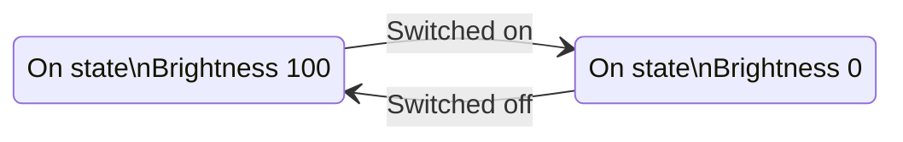

# General concepts

## State matrix
### What's that?

Each Bpod trial is programmed as a [virtual finite state machine](http://www.google.com/url?q=http%3A%2F%2Fen.wikipedia.org%2Fwiki%2FVirtual_finite-state_machine&sa=D&sntz=1&usg=AOvVaw1DcMhaObbuC0WOA7hhGMCg). This ensures precise timing of events - for any state machine you program, state transitions will be completed in less than 100 microseconds - so inefficient coding won't reduce the precision of events in your data.

### Introduction to the Bpod state machine

- Each state describes Bpod's outputs (Valves, LEDs, BNC channels, wire terminals, serial ports, etc.).
- Events detected by Bpod's inputs can be set to trigger transitions between specific states.

Here is a simple finite state machine, describing a binary switch that controls a bulb with variable brightness:



- Each state contains a name ("On state" or "Off state"), a hardware description ("Brightness: X"), and transition events ("Switched on/off")

Here is the same diagram presented as a state matrix, written in proper syntax for Bpod:

```matlab
sma = NewStateMatrix();         % Initializes a new, empty state 
                                % matrix, and assigns it to the variable "sma".

sma = AddState(sma, 'Name', 'OnState', ...  % Adds a new state called "OnState" 
                                            % to the matrix. 
    'Timer', 0,...                          % Sets the internal timer of 
                                            % "On state" to 0 seconds. 
    'StateChangeConditions', {'Port1In', 'OffState'},...  % Causes a transition 
                % to "Off state" (not yet defined) if a "Port1In" event occurs. 
    'OutputActions', {'PWM1', 255});           % Outputs for "On state". PWM1 is
                % Port 1's PWM channel, value set to max LED brightness 
                % (range = 0-255). 

sma = AddState(sma, 'Name', 'OffState', ... % Adds a state called "Off state". 
                                            % PWM1 = 0, "Port1Out" returns to
                                            % first state. 
    'Timer', 0,...
    'StateChangeConditions', {'Port1Out', 'OnState'},...
    'OutputActions', {'PWM1', 0});
```

## Bpod Console
Information on using the Bpod Console can be found [here](../user-guide/bpod-gui.md).

<!-- ## Modules

## Protocol design
Bpod is built for trial-based behavioral studies. -->