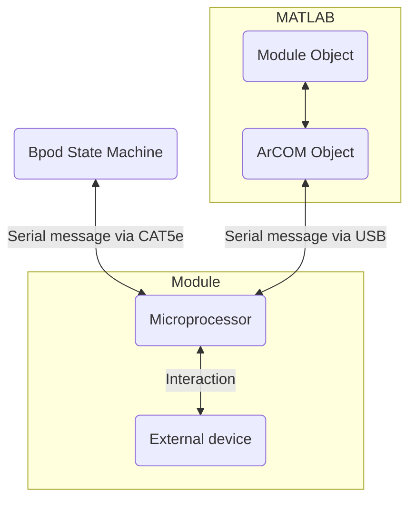

# Modules
The state machine can interact with "modules", devices that can produce effects that the state machine itself is unable to.

A module usually consists an Arduino compatible board, such as a Teensy, loaded with firmware to interpret and/or interact with an external device, allowing it to work alongside the state machine and the computer.

## Modules
- List from readme.md TOC

## Module documentation
Interaction with modules can be performed in three ways:

1. A MATLAB object/plugin[^1]
2. State Machine Command Interface
3. SerialUSB Command Interface

[^1]: The physical module is referred to as "X Module", while its MATLAB interface is the "`XModule` class/object/plugin"

The documentation for each module contains an explanation each of these three systems.

The MATLAB object is a wrapper for the SerialUSB interface.

The serial interface. A module will receive a byte specific to some instruction, and based on that byte might perform an action or know to read the following sequence of bytes in a particular way. 

A "wrapper" is code that allows you to use existing functions. In this case, each module receives and processes sequences of bytes

To understand this sequence more closely, read the [example in-depth explanation](../module-documentation/rotary-encoder-module.md#serial-interface-and-module-class-guide) for the Rotary Encoder Module.

## General explanation

ArCOM is a wrapper for Arduino's `SerialUSB` interface. ArCOM