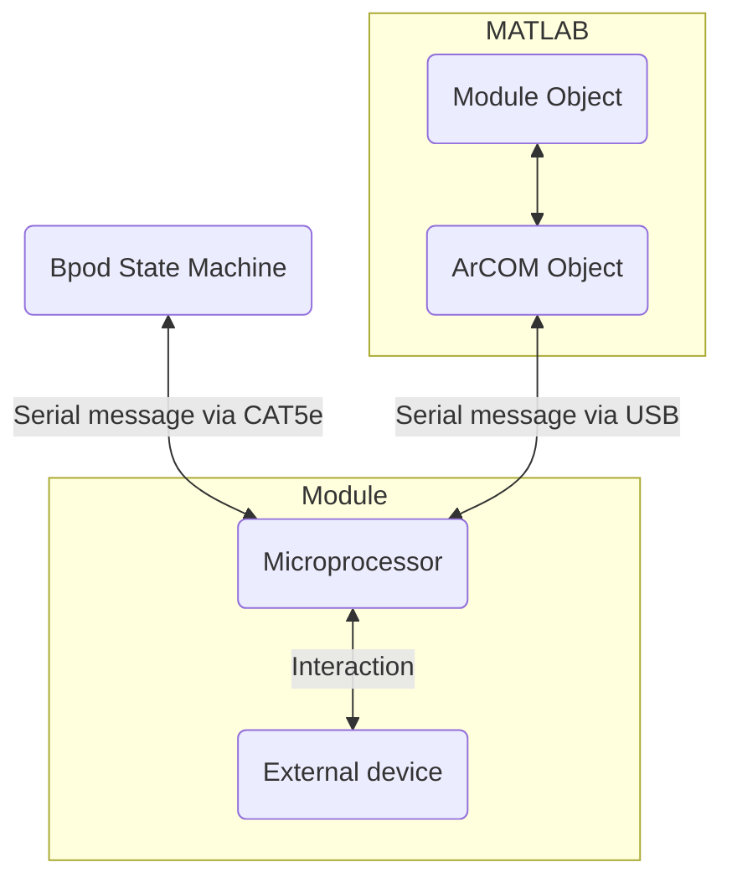

# Modules
Beyond solenoid valves, LEDs and TTL pulses, it's hard to anticipate what kinds of outputs Bpod will need to control hardware in future experiments.

As a general expansion framework, we have exposed 3 (or more) of the [UART serial ports](https://www.google.com/url?q=https%3A%2F%2Flearn.sparkfun.com%2Ftutorials%2Fserial-communication%2Fuarts&sa=D&sntz=1&usg=AOvVaw2e5bid8ez_clYR9sdmyEtv) of the state machine's microcontroller.

<!-- this is dope, more emphasis on the user-expandability of this would be good -->

- The serial ports are indicated on the enclosure as RJ45 ethernet jacks labeled "Modules" 1-N.
- The ports are configured to communicate with other microcontrollers at 1.3125Mb/s
- The state machine sends UART serial transmissions to modules using an RS485 IC at each end of the ethernet cable. This employs differential signaling over the Ethernet cable's twisted wire pairs, to make the digital messages more robust against noise.

We designed a special circuit board to interface between these ports and the UART on Arduino Leonardo: the [Bpod Arduino Shield](../assembly/arduino-shield-gen2-assembly.md).

To develop your own serial device with Arduino M0 or Arduino Due and the Bpod Arduino shield, use the BlinkModule sketch as a starting point.
- /Bpod_Gen2/Examples/Firmware/Gen2/BlinkModule/BlinkModule.ino

It will help to become familiar with the [Arduino language](http://www.google.com/url?q=http%3A%2F%2Farduino.cc%2Fen%2FReference%2FHomePage&sa=D&sntz=1&usg=AOvVaw1v-cPDNL0l0ua0s9yO_xvD).

An excellent intro to Arduino is located [here](https://www.google.com/url?q=https%3A%2F%2Flearn.sparkfun.com%2Ftutorials%2Fwhat-is-an-arduino&sa=D&sntz=1&usg=AOvVaw1od5YgunQFQgRDuuzRaBOE).

## Module documentation
Interaction with modules can be performed in three ways:

1. A MATLAB object/plugin[^1]
2. State Machine Command Interface
3. SerialUSB Command Interface

[^1]: The physical module is referred to as "X Module", while its MATLAB interface is the "`XModule` class/object/plugin"

The **Modules** section in the sidebar contains both **Plugins/**, the MATLAB class/object documentation, as well as **Serial Interfaces/**, the Computer <-> Module and State Machine <-> Module communication ruleset.

The MATLAB object is a wrapper for the SerialUSB interface.

The serial interface. A module will receive a byte specific to some instruction, and based on that byte might perform an action or know to read the following sequence of bytes in a particular way. 

A "wrapper" is code that allows you to use existing functions. In this case, each module receives and processes sequences of bytes

To understand this sequence more closely, read the [example in-depth explanation](../module-documentation/rotary-encoder-module.md#serial-interface-and-module-class-guide) for the Rotary Encoder Module.

## General explanation

ArCOM is a wrapper for Arduino's `SerialUSB` interface. ArCOM