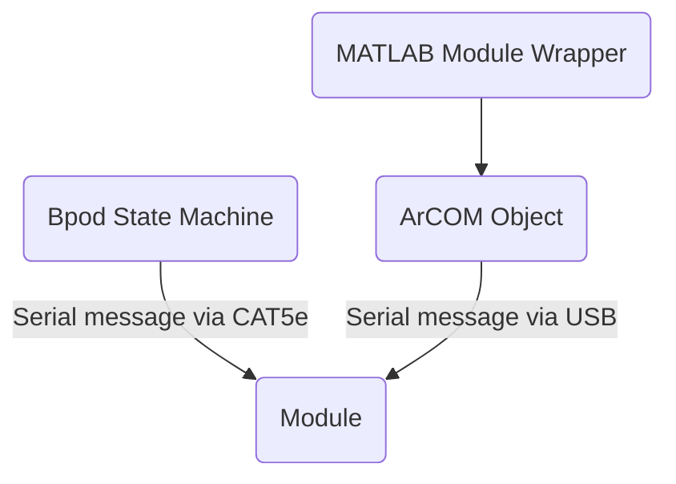

# Modules

```mermaid
flowchart
arcom(ArCOM Object)
modulefunction(MATLAB Module Wrapper)
moduleserial(Module)
statemachine(Bpod State Machine)

modulefunction --> arcom
statemachine -- Serial message via CAT5e --> moduleserial
arcom -- Serial message via USB --> moduleserial
```

# Module documentation

- [Rotary Encoder Module]
- 