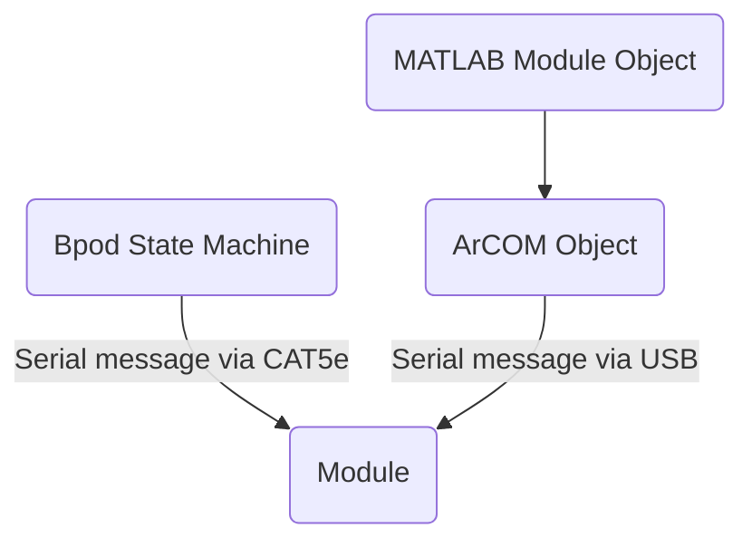

# Modules
Bpod can interact with "modules", devices that can produce effects.

A module is usually an Arduino compatible board, such as a Teensy, loaded 

Some modules, such as the Analog Output Module, can be loaded with different firmware, therefore requiring a different class.

Take, for example, the rotary encoder module. A rotary encoder is a device that sends a TTL signals to indicate that it has been moved X degrees in Y direction -- a "tick" that is also either clockwise or anticlockwise. Coming out of the rotary encoder are a series of wires that enable this signalling. They are connected via pins into the module's PCB, to which the Teensy board is connected. This allows the Teensy to receive and process the stream of ticks coming from the rotary encoder. The PCB also provides a way for other output methods to come out from the Teensy board.

# Module documentation

- BpodAudioPlayer()
- PulsePalModule
- DDS Module
- [Rotary Encoder Module]
- [BpodHiFi]
- BpodStepperModule

# Advanced
ArCOM is a wrapper for Arduino's `SerialUSB` interface. ArCOM