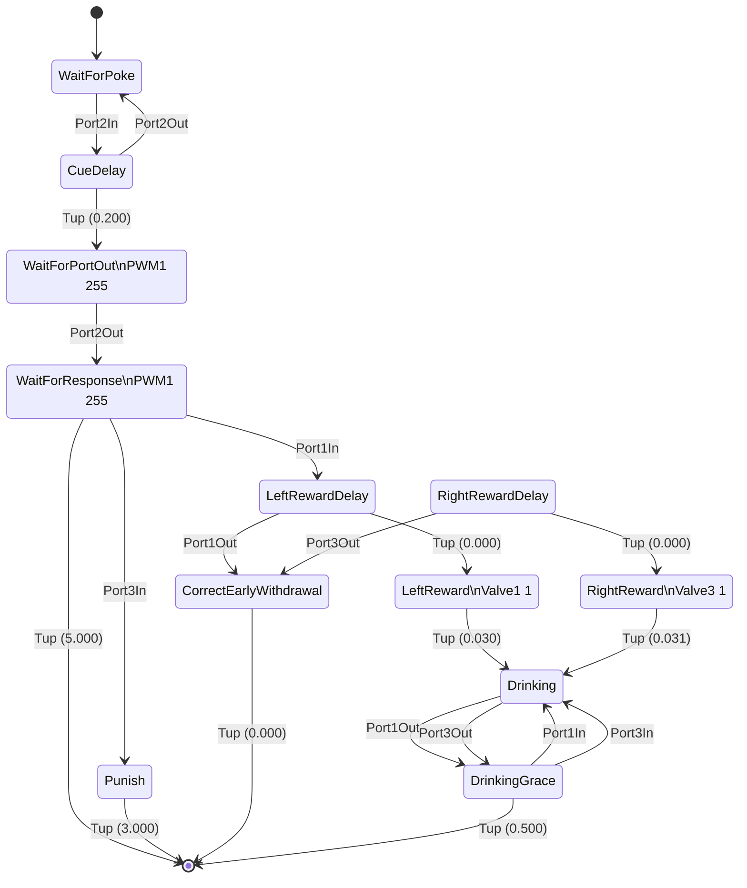

To run a trial-based experiment with Bpod, you must first program a behavioral protocol in MATLAB.

This guide will walk you through creating a simple protocol.

Other example protocols are available in /Bpod_Gen2/Examples/Protocols.

## Conceptual
A protocol is effectively two parts: 
1. Defining session parameters and initializing session hardware.
2. A loop to make the state machine activate and process the data.

## Procedure
### File Setup

- Open a new m-file in the MATLAB editor.
- Add the line function MyProtocol to the file. Here, MyProtocol is the name of your protocol.
- Save the m-file as MyProtocol.m in a folder with **the same name**, in /Bpod Local/Protocols/.
- Your file should now be: /Bpod Local/Protocols/MyProtocol/MyProtocol.m
  - Bpod considers a protocol to be *a folder containing an .m file with the same name*.
  - Protocol folders can be organised into subfolders within Protocols/
- Other files used exclusively by your protocol can also reside in this folder. For now, you just need the one you saved.

> [!NOTE]
> When a protocol is run, Bpod will move MATLAB's Current Directory into the folder where the protocol m-file is stored.
> 
### Protocol Setup (code that runs before the behavior session starts)

- On the next line of your protocol file, add `global BpodSystem`
  - This makes the BpodSystem object visible in the the MyProtocol function's workspace.
- Add code to create a struct containing your task parameters. For instance, if your parameters are stimulus intensity and stimulus delay, you could write:

```matlab
S = struct;
S.RewardAmount = 0;
S.ResponseTimeAllowed = 0;
```

When you launch a protocol from the launch manager, you can select a settings file. The settings file is simply a .mat file containing a parameter struct like the one above, which will be stored in BpodSystem.ProtocolSettings. To only use the default parameters when an empty (default) struct was selected, use:

```matlab
S = BpodSystem.ProtocolSettings;
if isempty(fieldnames(S))  
    S.RewardAmount = 0;
    S.ResponseTimeAllowed = 0;
end
```

If you want to view and edit some parameters during behavior
Add those parameters to the field "GUI":

S.GUI.TimeoutDuration = 5;

Initialize the Parameter GUI plugin:
```matlab
BpodParameterGUI('init', S);
```

Define a trial type for each possible behavioral response, and make a list of the future trial types for your session.
```matlab
% Trial Types: 1 = left, 2 = right, both sides equally probable and randomly interleaved 
TrialTypes = ceil(rand(1,1000)*2); 
```

If you will deliver liquid reward to the port, determine how long the valve needs to open to dispense the intended liquid volume with GetValveTimes
```matlab
R = GetValveTimes(S.RewardAmount, [1 3]); % Return the valve-open duration in seconds for valves 1 and 3
LeftValveTime = R(1); RightValveTime = R(2); 
```

Initialize any plots and plugins for online visualization and peripheral device control. Plugins are in /Bpod/Functions/Plugins.
```matlab
BpodNotebook('init'); % Launches an interface to write notes about behavior and manually score trials
```

> [!NOTE]
> It is recommended to initialise figures at the end of the startup because if an error is encountered (e.g. failure to configure a module) after figures are created then you will be left with windows to close manually.
<!-- This is some that could change in the future if a protocol error handling feature is introduced -->
### Main Loop (runs once each trial until some conditions are met, or the experimenter stops the session from the console)

Create a loop with some condition for ending the session
```matlab
for currentTrial = 1:MaxTrials % Run the session until a maximum number of trials are complete
```

If you are using the ParameterGUI plugin, synchronize it (display updated parameters changed by your code, and manually override any parameters changed by the user during the previous trial)
```matlab
S = BpodParameterGUI('sync', S);
```

Set up the variable parts of the current trial's state matrix. 
```matlab
switch TrialTypes(currentTrial)
    case 1
        LeftPortAction = 'Reward'; RightPortAction = 'Timeout'; 
        Stimulus = {'PWM1', 255}; ValveCode = 1; ValveTime = LeftValveTime;
    case 2
        LeftPortAction = 'Punish'; RightPortAction = 'Reward'; 
        Stimulus = {'PWM3', 255}; ValveCode = 4; ValveTime = RightValveTime;
end
```

Construct the current trial's state matrix using the NewStateMatrix and AddState functions:
```matlab
sma = NewStateMatrix(); % Create a blank matrix to define the trial's finite state machine

sma = AddState(sma, 'Name', 'WaitForPoke', ...
    'Timer', 0,...
    'StateChangeConditions', {'Port2In', 'DeliverStimulus'},...
    'OutputActions', {}); 

sma = AddState(sma, 'Name', 'DeliverStimulus', ...
    'Timer', 0,...
    'StateChangeConditions', {'Port2Out', 'WaitForResponse'},...
    'OutputActions', Stimulus);

sma = AddState(sma, 'Name', 'WaitForResponse', ...
    'Timer', S.ResponseTimeAllowed,...
    'StateChangeConditions', {'Port1In', LeftPokeAction, 'Port3In', RightPokeAction, 'Tup', 'exit'},...
    'OutputActions', Stimulus); 

sma = AddState(sma, 'Name', 'Reward', ...
    'Timer', ValveTime,...
    'StateChangeConditions', {'Tup', 'end'},...
    'OutputActions', {'ValveState', ValveCode}); 

sma = AddState(sma, 'Name', 'Timeout', ...
    'Timer', S.GUI.TimeoutDuration,...
    'StateChangeConditions', {'Tup', 'exit'},...
    'OutputActions', {}); 
```

Send the state matrix to the Bpod device with the SendStateMatrix function:
```matlab
SendStateMatrix(sma);
```
Run the trial's finite state machine, and return the measured timecourse of events and states. The flow of states will be controlled by the Bpod device, and the PC/MATLAB will act as a passive observer until the trial is complete (but see soft codes)
```matlab
RawEvents = RunStateMatrix;
```
Add this trial's raw data to a human-readable data struct using the AddTrialEvents function.

The data struct, BpodSystem.Data, will later be saved to the current data file (automatically created based on your launch manager selections and the current time).
```matlab
BpodSystem.Data = AddTrialEvents(BpodSystem.Data, RawEvents);
```
If you are using plugins that can add data to the data struct, call their update methods.
```matlab
BpodSystem.Data = BpodNotebook('sync', BpodSystem.Data);
```
Add a snapshot of the current settings struct, for a record of the parameters used for the current trial.
```matlab
BpodSystem.Data.TrialSettings(currentTrial) = S;
```
Add the current trial type.
```matlab
BpodSystem.Data.TrialTypes(currentTrial) = TrialTypes(currentTrial);
```
Save the data struct to the current data file.
```matlab
SaveBpodSessionData;
```
If the user has pressed the "Pause" button on the Bpod console, wait here until the session is resumed
```matlab
HandlePauseCondition;
```
If the user has ended the session from the Bpod console, exit the loop.
```matlab
if BpodSystem.BeingUsed == 0
    break
end
```

## State matrix assembly concepts
This is the state matrix from Bpod_Gen2/Examples/Protocols/Light/Light2AFC in diagram form.



## Going Further

- See /Bpod_Gen2/Protocols for other simple example protocols.
- Learn to use Global Timers and Global Counters
- Learn to use Soft Codes and Bpod Modules
- Learn to use the online plots in the /Bpod/Functions/Plugins folder.
- Set up liquid calibration for gravity flow reward delivery