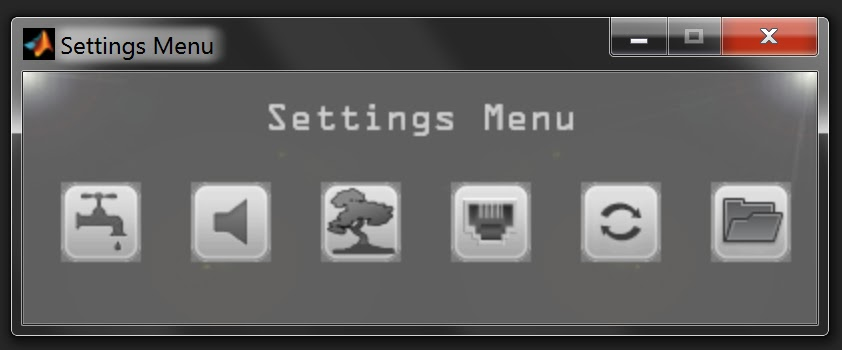

# Integrating Bpod with visual stimuli

## PsychToolboxVideo

## Bonsai integration

[Bonsai](https://bonsai-rx.org/) is an open source software tool for processing data streams, developed by [Goncalo Lopes](https://neurogears.org/about-us/).

Among many applications in behavior measurement, it can be used for live video tracking, e.g. to trigger a Bpod state change based on the test subject's position in an arena.

Two methods exist to integrate Bpod with Bonsai, depending on your state machine model and firmware:

### State Machine r2.0 and newer with firmware v23

With Firmware v23 on Bpod State Machine 2.0 or newer, the machine creates two USB serial ports on the PC. The primary port (e.g. COM3) is used to communicate with MATLAB. The secondary "App" port (e.g. COM4) can be used by a third-party application to exchange events with the state machine. Bonsai can send bytes to the App serial port using the [SerialWrite](https://bonsai-rx.org/docs/api/Bonsai.IO.Ports.SerialWrite.html) sink, found under 'IO.Ports' in the sink menu. Bonsai can receive bytes from the App serial port using the [SerialRead](https://bonsai-rx.org/docs/api/Bonsai.IO.Ports.SerialRead.html) source, under 'IO.Ports' in the source menu. 

Note: From the Bpod console, click the Info (spyglass) icon to view the identity of the App serial port.

#### Bonsai --> Bpod State Machine

When bytes in range [0x1, 0x15] are sent from Bonsai's SerialWrite sink to the state machine's App serial port, the bytes are interpreted by the state machine as events App_SoftCode0 to App_SoftCode14. To handle these events, add them to the 'StateChangeConditions' section of a state. The following example state proceeds to the next state when byte 0x2 arrives from Bonsai:

```matlab
sma = AddState(sma, 'Name', 'WaitForBonsai', ...
    'Timer', 0,...
    'StateChangeConditions', {'APP\_SoftCode2', 'MyNextState'},...
    'OutputActions', {});
```

#### Bpod State Machine --> Bonsai

Bytes in range 1-255 can be sent to Bonsai's SerialRead source from any state using:

```matlab
ByteToSend = 3; % Send byte 0x3 to Bonsai

sma = AddState(sma, 'Name', 'SendToBonsai', ...
    'Timer', 0,...
    'StateChangeConditions', {'Tup', 'MyNextSTate'},...
    'OutputActions', {'AppSoftCode', ByteToSend});
```

An example Bonsai program [here](https://github.com/sanworks/Bpod_Gen2/tree/develop/Functions/Plugins/Bonsai/APP_SoftCode%20Example) uses the SerialRead and SerialWrite nodes to read incoming bytes from the state machine, and echo the same bytes back to the state machine generating Bpod events. Usage instructions are in the Readme file in the program folder.

### State Machine r0.5 - r1.0 (any firmware), and r2.0 with firmware v22

Since Bonsai is a separate program and MATLAB requires ownership of the Bpod state machine's only serial port, the soft codes must be passed via a local TCP socket. The Bonsai Socket Configurator manages this socket connection by creating a TCP server within MATLAB, and confirming when Bonsai is successfully attached as a client.

Notice: The current release should be regarded as an alpha. It works with example code as detailed below, but it is preliminary, and will be updated in a future revision with a more general solution for built-in TCP communication. Please report any bugs you encounter.

Step 1: Launch the settings and calibration manager.

- From the Bpod console, click "Settings" (the wrench icon)f



- Next, click "Setup Bonsai Socket Connection" (the tree icon)
- You should now see the Bonsai socket configurator:


- Since you are creating the TCP server, you can use custom IP and Port. The defaults work fine.
- Click "Connect".
- In Bonsai, run an application that connects to your IP and Port. An example app is available in /Bpod/Bpod System Files/Plugins/Bonsai/App_SoftCode Example/. To demonstrate use of the app, after connecting to Bonsai, run the soft code example in /Bpod/Bpod System Files/ExampleMatrices: SoftCodeTriggeredStateChange.m. Shifting a bright light across your webcam's field of view from right to left should trigger a state change, visible as a change in port LEDs.
- If the connection was initiated successfully, the Bonsai Status should show "Connected" in green.
- Check "Auto-connect on Bpod start" to automatically connect to Bonsai when you run Bpod. Note: this will halt the Bpod launch routine until a Bonsai app connects.