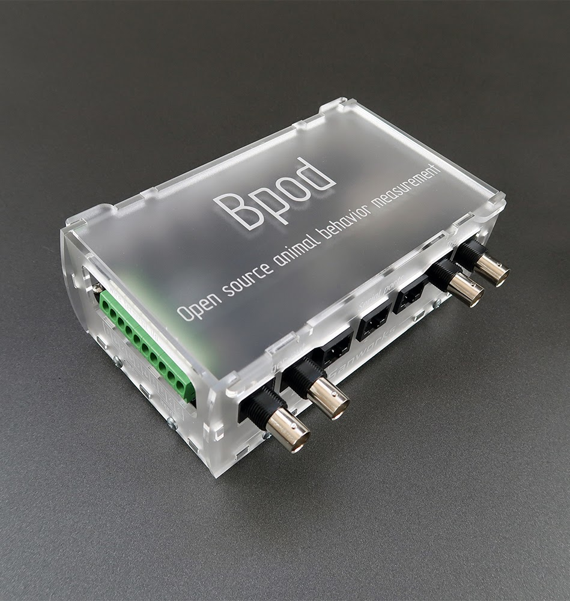

Welcome to the Bpod Wiki.

Bpod is an open source system for real-time behavior measurement in tasks consisting of multiple experimental trials. Experiment software is written in MATLAB, and device firmware is written in https://www.arduino.cc/[Arduino]. Hardware can be assembled with DIY desktop manufacturing methods - hand-soldering, 3-D printing, laser cutting and hand-tapping. The system architecture is low cost, and supremely hackable - precisely what is necessary to explore a space of behavioral metrics, or to train test subjects with high throughput. This wiki contains instructions for assembly and programming.

Bpod was initially developed in http://kepecslab.cshl.edu/[Kepecs Lab] at Cold Spring Harbor Laboratory, as a project alongside the lead developer's thesis research. It is maintained by https://sanworks.io/[Sanworks LLC], a company dedicated to developing Bpod and other open neuroscience tools.

Bpod builds on the central design concept of http://brodywiki.princeton.edu/bcontrol/index.php/Main_Page[B-control], a system provided by http://brodylab.org/[Brody Lab] at Princeton University for rodent behavior measurement. Experimental trials are constructed in MATLAB as https://en.wikipedia.org/wiki/Finite-state_machine[finite state machines], and executed on a separate real-time Linux computer. Bpod combines this parallel processing model with the accessibility of embedded computing in the Arduino language. Bpod provides a rich suite of software tools in high level interpreted computing environments for protocol development and online analysis, while real-time processing is delegated to an Arduino microcontroller network governed by finite state machine firmware.

We love hearing about the awesome [science] that is generated with Bpod! 

Please post on the https://sanworks.io/forums/[Forums] with your questions and feedback, or https://sanworks.io/about/contact.php[email us] directly.