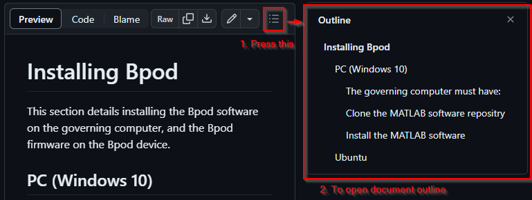

# Bpod Github Markdown Wiki Test
The contents of this repository can be used to build a website. The docs/ folder contains the Markdown files.

Test site hosted here: https://ogeesan.github.io/bpod-docs-testing/

[MkDocs](https://www.mkdocs.org/) and the [Material theme](https://squidfunk.github.io/mkdocs-material/) are used to build the site.

- .vscode/settings.json : some workspace specific settings that will help in consistency (e.g. spell check settings, column ruler)
- docs/ : the items of documentation
- mkdocs.yml : defines the site structure

In the terminal, `mkdocs gh-build` is used which **commits all existing changes and pushes to gh-pages**, building the site. This means any changes on the current branch will be included in the site, even if they weren't committed to the current branch.

https://codebeautify.org/html-to-markdown is being used to convert the Wiki pages to Markdown, after which some manual formatting is applied (including `\n\s+\n` to `\n` regex replace).

On `mkdocs serve` various warnings about absolute links will be raised -> these must be converted once all pages exist.

## Wiki Items

> - :white_check_mark: : import from original wiki complete
> - :memo: : additional information/improvements is planned/added
> - :bulb: : new item
> - :construction: : under construction

- Assembly
  - Items and assembly
    - State machines :white_check_mark:
    - Modules and items :white_check_mark:
  - [Bench testing Bpod](docs/assembly/bench-testing-bpod.md) :white_check_mark:
  - Downloads and sources :x: (exists on front page)
  - [Installing  Bpod](docs/assembly/installing-bpod.md) :white_check_mark:
  - Firmware updates :white_check_mark:
  - Software updates :white_check_mark:
- User guide
  - General concepts :white_check_mark: :memo:
  - Hardware Overview :memo:
    - Refers to older state machine, belongs in general concepts?
  - [Function reference](docs/user-guide/function-reference.md) :white_check_mark:
  - [Modules](docs/user-guide/modules.md) :construction: :memo:
  - [Protocol development](docs/user-guide/protocol-development.md) :white_check_mark: :memo: :construction:
  - [Serial interfaces](docs/user-guide/serial-interfaces.md) :white_check_mark: :memo:
  - Using BControl
  - :bulb:[Advanced user guide](docs/user-guide/advanced-user-guide.md) :construction:
- Module functions :white_check_mark:

To assist navigating long documents you can open a file outline:

