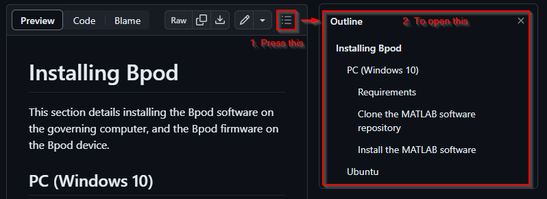

# Bpod Github Markdown Wiki Test
Welcome to the Bpod Wiki.

> [!WARNING]
> :stop_sign: This is a test version of the Bpod wiki to examine the feasability of moving it to Github. The official wiki maintained by Sanworks is hosted [here](https://sites.google.com/site/bpoddocumentation/home?authuser=0). :construction: This test wiki does not contain all items, and some of the items included have been modified.

Bpod is an open source system for real-time behavior measurement in tasks consisting of multiple experimental trials. Experiment software is written in MATLAB, and device firmware is written in [Arduino](https://www.arduino.cc/). Hardware can be assembled with DIY desktop manufacturing methods - hand-soldering, 3-D printing, laser cutting and hand-tapping. The system architecture is low cost, and supremely hackable - precisely what is necessary to explore a space of behavioral metrics, or to train test subjects with high throughput. This wiki contains instructions for assembly and programming.

## Table of Contents

- Assembly
  - [Bench testing Bpod](docs/assembly/bench-testing-bpod.md)
  - Downloads and sources
  - Hardware
  - [Installing  Bpod](docs/assembly/installing-bpod.md)
  - Firmware updates
  - Software updates
- User guide
  - [Function reference](docs/user-guide/function-reference.md)
  - General Conceptsfnconcepts
  - [Modules](docs/user-guide/modules.md)
  - [Protocol development](docs/user-guide/protocol-development.md)
  - [Serial interfaces](docs/user-guide/serial-interfaces.md)
  - Using BControl
- Module guides
  - Analog Input Module
  - Analog Output Module
  - DDS Module
  - Ethernet Module
  - HiFi Module
  - I2C Messenger Module
  - [Rotary Encoder Module](docs/module-documentation/rotary-encoder-module.md)
  - Port Array Module
  - Valve Driver Module

To assist navigating long documents you can open a file outline:

## About Bpod

Bpod was initially developed in [Kepecs Lab](http://kepecslab.cshl.edu/) at Cold Spring Harbor Laboratory, as a project alongside the lead developer's thesis research. It is maintained by [Sanworks LLC](https://sanworks.io/), a company dedicated to developing Bpod and other open neuroscience tools.

Bpod builds on the central design concept of [B-control](http://brodywiki.princeton.edu/bcontrol/index.php/Main_Page), a system provided by [Brody Lab](http://brodylab.org/) at Princeton University for rodent behavior measurement. Experimental trials are constructed in MATLAB as [finite state machines](https://en.wikipedia.org/wiki/Finite-state_machine), and executed on a separate real-time Linux computer. Bpod combines this parallel processing model with the accessibility of embedded computing in the Arduino language. Bpod provides a rich suite of software tools in high level interpreted computing environments for protocol development and online analysis, while real-time processing is delegated to an Arduino microcontroller network governed by finite state machine firmware.

We love hearing about the awesome [science](https://sanworks.io/science/science.php) that is generated with Bpod! 

Please post on the [Forums](https://sanworks.io/forums/) with your questions and feedback, or [email us](https://sanworks.io/about/contact.php) directly.

